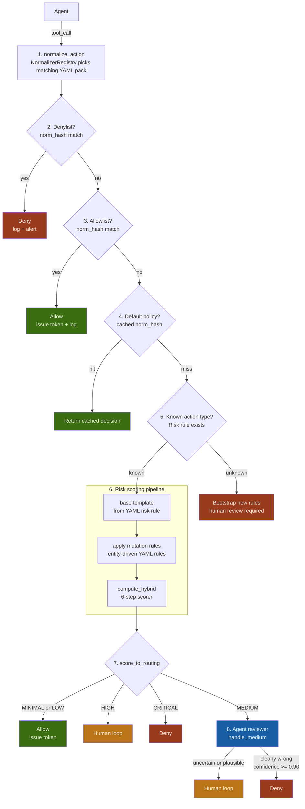
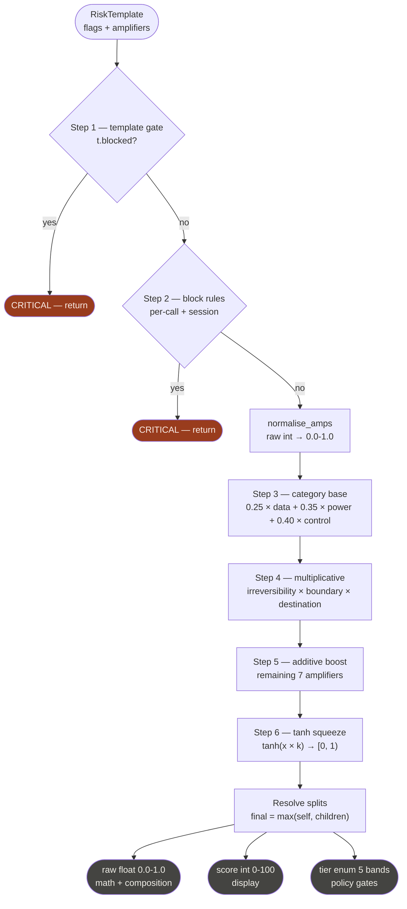

# permit0 — Agent Safety & Permission Framework

## Table of Contents

1. [Introduction](#1-introduction)
2. [System Architecture](#2-system-architecture)
3. [Core Types](#3-core-types)
4. [Action Catalog](#4-action-catalog)
5. [Risk Scoring Pipeline](#5-risk-scoring-pipeline)
6. [Normalizer Packs](#6-normalizer-packs)
7. [Risk Rules](#7-risk-rules)
8. [Calibration System](#8-calibration-system)
9. [Worked Example](#9-worked-example)
10. [Permission Decision Mapping](#10-permission-decision-mapping)
11. [Capability Token](#11-capability-token)
12. [Session-Aware Scoring](#12-session-aware-scoring)
13. [Agent-in-the-Loop](#13-agent-in-the-loop)
14. [Learning System](#14-learning-system)
15. [Audit & Compliance](#15-audit--compliance)
16. [Developing](#16-developing)
17. [Phased Implementation Plan](#17-phased-implementation-plan)

---

## 1. Introduction

### What is permit0?

permit0 is a deterministic, fine-grained permission framework for AI agents.
It intercepts every tool call an agent makes, evaluates its risk, and returns
one of three decisions: **Allow**, **Human-in-the-loop**, or **Deny**.

### Motivation

Current agent permission systems have three critical gaps:

- **Allowlists are static.** They cannot adapt to the context of a call — the same tool behaves very differently depending on its arguments.
- **Role-based access is coarse.** A role that allows "email" cannot distinguish "send to self" from "forward classified data externally".
- **Natural language policies are non-deterministic.** Asking an LLM to judge permissions produces inconsistent results across runs.

permit0 solves this with a **deterministic, rule-based risk pipeline** that converts raw tool calls into structured risk scores, then maps scores to permission decisions through explicit, auditable thresholds.

### Goals

- Every tool call is assessed against a **structured risk score**, not a natural language policy.
- Risk is computed from **two sources**: static flag weights (what kind of action is this?) and contextual amplifiers (how bad is this instance?).
- Adding a new integration requires **one YAML pack** — nothing else changes.
- All decisions are **logged and cacheable**. Human approvals become training data that improves future automation.
- The system is **composable**: a custom allowlist always wins; cached decisions are reused; the risk engine is the fallback.
- The core is **Rust** for determinism, memory safety, and compliance attestation. Python and TypeScript bindings allow polyglot host applications.
- Risk rules and normalizers are defined in a **YAML DSL** so contributors can add integrations without writing Rust.
- Calibration is a **three-layer system** (base engine → domain profile → org policy) with guardrails that prevent unsafe configuration.

### Non-Goals

- permit0 does not generate natural language policies.
- It does not make final allow/block decisions autonomously — it produces a tier; the host system decides what to do with it.
- Risk scores are calibrated heuristics, not probabilities. Do not interpret `score=72` as "72% chance of harm".
- permit0 does not call vendor APIs. It inspects the *shape* of tool calls the agent makes. The agent (or host) holds the SDK; permit0 evaluates the request.

### Glossary

| Term | Meaning |
|---|---|
| Raw action | The verbatim tool call payload from the agent |
| Normalized action (NormAction) | Structured representation: action_type, verb, channel, entities |
| Pack | A YAML bundle containing normalizers + risk rules for one vendor/integration |
| Normalizer | A declarative rule that matches a raw tool call and maps it to a NormAction |
| Risk rule | A declarative YAML definition of base flags/amplifiers and entity-driven mutations |
| Risk template | Mutable intermediate: flags + amplifiers, before scoring |
| Risk flag | Categorical risk label (e.g. OUTBOUND, DESTRUCTION) |
| Amplifier | Continuous dimension that scales risk (e.g. sensitivity) |
| RiskScore | Output: raw float, display int, tier enum, flags, reason |
| Tier | One of five bands: MINIMAL LOW MEDIUM HIGH CRITICAL |
| Permission | One of three decisions: Allow / Human-loop / Deny |
| Hard block | A gate rule that forces CRITICAL regardless of score |
| Split | A child assessment scored independently; score = max(self, child) |
| Domain profile | A curated calibration preset for an industry (fintech, healthtech) |
| Org policy | Per-customer calibration overrides within guardrail bounds |
| Guardrails | Compiled limits that prevent calibration from creating unsafe configurations |
| Capability token | A Biscuit-based bearer token issued on Allow, verifiable offline |
| norm_hash | SHA-256 hash of the canonical NormAction; key for caching and lists |

---

## 2. System Architecture

### End-to-End Pipeline



### Permission Decisions

Three final permissions, one internal routing state, two pre-scoring overrides.

| Decision | Source | Condition |
|---|---|---|
| **Deny** | Denylist | norm_hash in denylist — checked first, always wins |
| **Allow** | Allowlist | norm_hash in allowlist — skips scoring entirely |
| **Allow / Human / Deny** | Policy cache | Stored decision for this norm pattern — skips scoring |
| **Allow** | Scorer | Tier MINIMAL or LOW |
| **Human** | Scorer | Tier HIGH |
| **Deny** | Scorer | Tier CRITICAL or blocked |
| **Human** | Agent reviewer | Uncertain, plausible, or confidence < 0.90 |
| **Deny** | Agent reviewer | Clearly wrong, confidence >= 0.90, grounded reason |

The agent reviewer **never produces Allow** and **never issues tokens**. It is a skeptical gate: Human or Deny only. Allow comes from the scorer (MINIMAL/LOW) or from human review.

### Crate Layout

```
permit0-core/
├── Cargo.toml                       # workspace
├── crates/
│   ├── permit0-types/               # Tier, RiskScore, NormAction, Permission, RiskTemplate
│   │                                #   no_std-friendly, serde, zero deps, no I/O
│   ├── permit0-scoring/             # weights, amplifiers, block rules, compute_hybrid,
│   │                                #   ScoringConfig, guardrails, three-layer composition
│   ├── permit0-normalize/           # Normalizer trait, NormalizerRegistry, dispatch
│   │                                #   knows nothing about specific vendors
│   ├── permit0-registry/            # ActionHandler trait, ACTION_REGISTRY, assess()
│   │                                #   knows nothing about raw tool calls
│   ├── permit0-dsl/                 # YAML DSL runtime: parser, IR, interpreter,
│   │                                #   closed helper registry, static checker, loader
│   │                                #   handles both normalizer YAML and risk rule YAML
│   ├── permit0-token/               # biscuit-auth wrapper: mint, attenuate, verify
│   ├── permit0-store/               # trait Store + sqlite impl; audit sink trait;
│   │                                #   denylist, allowlist, policy cache, audit log
│   ├── permit0-session/             # SessionContext, ActionRecord, session block rules,
│   │                                #   session amplifier derivation
│   ├── permit0-engine/              # get_permission() orchestrator; Engine + EngineBuilder
│   │                                #   depends on all above; single public entry point
│   ├── permit0-agent/               # MEDIUM reviewer: trait LlmClient, handle_medium()
│   │                                #   (ollama/openai/mock impls behind cargo features)
│   ├── permit0-cli/                 # permit0 check|calibrate|audit|pack CLI
│   ├── permit0-py/                  # PyO3 bindings → wheel (maturin)
│   └── permit0-node/                # napi-rs bindings → npm package
├── packs/                           # first-party Rust-native packs (the trusted base)
│   ├── permit0-pack-bash/           # generic shell fallback + unknown
│   ├── permit0-pack-gmail/          # email.* via gmail
│   ├── permit0-pack-slack/          # messages.* via slack
│   ├── permit0-pack-stripe/         # payments.* via stripe
│   ├── permit0-pack-github/         # dev.* via github
│   ├── permit0-pack-fs/             # files.* for local filesystem
│   └── permit0-pack-http/           # network.http_* generic
├── pack-bundles/                    # DSL-authored community packs (YAML only)
│   ├── notion/
│   ├── linear/
│   └── sendgrid/
├── profiles/                        # domain calibration profiles
│   ├── fintech.profile.yaml
│   ├── healthtech.profile.yaml
│   └── general.profile.yaml
├── corpora/
│   └── calibration/                 # golden test cases (JSON), shared by all langs
├── bindings/
│   ├── python/                      # pure-python ergonomics layer over permit0-py
│   └── typescript/                  # TS types + ergonomic layer over permit0-node
└── docs/
    ├── permit.md                    # this document
    └── dsl.md                       # full DSL specification
```

### Language Strategy

| Layer | Language | Responsibility |
|---|---|---|
| Core engine | Rust | Risk scoring, token issuance/verification, session state, crypto, DSL interpreter |
| Packs & config | YAML DSL | Normalizer definitions, risk rule definitions, calibration profiles, org policies |
| Python bindings | Rust (PyO3) | In-process access to the engine from Python host apps |
| TypeScript bindings | Rust (napi-rs) | In-process access to the engine from Node.js/TS host apps |
| CLI | Rust | `permit0 check`, `permit0 calibrate`, `permit0 audit`, `permit0 pack` |

The core is Rust for three reasons: the scoring pipeline runs on every tool call in the hot path (latency matters), the token crypto must be correct by construction (safety matters), and compliance attestation requires a reviewable, deterministic codebase with a clean supply chain.

Python and TypeScript never touch cryptographic primitives or scoring math — they call into the Rust core via FFI. The YAML DSL is the authoring surface for rules and normalizers; the Rust DSL interpreter executes them deterministically.

---

## 3. Core Types

### Output Types

```rust
#[derive(Debug, Clone, Copy, PartialEq, Eq, PartialOrd, Ord, Serialize, Deserialize)]
pub enum Tier {
    Minimal  = 0,   // raw < 0.15  → Allow (direct)
    Low      = 1,   // raw < 0.35  → Allow (direct)
    Medium   = 2,   // raw < 0.55  → Agent reviewer → Human | Deny only
    High     = 3,   // raw < 0.75  → Human-in-the-loop (direct)
    Critical = 4,   // raw >= 0.75 → Deny (direct)
}

#[derive(Debug, Clone, Serialize, Deserialize)]
pub struct RiskScore {
    pub raw:          f64,          // 0.0–1.0  — use for math / composition
    pub score:        u32,          // 0–100    — use for display
    pub tier:         Tier,
    pub flags:        Vec<String>,  // which risk flags fired
    pub reason:       String,       // human-readable explanation
    pub blocked:      bool,
    pub block_reason: Option<String>,
}

pub const TIER_THRESHOLDS: &[(f64, Tier)] = &[
    (0.15, Tier::Minimal),
    (0.35, Tier::Low),
    (0.55, Tier::Medium),
    (0.75, Tier::High),
    (1.00, Tier::Critical),
];

pub fn to_risk_score(
    raw: f64,
    flags: Vec<String>,
    reason: &str,
    blocked: bool,
    block_reason: Option<String>,
) -> RiskScore {
    let raw = raw.clamp(0.0, 1.0);
    let score = (raw * 100.0).round() as u32;
    let tier = if blocked {
        Tier::Critical
    } else {
        TIER_THRESHOLDS.iter()
            .find(|(ceiling, _)| raw <= *ceiling)
            .map(|(_, t)| *t)
            .unwrap_or(Tier::Critical)
    };
    RiskScore {
        raw: (raw * 10000.0).round() / 10000.0,
        score,
        tier,
        flags,
        reason: reason.to_string(),
        blocked,
        block_reason,
    }
}
```

### Normalized Action

A structured, tool-agnostic representation of what the action *means*. This is the stable key used for risk rule lookup and caching.

```rust
#[derive(Debug, Clone, Serialize, Deserialize)]
pub struct NormAction {
    pub action_type: String,        // "email.send" — primary key for risk rules
    pub domain:      String,        // "email"
    pub verb:        String,        // "send"
    pub channel:     String,        // "gmail"
    pub entities:    Entities,      // semantic parameters
    pub execution:   ExecutionMeta, // surface tool and raw command (for audit)
}

/// Opaque entity map — pack-defined fields.
pub type Entities = serde_json::Map<String, serde_json::Value>;

#[derive(Debug, Clone, Serialize, Deserialize)]
pub struct ExecutionMeta {
    pub surface_tool:    String,
    pub surface_command: String,
}

/// SHA-256 of the canonical JSON form, truncated to 16 hex chars for display.
/// Internally stored as full 32 bytes.
pub type NormHash = [u8; 32];

impl NormAction {
    pub fn norm_hash(&self) -> NormHash {
        // Canonical JSON: sorted keys, no whitespace, UTF-8 NFC,
        // null fields omitted, integers without leading zeros.
        let canonical = canonical_json(self);
        sha256(canonical.as_bytes())
    }
}
```

### Permission and Routing

```rust
/// Three final outcomes visible to callers.
#[derive(Debug, Clone, Copy, PartialEq, Eq, Serialize, Deserialize)]
pub enum Permission {
    Allow,
    HumanInTheLoop,
    Deny,
}

/// Internal routing — never returned from get_permission().
#[derive(Debug, Clone, Copy, PartialEq, Eq)]
pub(crate) enum Routing {
    Agent,  // triggers agent reviewer pipeline for MEDIUM tier
}

pub fn score_to_routing(tier: Tier, blocked: bool) -> Result<Permission, Routing> {
    if blocked || tier == Tier::Critical {
        return Ok(Permission::Deny);
    }
    match tier {
        Tier::Minimal | Tier::Low => Ok(Permission::Allow),
        Tier::Medium => Err(Routing::Agent),  // internal routing
        Tier::High => Ok(Permission::HumanInTheLoop),
        Tier::Critical => Ok(Permission::Deny),
    }
}
```

### Risk Template and Mutation API

The `RiskTemplate` is the mutable intermediate representation that risk rules build up before scoring. It is constructed from YAML `base` definitions and modified by YAML `rules`.

```rust
#[derive(Debug, Clone, Serialize, Deserialize)]
pub struct RiskTemplate {
    pub flags:        HashMap<String, FlagRole>,  // flag → primary | secondary
    pub amplifiers:   HashMap<String, i32>,       // dimension → raw integer value
    pub blocked:      bool,
    pub block_reason: Option<String>,
    pub children:     Vec<RiskTemplate>,
}

#[derive(Debug, Clone, Copy, PartialEq, Eq, Serialize, Deserialize)]
pub enum FlagRole {
    Primary,
    Secondary,
}

impl RiskTemplate {
    // ── Mutation API ────────────────────────────────────────────────
    // The ONLY way to modify a template. Mapped 1:1 from YAML rule actions.

    pub fn add(&mut self, flag: &str, role: FlagRole)       // add flag if not present
    pub fn remove(&mut self, flag: &str)                     // remove flag entirely
    pub fn promote(&mut self, flag: &str)                    // secondary → primary
    pub fn demote(&mut self, flag: &str)                     // primary → secondary
    pub fn upgrade(&mut self, dim: &str, delta: i32)         // increase amplifier, capped
    pub fn downgrade(&mut self, dim: &str, delta: i32)       // decrease amplifier, floored at 0
    pub fn override_amp(&mut self, dim: &str, value: i32)    // set exact value, clamped
    pub fn gate(&mut self, reason: &str)                     // hard block
    pub fn split(&mut self, child: RiskTemplate)             // fork independent child
}
```

---

## 4. Action Catalog

Every action is identified by a `domain.verb` string. The catalog is **append-only** — entries can be added but never renamed or removed without a major version bump.

| Domain | Verbs |
|---|---|
| email | search, get_thread, send, reply, forward, draft, label, archive, delete |
| messages | send, post_channel, send_dm, search, react, delete |
| content | post_social, update_cms, send_newsletter |
| calendar | list_events, get_event, create_event, update_event, delete_event, rsvp |
| tasks | create, assign, complete, update, delete, comment |
| files | list, read, write, delete, move, copy, share, upload, download, export |
| db | select, insert, update, delete, admin, export, backup |
| crm | search_contacts, get_contact, create_contact, update_contact, delete_contact, create_deal, update_deal, log_activity, export |
| payments | charge, refund, transfer, get_balance, list_transactions, create_invoice, update_payment_method, create_subscription |
| legal | sign_document, submit_filing, accept_terms |
| iam | list_users, create_user, update_user, delete_user, assign_role, revoke_role, reset_password, generate_api_key |
| secrets | read, create, rotate |
| infra | list_resources, create_resource, modify_resource, terminate_resource, scale, modify_network |
| process | shell, run_script, docker_run, lambda_invoke |
| network | http_get, http_post, webhook_send |
| dev | get_repo, list_issues, create_issue, create_pr, merge_pr, push_code, deploy, run_pipeline, create_release |
| browser | navigate, click, fill_form, submit_form, screenshot, download, execute_js |
| device | unlock, lock, camera_enable, camera_disable, move |
| ai | prompt, embed, fine_tune |
| unknown | unclassified |

### Default Risk Tier by Verb

| Verb pattern | Default tier | Rationale |
|---|---|---|
| list, search, get, read | MINIMAL–LOW | Read-only, no state change |
| create, draft, comment | LOW–MEDIUM | Additive, usually reversible |
| send, post, reply | MEDIUM | Outbound, irreversible once delivered |
| update, edit, move, copy | MEDIUM | Mutation, scope-dependent |
| delete, archive, revoke | MEDIUM–HIGH | Destructive, often irreversible |
| forward, export, share | HIGH | Outbound + potential data leakage |
| deploy, run, exec, shell | HIGH | Execution risk |
| charge, transfer, sign | HIGH–CRITICAL | Financial or legal consequence |
| terminate, drop, purge | CRITICAL | Irreversible destruction |
| assign_role, generate_key | HIGH | Privilege escalation |

### Catalog Versioning

- The catalog is published as `CATALOG.md` with a dated changelog alongside `CHANGELOG.md`.
- New `domain.verb` entries can be added in any minor release.
- Renames and splits require a major release and a multi-version migration path.
- The meaning of an existing entry never changes — add a new entry instead.
- The catalog is part of the compliance attestation surface.

---

## 5. Risk Scoring Pipeline

### Risk Flags

```rust
/// Per-flag base weights (fractions of 1.0).
/// NOT a probability distribution — multiple flags can fire simultaneously.
/// Calibration question: "if only this flag fired with no amplifiers,
/// what fraction of maximum risk does it represent?"
pub const BASE_RISK_WEIGHTS: &[(&str, f64)] = &[
    //  Flag             Weight   Category   Rationale
    ("DESTRUCTION",      0.28),  // Power      Catastrophic, hard to undo
    ("PHYSICAL",         0.26),  // Control    Real-world effects, hardest to reverse
    ("EXECUTION",        0.22),  // Control    Arbitrary code — a force multiplier
    ("PRIVILEGE",        0.20),  // Power      Cascades to everything else
    ("FINANCIAL",        0.20),  // Power      Direct liability
    ("EXPOSURE",         0.16),  // Data       Severity depends on what is exposed
    ("GOVERNANCE",       0.14),  // Control    Important but often recoverable
    ("OUTBOUND",         0.10),  // Data       Risky but common; context matters most
    ("MUTATION",         0.10),  // Data       Often reversible, scope-dependent
];

/// Flag categories and their scorer weights.
/// Control risks weighted most heavily — loss of safety mechanisms.
pub const CATEGORIES: &[(&str, CategoryConfig)] = &[
    ("data",    CategoryConfig { flags: &["OUTBOUND", "EXPOSURE", "MUTATION"],
                                  amps: &["sensitivity", "scope", "destination", "volume"],
                                  weight: 0.25 }),
    ("power",   CategoryConfig { flags: &["DESTRUCTION", "PRIVILEGE", "FINANCIAL"],
                                  amps: &["amount", "irreversibility", "boundary", "environment"],
                                  weight: 0.35 }),
    ("control", CategoryConfig { flags: &["EXECUTION", "PHYSICAL", "GOVERNANCE"],
                                  amps: &["actor", "session", "scope", "environment"],
                                  weight: 0.40 }),
];
```

### Amplifier Dimensions

```rust
/// AMP_WEIGHTS is a budget — MUST sum to exactly 1.0.
/// Raising one entry requires lowering another.
pub const BASE_AMP_WEIGHTS: &[(&str, f64)] = &[
    ("destination",     0.155),  // Where data/action is going — largest share
    ("sensitivity",     0.136),  // How sensitive the data is
    ("scope",           0.136),  // Breadth of impact
    ("amount",          0.117),  // Financial or quantitative magnitude
    ("session",         0.097),  // Persistence across sessions
    ("irreversibility", 0.097),  // Inability to undo
    ("volume",          0.078),  // Scale / frequency
    ("boundary",        0.078),  // Crossing trust boundaries
    ("actor",           0.058),  // Who is performing the action
    ("environment",     0.048),  // Prod > staging > test > dev
];
// Sum must equal 1.0 — enforced at compile time.

/// Raw integer ceilings — used only for normalisation.
pub const AMP_MAXES: &[(&str, i32)] = &[
    ("sensitivity",     35),
    ("scope",           35),
    ("boundary",        20),
    ("amount",          30),
    ("actor",           20),
    ("destination",     40),
    ("session",         30),
    ("volume",          25),
    ("irreversibility", 20),
    ("environment",     15),
];

pub fn normalise_amps(amplifiers: &HashMap<String, i32>) -> HashMap<String, f64> {
    AMP_MAXES.iter().map(|(dim, max)| {
        let raw = amplifiers.get(*dim).copied().unwrap_or(0);
        (dim.to_string(), (raw as f64 / *max as f64).clamp(0.0, 1.0))
    }).collect()
}
```

### Hard Block Rules

Block rules are evaluated after template-level gates, before scoring. They operate on normalised amplifier values (0.0–1.0), not raw integers.

| Rule name | Flags required | Amplifier thresholds | Reason |
|---|---|---|---|
| `irreversible_destruction` | DESTRUCTION | irreversibility >= 0.90 | Irreversible destruction exceeds tolerable threshold |
| `financial_exfiltration` | FINANCIAL + OUTBOUND | amount >= 0.83, destination >= 0.75 | High-value outbound financial movement to untrusted destination |
| `privileged_prod_execution` | EXECUTION + PRIVILEGE | environment >= 0.80, scope >= 0.80 | Arbitrary execution with elevated privilege in production scope |
| `governance_trust_boundary` | GOVERNANCE | boundary >= 0.90 | Rule-change crossing a high trust boundary |
| `classified_external_send` | OUTBOUND + EXPOSURE | sensitivity >= 0.94, destination >= 0.75 | Highly sensitive data sent to untrusted external destination |

Block rules can be **added** by domain profiles and org policies. The five rules above are **immutable** — they cannot be removed or weakened by any configuration layer.

### Hybrid Scorer

Steps 1–2 are gates that return CRITICAL immediately. Steps 3–5 compute the score in three layers. Step 6 squeezes to `[0, 1)`. Splits are resolved last by taking `max(self, children)`.



```rust
const MULTIPLICATIVE_DIMS: &[&str] = &["irreversibility", "boundary", "destination"];

pub fn compute_hybrid(t: &RiskTemplate, config: &ScoringConfig) -> RiskScore {
    let active_flags: Vec<String> = t.flags.keys().cloned().collect();
    let norm = normalise_amps(&t.amplifiers);

    // Step 1 — template-level gate
    if t.blocked {
        return to_risk_score(1.0, active_flags,
            t.block_reason.as_deref().unwrap_or("blocked by template gate"),
            true, t.block_reason.clone());
    }

    // Step 2 — block rules (base + profile + org additions)
    for rule in &config.block_rules {
        if rule.matches(&active_flags, &norm) {
            return to_risk_score(1.0, active_flags, &rule.reason,
                true, Some(rule.reason.clone()));
        }
    }

    // Step 3 — category-weighted base
    let base: f64 = config.categories.iter().map(|cat| {
        let flag_base: f64 = active_flags.iter()
            .filter(|f| cat.flags.contains(&f.as_str()))
            .map(|f| config.risk_weight(f))
            .sum();
        if flag_base == 0.0 { return 0.0; }
        let cat_amps: Vec<(&str, f64)> = cat.amps.iter()
            .map(|d| (*d, config.amp_weight(d)))
            .collect();
        let cat_sum: f64 = cat_amps.iter().map(|(_, w)| w).sum();
        let amp: f64 = cat_amps.iter()
            .map(|(d, w)| (w / cat_sum) * norm[*d])
            .sum();
        cat.weight * flag_base * (1.0 + amp) / 2.0
    }).sum();

    // Step 4 — multiplicative compound for high-stakes dims
    let compound: f64 = MULTIPLICATIVE_DIMS.iter()
        .map(|dim| 1.0 + config.amp_weight(dim) * norm[*dim])
        .product();

    // Step 5 — additive boost from remaining dims
    let add_boost: f64 = AMP_WEIGHTS.iter()
        .filter(|(d, _)| !MULTIPLICATIVE_DIMS.contains(d))
        .map(|(d, _)| config.amp_weight(d) * norm[*d])
        .sum();

    let intermediate = base * compound * (1.0 + add_boost);

    // Step 6 — tanh squeeze
    let raw = (intermediate * config.tanh_k).tanh();

    let reason = format!(
        "flags={active_flags:?}, base={base:.3f}, compound={compound:.3f}, add_boost={add_boost:.3f}"
    );
    let mut score = to_risk_score(raw, active_flags, &reason, false, None);

    // Apply per-action-type floor if configured
    if let Some(floor_tier) = config.action_type_floor(action_type) {
        if score.tier < floor_tier {
            score.tier = floor_tier;
        }
    }

    // Resolve splits: final score = max(self, all children)
    for child in &t.children {
        let child_score = compute_hybrid(child, config);
        if child_score.raw > score.raw {
            score = child_score;
        }
    }

    score
}
```

---

## 6. Normalizer Packs

Packs are the primary contribution unit for permit0. Each pack is a bundle of YAML files that teach permit0 how to recognize and score tool calls for a specific vendor or integration.

A pack contains:

1. **Normalizers** — YAML rules that match raw tool calls and map them to `NormAction` structs.
2. **Risk rules** — YAML definitions of the base risk template and entity-driven mutation rules for each `action_type` the pack produces.
3. **Fixtures** — test cases that verify normalizers and risk rules produce expected results.

The full DSL specification is in [docs/dsl.md](dsl.md). This section covers the architecture and key concepts.

### Pack Structure

```
packs/stripe/
├── pack.yaml                              # manifest
├── normalizers/
│   ├── charges.create.norm.yaml           # normalizer for POST /v1/charges
│   ├── charges.create.v2024-11-20.norm.yaml  # vendor API version variant
│   ├── refunds.create.norm.yaml
│   └── transfers.create.norm.yaml
├── risk-rules/
│   ├── payments.charge.risk.yaml          # risk rule for payments.charge
│   ├── payments.refund.risk.yaml
│   └── payments.transfer.risk.yaml
└── fixtures/
    ├── charges.create.fixtures.yaml
    ├── refunds.create.fixtures.yaml
    └── transfers.create.fixtures.yaml
```

### Pack Manifest

```yaml
# packs/stripe/pack.yaml
name: permit0-pack-stripe
version: 0.3.1
permit0_pack: v1
description: Stripe payments integration
vendor: stripe

normalizers:
  - normalizers/charges.create.norm.yaml
  - normalizers/charges.create.v2024-11-20.norm.yaml
  - normalizers/refunds.create.norm.yaml
  - normalizers/transfers.create.norm.yaml

risk_rules:
  - risk-rules/payments.charge.risk.yaml
  - risk-rules/payments.refund.risk.yaml
  - risk-rules/payments.transfer.risk.yaml
```

### Normalizer YAML

```yaml
# packs/stripe/normalizers/charges.create.norm.yaml
permit0_pack: v1
id: stripe.charges.create
priority: 100

match:
  all:
    - tool: http
    - arg.method: POST
    - arg.url:
        matches_url:
          host: api.stripe.com
          path: /v1/charges

normalize:
  action_type: payments.charge
  domain:      payments
  verb:        charge
  channel:     stripe
  entities:
    amount:
      from: arg.body.amount
      type: int
      required: true
    currency:
      from: arg.body.currency
      type: string
      default: usd
      lowercase: true
    customer:
      from: arg.body.customer
      type: string
      optional: true
    destination_scope:
      compute: classify_destination
      args: [arg.body.destination.account, ctx.org_stripe_account_id]
```

### API Version Handling

Vendor APIs evolve. Packs handle this with version-aware normalizers:

```yaml
# packs/stripe/normalizers/charges.create.v2024-11-20.norm.yaml
permit0_pack: v1
id: stripe.charges.create@2024-11-20
extends: ./charges.create.norm.yaml

api_version:
  vendor: stripe
  range: ">=2024-11-20"
  detected_from: arg.headers.Stripe-Version

# Only the fields that changed
normalize:
  entities:
    payment_source:
      from: arg.body.payment_method    # was arg.body.source
```

Rules:

- Both versions ship in the same pack. The dispatcher picks the right one at match time by checking `api_version.range` against the detected version header.
- Both produce the **same `action_type`** and the **same entity shape**. Vendor field moves are hidden from the scorer.
- Unknown versions route to an explicit per-vendor fallback (not to generic unknown).
- Old versions have a `sunset` date; past sunset they warn but still work. Removal only happens in a major permit0 release.

### Normalizer Dispatch

```rust
pub trait Normalizer: Send + Sync {
    fn id(&self) -> &str;
    fn priority(&self) -> i32;
    fn matches(&self, raw: &RawToolCall) -> bool;
    fn normalize(&self, raw: &RawToolCall, ctx: &NormalizeCtx)
        -> Result<NormAction, NormalizeError>;
}

pub struct NormalizerRegistry {
    by_priority: Vec<Arc<dyn Normalizer>>,  // highest priority first
    fallback:    Arc<dyn Normalizer>,        // bash/unknown, priority 0
}
```

- Higher priority number = checked earlier.
- If two normalizers match at the same priority, that's a registration-time error.
- The DSL-loaded YAML normalizer implements the `Normalizer` trait via `DslNormalizer`.

### Fixtures

Every pack must ship fixtures. CI runs `permit0 pack test packs/**` on every PR.

```yaml
# packs/stripe/fixtures/charges.create.fixtures.yaml
- name: basic usd charge
  input:
    tool: http
    arguments:
      method: POST
      url: https://api.stripe.com/v1/charges
      body: { amount: 5000, currency: usd, customer: cus_123 }
  ctx:
    org_stripe_account_id: acct_123
  expect:
    action_type: payments.charge
    entities:
      amount: 5000
      currency: usd
      destination_scope: internal

- name: wrong host does not match
  input:
    tool: http
    arguments:
      method: POST
      url: https://api.evil.com/v1/charges
      body: { amount: 100 }
  expect:
    matched: false
```

### Contribution Model

- **First-party packs** (Rust crates under `packs/`) are maintained by the core team.
- **Community packs** (YAML under `pack-bundles/`) are contributed by anyone. They follow a staged trust model: `community/` → `verified/` after review and sustained deployment.
- A contributor who has never seen permit0 should be able to copy an existing pack, modify it, run `permit0 pack test`, and submit a PR **in under 30 minutes**.
- **Packs never depend on vendor SDKs.** They parse the *shape* of tool calls, not live API responses. If enrichment is needed (e.g., "is this Slack channel public?"), the host pre-enriches the raw call before permit0 sees it.

---

## 7. Risk Rules

Risk rules define how each `action_type` is scored. They are YAML files that declare the base risk template (flags + amplifiers) and entity-driven mutation rules.

The full DSL specification is in [docs/dsl.md](dsl.md). This section shows the architecture and reference implementations.

### Risk Rule Structure

A risk rule has three parts:

1. **`base`** — the structural minimum risk template (flags + amplifiers that are always true for this action type).
2. **`rules`** — ordered list of entity-driven mutations (if X then add flag / adjust amplifier).
3. **`session_rules`** — optional session-aware mutations (if session history shows Y then adjust).

### Example: email.send

```yaml
# packs/gmail/risk-rules/email.send.risk.yaml
permit0_pack: v1
action_type: email.send

base:
  flags:
    OUTBOUND: primary       # every send crosses a boundary
    EXPOSURE: primary       # surfaces sender identity and content
    MUTATION: secondary     # leaves a record (sent folder, logs)
  amplifiers:
    irreversibility: 16     # cannot be recalled once sent
    boundary:        12     # crosses at least one trust boundary
    destination:     20     # unknown until recipient is seen
    sensitivity:     10     # unknown until content is seen
    environment:     10     # assumed production until stated
    session:          8
    actor:            5
    scope:            5
    volume:           3
    amount:           0

rules:
  # ── Recipient scope ──────────────────────────────────────────
  - when:
      entity.recipient_scope: self
    then:
      - remove_flag: EXPOSURE
      - downgrade: { dim: boundary, delta: 10 }
      - downgrade: { dim: destination, delta: 12 }

  - when:
      entity.recipient_scope: internal
    then:
      - downgrade: { dim: destination, delta: 12 }
      - downgrade: { dim: boundary, delta: 6 }

  - when:
      entity.recipient_scope: external
    then:
      - upgrade: { dim: destination, delta: 14 }

  # ── Reply context ────────────────────────────────────────────
  - when:
      entity.in_reply_to:
        exists: true
    then:
      - downgrade: { dim: boundary, delta: 5 }

  # ── Attachments ──────────────────────────────────────────────
  - when:
      entity.attachments:
        not_empty: true
    then:
      - upgrade: { dim: sensitivity, delta: 12 }

  - when:
      entity.attachments:
        any_match:
          field: classification
          value: [confidential, secret]
    then:
      - gate: "Classified attachment to external or unknown recipient"

  # ── Body / subject content ───────────────────────────────────
  - when:
      entity.body:
        contains_any: [invoice, wire, payment, "account number", "routing number"]
    then:
      - add_flag: { flag: FINANCIAL, role: primary }
      - upgrade: { dim: amount, delta: 18 }

  - when:
      entity.body:
        contains_any: [password, secret, "api key", token, "private key"]
    then:
      - upgrade: { dim: sensitivity, delta: 20 }
      - promote_flag: EXPOSURE

  # ── Recipient count ──────────────────────────────────────────
  - when:
      entity.recipient_count: { gte: 50 }
    then:
      - upgrade: { dim: scope, delta: 25 }
      - add_flag: { flag: GOVERNANCE, role: secondary }

  - when:
      entity.recipient_count: { gte: 10, lt: 50 }
    then:
      - upgrade: { dim: scope, delta: 12 }

  # ── Send rate ────────────────────────────────────────────────
  - when:
      entity.send_rate_per_minute: { gt: 10 }
    then:
      - upgrade: { dim: volume, delta: 18 }
      - add_flag: { flag: EXECUTION, role: secondary }

  # ── Forward leakage (split) ─────────────────────────────────
  - when:
      all:
        - entity.is_forward: true
        - entity.original_sender_domain: { equals_ctx: org_domain }
        - entity.recipient_scope: external
    then:
      - split:
          flags:
            EXPOSURE: primary
            OUTBOUND: primary
          amplifiers:
            destination: 40
            sensitivity: 25
            irreversibility: 20

  # ── Environment ──────────────────────────────────────────────
  - when:
      entity.environment: production
    then:
      - override: { dim: environment, value: 15 }

  - when:
      entity.environment: { in: [test, staging, dev] }
    then:
      - override: { dim: environment, value: 3 }

# ── Session-aware rules ──────────────────────────────────────
session_rules:
  - when:
      session.rate_per_minute:
        action_type: email.send
        gte: 20
    then:
      - gate: "Email send rate exceeds 20/min — possible exfiltration"

  - when:
      session.rate_per_minute:
        action_type: email.send
        gte: 5
    then:
      - upgrade: { dim: volume, delta: 15 }
      - add_flag: { flag: GOVERNANCE, role: secondary }

  - when:
      session.preceded_by:
        action_types: [files.read, db.select]
        within: 5
    then:
      - upgrade: { dim: sensitivity, delta: 12 }
      - upgrade: { dim: destination, delta: 8 }

  - when:
      session.max_tier: { gte: HIGH }
    then:
      - upgrade: { dim: boundary, delta: 6 }
      - upgrade: { dim: scope, delta: 6 }
```

### Example: process.shell

```yaml
# packs/bash/risk-rules/process.shell.risk.yaml
permit0_pack: v1
action_type: process.shell

base:
  flags:
    EXECUTION: primary     # arbitrary shell logic always runs
    MUTATION:  primary     # filesystem or process state may change
  amplifiers:
    irreversibility: 10
    boundary:         8
    destination:      5
    sensitivity:      8
    environment:     10
    session:         10
    actor:            8
    scope:           10
    volume:           5
    amount:           0

rules:
  - when:
      entity.command:
        contains_any: ["rm -rf", "drop table", shred, mkfs, truncate]
    then:
      - add_flag: { flag: DESTRUCTION, role: primary }
      - upgrade: { dim: irreversibility, delta: 10 }

  - when:
      entity.command:
        contains_any: [curl, wget, scp, rsync, " nc ", ncat, "ssh "]
    then:
      - add_flag: { flag: OUTBOUND, role: primary }
      - upgrade: { dim: destination, delta: 15 }
      - upgrade: { dim: boundary, delta: 8 }

  - when:
      entity.command:
        contains_any: [sudo, "su ", "chmod 777", "chown root", setuid]
    then:
      - add_flag: { flag: PRIVILEGE, role: primary }
      - upgrade: { dim: scope, delta: 15 }
      - upgrade: { dim: actor, delta: 10 }

  - when:
      entity.command:
        contains_any: [password, secret, token, private_key, credentials]
    then:
      - add_flag: { flag: EXPOSURE, role: primary }
      - upgrade: { dim: sensitivity, delta: 20 }

  - when:
      entity.command:
        contains_any: [stripe, payment, invoice, wire, transfer]
    then:
      - add_flag: { flag: FINANCIAL, role: primary }
      - upgrade: { dim: amount, delta: 15 }

  - when:
      entity.pipe_count: { gte: 3 }
    then:
      - upgrade: { dim: scope, delta: 8 }
      - upgrade: { dim: irreversibility, delta: 4 }

  - when:
      entity.environment: production
    then:
      - override: { dim: environment, value: 15 }
      - upgrade: { dim: scope, delta: 8 }

  - when:
      entity.environment: { in: [test, staging, dev] }
    then:
      - override: { dim: environment, value: 3 }

session_rules:
  - when:
      session.preceded_by:
        action_types: [iam.assign_role]
        within: 3
    then:
      - upgrade: { dim: scope, delta: 15 }
      - upgrade: { dim: actor, delta: 10 }
      - add_flag: { flag: PRIVILEGE, role: primary }

  - when:
      session.flag_sequence:
        last_n: 4
        contains: EXPOSURE
    then:
      - upgrade: { dim: destination, delta: 10 }
      - upgrade: { dim: sensitivity, delta: 8 }
```

### Example: payments.charge

```yaml
# packs/stripe/risk-rules/payments.charge.risk.yaml
permit0_pack: v1
action_type: payments.charge

base:
  flags:
    FINANCIAL: primary
    MUTATION:  primary
    OUTBOUND:  secondary    # money leaves the account
  amplifiers:
    irreversibility: 18     # financial txns are hard to reverse
    boundary:        16     # crosses financial system boundary
    destination:     22     # external payment endpoint
    amount:          20     # unknown until amount is known
    sensitivity:     12
    environment:     12
    session:         10
    actor:           10
    scope:            5
    volume:           5

rules:
  - when:
      entity.amount: { gt: 100000 }
    then:
      - gate: "Large financial transaction exceeds autonomous limit"

  - when:
      entity.amount: { gt: 10000 }
    then:
      - upgrade: { dim: amount, delta: 10 }
      - upgrade: { dim: scope, delta: 8 }

  - when:
      entity.recipient:
        not_in_set: approved_payees
    then:
      - upgrade: { dim: destination, delta: 14 }
      - upgrade: { dim: boundary, delta: 8 }

  - when:
      all:
        - entity.verb: transfer
        - entity.destination_is_external: true
    then:
      - upgrade: { dim: destination, delta: 16 }
      - add_flag: { flag: GOVERNANCE, role: secondary }

  - when:
      entity.environment: production
    then:
      - override: { dim: environment, value: 15 }

  - when:
      entity.environment: { in: [test, staging, dev] }
    then:
      - override: { dim: environment, value: 3 }
```

### Risk Rule Execution

The Rust DSL interpreter executes risk rules in this order:

1. Construct a `RiskTemplate` from the `base` section.
2. Evaluate each rule in `rules` top-to-bottom. If `when` matches the entity values, apply the `then` mutations. A `gate` halts evaluation immediately.
3. If a `SessionContext` is present, evaluate `session_rules` top-to-bottom.
4. Pass the completed `RiskTemplate` to `compute_hybrid()`.

Rules are evaluated in declaration order. This is intentional — authors control precedence by ordering. A `gate` rule placed early can short-circuit all subsequent rules.

### Adding a New Action Type — Checklist

1. `action_type` uses `domain.verb` format from the catalog
2. `base.flags` include only structurally-always-true flags
3. `base.amplifiers` set to reasonable defaults — not all zeros
4. `rules` cover all meaningful entity field values
5. `gate` rules come before the mutations they protect
6. `split` used only for independent sub-risk events
7. Environment rules included at the end
8. Five calibration fixtures written and passing
9. Session rules cover known dangerous patterns for this action type

---

## 8. Calibration System

The calibration system is a three-layer architecture that allows safe customisation of risk scoring without compromising the safety model.

### Layer 1: Base Engine (Rust, compiled)

The weights, thresholds, and immutable block rules from §5 are compiled into Rust. They are the source of truth when no configuration exists.

The base engine also defines **guardrails** — absolute bounds no configuration layer can escape:

```rust
pub struct Guardrails {
    /// No flag weight can be adjusted below this fraction of its base (default: 0.5).
    pub min_weight_ratio: f64,
    /// No flag weight can be adjusted above this fraction of its base (default: 2.0).
    pub max_weight_ratio: f64,
    /// Tier thresholds cannot shift more than this (default: 0.10).
    pub max_threshold_shift: f64,
    /// Block rules can only be made stricter, never weaker.
    pub block_rules_direction: Direction,  // OnlyStricter
    /// The tanh constant range (default: 1.0–2.5).
    pub tanh_k_range: (f64, f64),
    /// Flags that can NEVER be removed or zeroed (DESTRUCTION, PHYSICAL, EXECUTION).
    pub immutable_flags: Vec<String>,
    /// Block rules that can NEVER be disabled.
    pub immutable_block_rules: Vec<String>,
    /// Minimum tier floor per domain.
    pub min_tier_by_domain: HashMap<String, Tier>,
}
```

Guardrails are **compiled into the engine**. No YAML file can disable them.

### Layer 2: Domain Profiles (shipped presets)

Curated configurations for specific industries. Customers choose one as their starting point.

```yaml
# profiles/fintech.profile.yaml
permit0_profile: v1
id: fintech
name: Financial Services
description: >
  Conservative defaults for PCI-DSS and SOX regulated environments.
version: "2025.1"

risk_weight_adjustments:
  FINANCIAL:    1.5     # 0.20 × 1.5 = 0.30
  EXPOSURE:     1.3
  OUTBOUND:     1.2
  MUTATION:     0.8

amp_weight_adjustments:
  amount:       1.4
  destination:  1.3
  sensitivity:  1.1
  actor:        0.7

tier_threshold_shifts:
  MEDIUM:  -0.05        # 0.55 → 0.50
  HIGH:    -0.05        # 0.75 → 0.70

additional_block_rules:
  - name: large_external_transfer
    condition:
      flags: [FINANCIAL, OUTBOUND]
      amplifiers:
        amount: ">= 0.70"
        destination: ">= 0.60"
    reason: "Large financial transfer to external destination"

action_type_floors:
  payments.charge:      LOW
  payments.transfer:    MEDIUM
  iam.assign_role:      HIGH
  iam.generate_api_key: HIGH
  secrets.read:         MEDIUM
```

```yaml
# profiles/healthtech.profile.yaml
permit0_profile: v1
id: healthtech
name: Healthcare & Life Sciences
description: >
  HIPAA-aligned defaults. Aggressive on data exposure and
  external communication involving potential PHI.
version: "2025.1"

risk_weight_adjustments:
  EXPOSURE:     1.8     # PHI exposure is the primary threat
  OUTBOUND:     1.5
  FINANCIAL:    0.9
  PHYSICAL:     1.4

amp_weight_adjustments:
  sensitivity:  1.6
  destination:  1.4
  boundary:     1.3
  amount:       0.6

tier_threshold_shifts:
  MEDIUM:  -0.08
  HIGH:    -0.07

additional_block_rules:
  - name: phi_external_send
    condition:
      flags: [OUTBOUND, EXPOSURE]
      amplifiers:
        sensitivity: ">= 0.60"
        destination: ">= 0.50"
    reason: "Potential PHI sent to external destination"

  - name: bulk_patient_export
    condition:
      flags: [EXPOSURE]
      amplifiers:
        volume: ">= 0.80"
        sensitivity: ">= 0.50"
    reason: "Bulk export of sensitive records"

action_type_floors:
  email.send:     MEDIUM
  email.forward:  HIGH
  files.export:   HIGH
  files.share:    HIGH
  db.export:      HIGH
  db.select:      LOW
```

What domain profiles **can** do: adjust weights (0.5×–2.0×), shift thresholds (±0.10), add block rules, set action-type floor tiers (only raise).

What they **cannot** do: remove/zero a flag, disable a base block rule, lower a floor, change the scoring algorithm.

### Layer 3: Org Policy (per-customer)

```yaml
# config/org-policy.yaml
permit0_org_policy: v1
org_id: acme-treasury
base_profile: fintech

risk_weight_adjustments:
  FINANCIAL: 1.2

tier_threshold_shifts:
  HIGH: +0.03

action_type_amplifier_overrides:
  payments.charge:
    amount:
      breakpoints:
        - below: 50000       # under $500 — low
          value: 5
        - below: 5000000     # under $50k — moderate
          value: 15
        - below: 50000000    # under $500k — high
          value: 25
        - above: 50000000    # over $500k — max
          value: 30

  payments.transfer:
    destination:
      known_safe_values:
        - "acct_correspondent_bank_a"
        - "acct_correspondent_bank_b"
      when_safe: 5
      when_unknown: 35

allowlist:
  - norm_hash: "a3f91b2c7d4e8012"
    reason: "Daily reconciliation report to internal finance team"
    approved_by: "jane@acme.com"
    approved_at: "2025-03-15"
    expires: "2025-09-15"
    review_ticket: "SEC-1234"

additional_block_rules:
  - name: weekend_large_transfer
    condition:
      flags: [FINANCIAL, OUTBOUND]
      amplifiers:
        amount: ">= 0.50"
      context:
        day_of_week: [saturday, sunday]
    reason: "Large transfers blocked outside business hours"
```

Org policies can additionally define **custom amplifier breakpoints** per action type and **known-safe values** that reduce amplifier scores for specific entity fields.

### Layer Composition

At engine startup, the three layers are resolved into a single `ScoringConfig`:

```rust
let config = ScoringConfig::from_layers(
    &BaseConfig::default(),
    Some(&Profile::load("fintech")?),
    Some(&OrgPolicy::load("./org-policy.yaml")?),
    &Guardrails::default(),
)?;
```

`check_guardrails()` runs after each layer is applied and ensures cumulative effects stay within bounds. If any check fails, the **engine refuses to start** — not a warning, a hard failure.

### Calibration Tooling

```bash
# Show what a profile/org-policy changes
permit0 calibrate diff --profile fintech

# Run a tool call through a specific config
permit0 calibrate simulate --profile fintech --org-policy ./org-policy.yaml \
  --input '{"tool":"stripe","arguments":{"method":"charges.create","amount":5000}}'

# Run the golden calibration corpus
permit0 calibrate test --profile fintech --corpus corpora/calibration/

# Validate guardrails without starting the engine
permit0 calibrate validate --profile fintech --org-policy ./org-policy.yaml
```

### What Calibrated Means

The system is calibrated when:

- A human reviewer, shown a tool call and its tier, agrees in >= 90% of cases
- Tier distribution across production traffic roughly matches:
  - MINIMAL / LOW: ~60% (routine reads, internal ops)
  - MEDIUM: ~25% (sends, writes, external calls)
  - HIGH: ~10% (sensitive data, financial, prod exec)
  - CRITICAL: ~5% (should be rare — tune if higher)
- Block rules fire on real violations, not benign actions

### Calibration Cadence

| Trigger | Action |
|---|---|
| New action type registered | Calibrate that type with >= 5 cases |
| New risk class observed in prod | Review relevant block rules |
| Human override rate > 15% | Full calibration pass |
| Quarterly review | Full calibration pass |
| Significant policy change | Re-derive tier thresholds |

---

## 9. Worked Example

**Input: `bash` → gmail send**

```
Raw tool call:
{
  "tool": "bash",
  "arguments": {
    "command": "gog gmail send --to alice@outlook.com --subject \"Hello\" --body \"Hello!\""
  }
}
```

**Step 1: Normalize** (gmail bash normalizer matches)

```yaml
NormAction:
  action_type: email.send
  domain: email
  verb: send
  channel: gmail
  entities:
    recipient: alice@outlook.com
    recipient_scope: external      # outlook.com ≠ myorg.com
    subject: Hello
    has_body: true
    has_attachments: false
    body: "Hello!"
  execution:
    surface_tool: bash
    surface_command: "gog gmail send --to alice@outlook.com ..."
```

**Step 2: Build risk template** from `email.send.risk.yaml` base:

```
flags = {OUTBOUND: primary, EXPOSURE: primary, MUTATION: secondary}
amplifiers = {irreversibility:16, boundary:12, destination:20,
              sensitivity:10, environment:10, session:8,
              actor:5, scope:5, volume:3, amount:0}
```

**Step 3: Apply mutation rules** (top-to-bottom):

```
1. recipient_scope == "external" → upgrade(destination, 14) → 20+14 = 34
2. no in_reply_to               → skip
3. no attachments                → skip
4. body "Hello!" — no financial patterns → skip
5. body — no credential patterns → skip
6. recipient_count < 10          → skip
7. environment "production"      → override(environment, 15)
```

**Step 4: Score** via `compute_hybrid`:

```
norm: destination=34/40=0.85, boundary=12/20=0.60, irreversibility=16/20=0.80
compound = (1 + 0.155×0.85) × (1 + 0.078×0.60) × (1 + 0.097×0.80)
         = 1.132 × 1.047 × 1.078 ≈ 1.277
base (data category): OUTBOUND+EXPOSURE+MUTATION fire → moderate
tanh squeeze → raw ≈ 0.38
```

**Result:** `raw=0.38, score=38, tier=MEDIUM`

**Why MEDIUM and not LOW?**
- `destination` at 34/40 (external recipient)
- `irreversibility` at 16/20 (email cannot be recalled)
- `environment` at 15/15 (production confirmed)
- These three multiply → pushes above LOW ceiling (0.35)

**Why not HIGH?**
- Body is benign — no financial or credential patterns
- No attachments — sensitivity stays at 10/35
- Single recipient — scope minimal at 5/35
- No Power or Control flags fired

MEDIUM routes to the agent reviewer via `handle_medium()`. The reviewer sees a benign body with a single recipient → verdict: **HUMAN** (plausible but uncertain; let a human confirm).

---

## 10. Permission Decision Mapping

### Pipeline Entry Point

```rust
impl Engine {
    pub fn get_permission(
        &self,
        tool_call: &RawToolCall,
        ctx: &PermissionCtx,
    ) -> Result<(Permission, Option<CapabilityToken>), EngineError> {
        // Step 1: Normalize — always first
        let norm = self.normalizer_registry.normalize(tool_call, &ctx.normalize_ctx)?;
        let norm_hash = norm.norm_hash();

        // Step 2: Denylist — checked before allowlist, deny always wins
        if let Some(reason) = self.store.denylist_check(&norm_hash)? {
            self.audit(tool_call, Permission::Deny, &norm, "denylist")?;
            return Ok((Permission::Deny, None));
        }

        // Step 3: Allowlist — skips scoring entirely
        if self.store.allowlist_check(&norm_hash)? {
            let token = self.issue_token(&norm, IssuingAuthority::Scorer)?;
            self.audit(tool_call, Permission::Allow, &norm, "allowlist")?;
            return Ok((Permission::Allow, Some(token)));
        }

        // Step 4: Policy cache — stored decision, skips scoring
        if let Some(decision) = self.store.policy_cache_get(&norm_hash)? {
            self.audit(tool_call, decision, &norm, "policy_cache")?;
            let token = if decision == Permission::Allow {
                Some(self.issue_token(&norm, IssuingAuthority::Scorer)?)
            } else { None };
            return Ok((decision, token));
        }

        // Step 5: Unknown action type → bootstrap
        if !self.has_risk_rule(&norm.action_type) {
            return self.bootstrap_new_rules(tool_call, &norm);
        }

        // Step 6: Risk scoring — YAML risk rules → RiskTemplate → compute_hybrid
        let risk_score = self.assess(&norm, ctx.session.as_ref())?;

        // Step 7: Map score → routing
        match score_to_routing(risk_score.tier, risk_score.blocked) {
            Ok(Permission::Allow) => {
                let token = self.issue_token(&norm, IssuingAuthority::Scorer)?;
                self.store.policy_cache_set(&norm_hash, Permission::Allow)?;
                self.audit(tool_call, Permission::Allow, &norm, "scorer")?;
                Ok((Permission::Allow, Some(token)))
            }
            Ok(permission) => {
                self.store.policy_cache_set(&norm_hash, permission)?;
                self.audit(tool_call, permission, &norm, "scorer")?;
                Ok((permission, None))
            }
            Err(Routing::Agent) => {
                // Step 8: Agent reviewer — MEDIUM only
                let (decision, _) = self.handle_medium(
                    tool_call, &norm, &risk_score, ctx,
                )?;
                self.store.policy_cache_set(&norm_hash, decision)?;
                Ok((decision, None))
            }
        }
    }
}
```

### Allowlist and Denylist

Both lists are keyed on `norm_hash` — the hash of the normalized action — not the raw tool call. A single entry covers all execution surfaces.

**Priority order:** denylist is checked before allowlist. If an action appears on both, it is denied.

| Store | Key | Set by | Use for |
|---|---|---|---|
| Denylist | norm_hash | Security team, incident response | Known-bad patterns, prohibited actions |
| Allowlist | norm_hash | Ops team, manual review | Known-safe patterns, pre-approved ops |
| Policy cache | norm_hash | Scorer (automatic) or human | Cached decision for this action pattern |

The denylist and allowlist are configuration — they change rarely and deliberately. The policy cache is operational — it fills automatically and can be cleared at any time.

Allowlist entries from org policy **must have an expiry date** and a justification.

### Policy Cache Invalidation

```bash
# Invalidate a specific pattern
permit0 cache invalidate --norm-hash a3f91b2c7d4e8012

# Clear all cached decisions
permit0 cache clear

# Triggered automatically by:
#   - Risk rule updates
#   - Calibration profile changes
#   - Org policy changes
#   - Human overrides of cached decisions
```

---

## 11. Capability Token

Once an action is approved — by the scorer, or a human — permit0 issues a **capability token** using [Biscuit](https://github.com/eclipse-biscuit/biscuit). Downstream tools verify this token cryptographically without re-running the risk pipeline.

### Why Biscuit?

- **Attenuation** — any holder can narrow a token's scope without contacting the issuer.
- **Datalog authorisation** — policies are Datalog facts embedded in the token, verified offline.
- **Offline verification** — verifiers only need the issuer's public key.

Biscuit is an implementation detail of `permit0-token`. The public API is `Token::mint(...)` and `Token::verify(...)`. Hosts never interact with biscuit types directly.

### Token Claims

| Claim | Type | Description |
|---|---|---|
| `action_type` | string | The `domain.verb` that was approved |
| `scope` | object | Entity constraints: recipient, path_prefix, amount_ceiling, etc. |
| `issued_by` | enum | `scorer` or `human` |
| `risk_score` | int | The score (0-100) at time of approval |
| `risk_tier` | string | MINIMAL / LOW / MEDIUM / HIGH |
| `session_id` | string | Session this token belongs to |
| `issued_at` | timestamp | Unix timestamp of issuance |
| `expires_at` | timestamp | Hard expiry |
| `safeguards` | list | Required checks before execution |
| `nonce` | bytes | Random bytes preventing replay |

### TTL by Issuing Authority

| Authority | TTL | Rationale |
|---|---|---|
| Scorer (MINIMAL/LOW) | 5 minutes | Auto-approved, short-lived |
| Human | 1 hour | Reviewed, longer-lived |

The agent reviewer does not issue tokens. Tokens are issued only by the scorer (low-risk) or after human approval.

### Safeguards per Tier

| Tier | Safeguards |
|---|---|
| MINIMAL | (none) |
| LOW | (none) |
| MEDIUM | `log_entities` |
| HIGH | `log_entities`, `log_body`, `confirm_before_execute` |
| CRITICAL | (never issued — CRITICAL is DENY) |

### Scope Verification

The token encodes the approved scope. Before execution, the executor verifies actual arguments stay within scope:

```rust
pub fn verify_token(
    token: &BiscuitToken,
    actual_entities: &Entities,
    root_public_key: &PublicKey,
) -> Result<VerificationResult, TokenError> {
    // 1. Signature verification (biscuit-auth handles this)
    // 2. Expiry check
    // 3. Action type match
    // 4. Scope constraint verification:
    //    - recipient must match if constrained
    //    - path must be within path_prefix if constrained
    //    - amount must be <= amount_ceiling if constrained
    //    - environment must match if constrained
}
```

### Token Attenuation

A reviewer can narrow a token before passing it downstream:

```rust
pub fn attenuate(
    original: &BiscuitToken,
    narrower_scope: &TokenScope,
    shorter_ttl: Option<Duration>,
) -> Result<BiscuitToken, TokenError> {
    // Attenuation can only restrict — never grant new permissions.
    // Biscuit's native attenuation mechanism handles this.
}
```

---

## 12. Session-Aware Scoring

The core framework scores each tool call in isolation. But many risks emerge from the *sequence* of actions in a session.

### Dangerous Combinations

**Single calls that look harmless, dangerous together:**

```
call 1: files.read   path=/etc/passwd       → LOW
call 2: network.http_post  url=external.com → LOW
Together: read a system file then exfiltrate it.
```

**Attack chains:**

```
call 1: iam.assign_role  role=admin         → HIGH
call 2: secrets.read     secret=prod_key    → MEDIUM
call 3: payments.transfer  amount=50000     → HIGH
Three steps: escalate privilege, steal a key, move money.
```

**Rate anomalies:**

```
calls 1-50: email.send  recipient=external  → MEDIUM × 50
Call 1 is MEDIUM. Call 50 is still MEDIUM. But this is bulk exfiltration.
```

### SessionContext

```rust
pub struct SessionContext {
    pub session_id: String,
    pub records:    Vec<ActionRecord>,
}

pub struct ActionRecord {
    pub action_type: String,
    pub tier:        Tier,
    pub flags:       Vec<String>,
    pub timestamp:   f64,
    pub entities:    Entities,
}

/// Common filter for scoping session queries.
pub struct SessionFilter {
    pub action_type:    Option<String>,        // single type
    pub action_types:   Option<Vec<String>>,   // multiple types (OR)
    pub entity_match:   Option<Vec<(String, Value)>>,  // entity field conditions
    pub within_minutes: Option<u64>,           // time window
}

impl SessionContext {
    // ── Existing ─────────────────────────────────────────────
    pub fn recent(&self, seconds: u64) -> Vec<&ActionRecord>;
    pub fn count(&self, action_type: Option<&str>, flag: Option<&str>) -> usize;
    pub fn max_tier(&self) -> Tier;
    pub fn flag_sequence(&self, last_n: usize) -> Vec<String>;
    pub fn rate_per_minute(&self, action_type: &str) -> f64;
    pub fn preceded_by(&self, action_types: &[&str], within: usize) -> bool;

    // ── Numeric aggregation ──────────────────────────────────
    /// Sum an entity field across matching records.
    /// e.g. total transfer amount in the last 24 hours.
    pub fn sum(&self, field: &str, filter: &SessionFilter) -> f64;

    /// Maximum value of an entity field across matching records.
    /// e.g. largest single charge in the session.
    pub fn max_val(&self, field: &str, filter: &SessionFilter) -> Option<f64>;

    /// Minimum value of an entity field across matching records.
    /// e.g. smallest charge (detects card-testing micro-transactions).
    pub fn min_val(&self, field: &str, filter: &SessionFilter) -> Option<f64>;

    /// Average value of an entity field across matching records.
    pub fn avg(&self, field: &str, filter: &SessionFilter) -> Option<f64>;

    // ── Counting ─────────────────────────────────────────────
    /// Count records matching filter + entity conditions.
    pub fn count_where(&self, filter: &SessionFilter) -> usize;

    /// Count distinct values of an entity field across matching records.
    /// e.g. how many unique recipients received emails.
    pub fn distinct_count(&self, field: &str, filter: &SessionFilter) -> usize;

    /// Collect distinct values of an entity field.
    pub fn distinct_values(&self, field: &str, filter: &SessionFilter) -> Vec<Value>;

    // ── Frequency & time ─────────────────────────────────────
    /// Rate per minute scoped to a time window.
    pub fn rate_per_minute_windowed(
        &self, action_type: &str, within_min: u64,
    ) -> f64;

    /// How long the session has been active (minutes).
    pub fn duration_minutes(&self) -> f64;

    /// Detects silence followed by a burst of activity.
    pub fn idle_then_burst(
        &self, idle_min: u64, burst_count: usize, burst_window_min: u64,
    ) -> bool;

    /// Detects accelerating action frequency over sliding windows.
    pub fn accelerating(
        &self, action_type: &str, window_count: usize, factor: f64,
    ) -> bool;

    // ── Pattern & set operations ─────────────────────────────
    /// Ordered or unordered subsequence detection.
    /// e.g. [files.read, db.select, email.send] appeared in order.
    pub fn sequence(
        &self, pattern: &[&str], within: usize, ordered: bool,
    ) -> bool;

    /// Number of distinct risk flags observed in a time window.
    pub fn distinct_flags(&self, within_min: Option<u64>) -> usize;

    /// Ratio of record counts matching two filters.
    /// e.g. reads-to-writes ratio > 10 indicates reconnaissance.
    pub fn ratio(
        &self, numerator: &SessionFilter, denominator: &SessionFilter,
    ) -> f64;
}
```

### Session Amplifier Derivation

The `session` amplifier dimension (0–30) is derived automatically from session history:

```rust
pub fn session_amplifier_score(session: &SessionContext) -> i32 {
    if session.records.is_empty() { return 5; }  // baseline

    let high_count = session.records.iter()
        .filter(|r| r.tier >= Tier::High).count();
    let medium_count = session.records.iter()
        .filter(|r| r.tier == Tier::Medium).count();
    let distinct_flags: HashSet<_> = session.records.iter()
        .flat_map(|r| r.flags.iter()).collect();

    let score = high_count as i32 * 8
              + medium_count as i32 * 3
              + distinct_flags.len() as i32;
    score.min(30)
}
```

### Session Block Rules

Some patterns should trigger a hard block regardless of the individual call's score.

| Rule | Condition | Reason |
|---|---|---|
| `privilege_escalation_then_exec` | action is shell or file write, preceded by iam.assign_role within 5 actions, max_tier >= HIGH | Execution after privilege escalation |
| `read_then_exfiltrate` | action is email.send or http_post, EXPOSURE in last 3 flags, recipient is external | Sensitive data read followed by external send |
| `bulk_external_send` | action is email.send, rate > 20/min | Email rate exceeds autonomous limit |
| `cumulative_transfer_limit` | session.sum(amount, payments.transfer) >= $500k | Cumulative transfer amount exceeds session limit |
| `card_testing` | 3+ charges < $2 to distinct customers within 10 min | Multiple micro-charges — possible card testing |
| `scatter_transfer` | 5+ distinct transfer recipients within 60 min | Dispersed transfers to many recipients |
| `privilege_then_large_transfer` | preceded by iam.assign_role within 5, cumulative transfers >= $10k | Large transfer following privilege escalation |

Session block rules are evaluated in `compute_hybrid` as step 2b, after per-call block rules.

### Session-Aware Rules in YAML

Session rules are defined in the `session_rules` section of risk rule YAML files (see §7). The DSL provides these session conditions:

**Existing (basic):**

- `session.rate_per_minute` — actions per minute by type
- `session.preceded_by` — whether specific action types appeared recently
- `session.max_tier` — highest tier in the session so far
- `session.flag_sequence` — flags from the last N actions
- `session.count` — total actions matching type or flag

**Numeric aggregation:**

- `session.sum` — cumulative sum of an entity field (e.g. total transfer amount)
- `session.max` — maximum value of an entity field (e.g. largest single charge)
- `session.min` — minimum value of an entity field (detects micro-transaction probing)
- `session.avg` — average value of an entity field

**Advanced counting:**

- `session.count_where` — count records matching entity conditions (e.g. external emails only)
- `session.distinct_count` — count unique values of an entity field (e.g. distinct recipients)

**Temporal patterns:**

- `session.duration_minutes` — how long the session has been active
- `session.idle_then_burst` — silence followed by a sudden burst of activity
- `session.accelerating` — action frequency increasing over sliding windows

**Set & sequence operations:**

- `session.sequence` — ordered or unordered subsequence detection across action types
- `session.distinct_flags` — number of distinct risk flags observed in a time window
- `session.ratio` — ratio between counts of two filtered groups (e.g. reads-to-writes)

All aggregation primitives support an optional `within_minutes` parameter for time-windowed queries. See [docs/dsl.md](dsl.md) §5 for the full specification.

### Session Storage

| Deployment | Storage | Notes |
|---|---|---|
| Development | In-memory HashMap | Simple, reset on restart |
| Production single node | In-memory + periodic flush | Reset on restart |
| Production distributed | Redis with TTL | Key = session_id, TTL = 30 min |
| Long-running agents | Persistent DB + cache | Tasks spanning hours |

Session lifetime follows task boundaries. Clear on task completion, not a fixed timer.

### Worked Example: Read-Then-Exfiltrate

```
Session: task-42

Call 1: files.read, path=/etc/credentials.json, environment=production
  → tier=LOW (flags: [EXPOSURE, MUTATION])

Call 2: email.send, recipient_scope=external, to=attacker@evil.com
  → session rule: preceded_by [files.read] within 5 → upgrade sensitivity+12, destination+8
  → tier=HIGH (elevated by session context)

Call 3: email.send, recipient_scope=external, to=attacker@evil.com
  → session block rule: read_then_exfiltrate fires
  → CRITICAL (blocked)
  → reason: "Sensitive data read followed by external send in same session"
```

### Worked Example: Cumulative Transfer Escalation

```
Session: treasury-daily

Call 1: payments.transfer, amount=$50k, recipient=bank_a
  → session.sum(amount) = $50k → below all thresholds
  → tier=MEDIUM (standard for external transfer)

Call 2: payments.transfer, amount=$100k, recipient=bank_b
  → session.sum(amount) = $150k → exceeds $100k threshold
  → session rule fires: upgrade amount+15, scope+10
  → tier=HIGH (elevated by cumulative amount)
  → routes to Human

Call 3: payments.transfer, amount=$400k, recipient=bank_c
  → session.sum(amount) = $550k → exceeds $500k threshold
  → session block rule: cumulative_transfer_limit fires
  → CRITICAL (blocked)
  → reason: "Cumulative transfer amount exceeds $500k in session"
```

### Worked Example: Card Testing Detection

```
Session: checkout-agent

Call 1: payments.charge, amount=$0.50, customer=cus_aaa
  → tier=LOW

Call 2: payments.charge, amount=$1.00, customer=cus_bbb
  → tier=LOW

Call 3: payments.charge, amount=$0.75, customer=cus_ccc
  → session.count_where(amount < $2) = 3
  → session.distinct_count(customer) = 3
  → session block rule: card_testing fires
  → CRITICAL (blocked)
  → reason: "Multiple small charges to different customers — possible card testing"
```

---

## 13. Agent-in-the-Loop

The agent reviewer handles MEDIUM-tier calls by applying contextual reasoning the scorer cannot: reading the task goal, inspecting session history, and comparing against prior decisions.

**Its output is exactly two verdicts: Human or Deny.** It cannot approve, cannot issue tokens, and cannot override policy.

### Role Boundaries

| Role | Input | Outputs | Cannot |
|---|---|---|---|
| Scorer | raw action + entities | ALLOW / HUMAN / DENY / _AGENT_ | Read task goal or session intent |
| Agent reviewer | MEDIUM calls + full context | **Human or Deny only** | Produce Allow, issue tokens |
| Human | Any call routed to Human | Allow / Deny | — |

### When the Reviewer is Invoked

The reviewer is skipped (go straight to HUMAN) when:

- Action type is inherently high-stakes regardless of MEDIUM score: `payments.charge`, `payments.transfer`, `iam.assign_role`, `iam.generate_api_key`, `secrets.read`, `legal.sign_document`
- Score >= 52 (top of MEDIUM band, too close to HIGH)
- Session already contains a blocked action

### Confidence Thresholds

```
deny_above: 0.90   # only deny when very confident the action is wrong
```

- DENY requires confidence >= 0.90 with a specific, grounded reason.
- Below 0.90, deny is downgraded to HUMAN. **Uncertainty routes to a human, never to a block.**
- Parse failures route to HUMAN.

### Input Schema

The reviewer receives:

| Field | Description |
|---|---|
| `norm_action` | Full normalized action |
| `risk_score` | From the scorer |
| `raw_tool_call` | Original verbatim payload |
| `task_goal` | What the agent was asked to do |
| `session` | Session history |
| `session_summary` | Lightweight LLM summary |
| `similar_past` | Nearest-neighbour decisions from DB |
| `org_policy` | Plain-text policy for this action type |

### Output Schema

```rust
pub struct AgentReviewResponse {
    pub verdict:         ReviewVerdict,   // Human or Deny
    pub reason:          String,          // logged; shown to human if verdict is Human
    pub confidence:      f64,             // 0.0–1.0
    pub escalate_reason: Option<String>,  // why human review is needed
}

pub enum ReviewVerdict {
    HumanInTheLoop,
    Deny,
}
```

### Reviewer Constraints

The reviewer prompt includes hard constraints:

- Never allow if the action contradicts the stated task goal.
- Never allow if the action accesses data not mentioned in the task goal.
- Never allow financial transfers to recipients not named in the task goal.
- Always return Human if confidence < 0.7.
- Always return Human if the session shows read-then-send-externally.
- Never deny without a specific reason grounded in the data provided.

### LLM Client

The reviewer is pluggable via a trait:

```rust
pub trait LlmClient: Send + Sync {
    fn review(&self, prompt: &str) -> Result<String, LlmError>;
}
```

Implementations behind cargo features: `ollama`, `openai`, `mock`. Tests always use `mock`.

### Decision Flow

```mermaid
flowchart TD
    M([MEDIUM score]) --> SK{"should_skip?<br/>always-human type or score >= 52"}

    SK -->|yes| HL0([Human loop — direct])
    SK -->|no|  CTX["Fetch context<br/>task_goal, session, similar, policy"]

    CTX --> LLM["LLM reviewer"]
    LLM --> PV{"Parse + confidence check"}

    PV -->|"parse failure"| HLC([Human loop])
    PV -->|"deny but confidence < 0.90"| HLC
    PV --> VD{"Verdict?"}

    VD -->|"human (uncertain)"| HLV([Human loop])
    VD -->|"deny (confident, grounded)"| DN(["Deny"])

    style HL0  fill:#BA7517,color:#FAEEDA
    style HLC  fill:#BA7517,color:#FAEEDA
    style HLV  fill:#BA7517,color:#FAEEDA
    style DN   fill:#993C1D,color:#FAECE7
```

### Learning from Reviewer Decisions

1. **Promote to allowlist.** If humans consistently approve a pattern (>= 50 approvals, < 2% override rate), promote it to the allowlist so future calls skip scoring entirely.
2. **Tune deny threshold.** If a reviewer denies at 0.91 and a human overrides to Allow, `deny_above` may be too low.
3. **Grow always-human set.** Action types where the reviewer routes to Human > 80% of the time should be pre-routed to human directly.

---

## 14. Learning System

### Decision Records

Every `get_permission()` call produces a `DecisionRecord` stored in the audit log:

```rust
pub struct DecisionRecord {
    pub timestamp:      DateTime<Utc>,
    pub tool_call:      Value,           // raw (redacted)
    pub norm_action:    NormAction,
    pub risk_score:     RiskScore,
    pub permission:     Permission,
    pub human_override: bool,
    pub override_to:    Option<Permission>,
    pub context:        DecisionContext,
}
```

### Using Decisions as Training Data

Human overrides are the most valuable signal — they show where the automated score disagreed with human judgment.

```rust
pub struct TrainingFeatures {
    pub raw_score:      f64,
    pub score:          u32,
    pub tier:           Tier,
    pub flag_count:     usize,
    pub blocked:        bool,
    pub flags:          HashMap<String, bool>,  // per-flag indicators
    pub action_type:    String,
    pub domain:         String,
    pub verb:           String,
    pub label:          Permission,             // what the human decided
    pub was_overridden: bool,
}
```

### Automation Escalation

```
Phase 1: all MEDIUM → Agent-in-the-loop
Phase 2: well-understood MEDIUM → Allow (when approval rate >= 95% over 100+ examples)
Phase 3: edge MEDIUM cases remain Agent-in-the-loop
```

The `should_auto_approve()` check requires:
- At least 100 human-approved examples for this `action_type`
- Override rate < 5%
- No recent security incidents involving this action type

### ML Approaches

| Approach | Use case | Notes |
|---|---|---|
| Rule-based only | Bootstrap / low-data environment | Fully deterministic, auditable |
| XGBoost / gradient boost | Tabular features from risk scores | Interpretable, low data requirement |
| Transformer + classifier | Feature extraction from norm_action | Moderate data requirement |
| LLM classifier | Unknown action types, free-text policies | Non-deterministic, use as fallback only |

Start with rule-based only. Add ML as a **complement**, not a replacement. The rule-based scorer always runs; ML can suggest overrides with confidence scores.

---

## 15. Audit & Compliance

### Audit Entry

Every decision is logged as an immutable audit entry with cryptographic integrity.

```rust
pub struct AuditEntry {
    // ── Identity ─────────────────────────────────────────
    pub entry_id:        Ulid,
    pub timestamp:       DateTime<Utc>,
    pub sequence:        u64,              // monotonic, gaps = tampering evidence

    // ── Decision ─────────────────────────────────────────
    pub decision:        Permission,
    pub decision_source: DecisionSource,   // scorer | allowlist | denylist
                                           //   | policy_cache | agent_reviewer
                                           //   | human_review | bootstrap

    // ── What was decided ─────────────────────────────────
    pub norm_action:     NormAction,
    pub norm_hash:       NormHash,
    pub raw_tool_call:   Value,            // redacted

    // ── How it was scored ────────────────────────────────
    pub risk_score:      Option<RiskScore>,
    pub scoring_detail:  Option<ScoringDetail>,  // full breakdown, reproducible

    // ── Who / where / why ────────────────────────────────
    pub agent_id:        String,
    pub session_id:      Option<String>,
    pub task_goal:       Option<String>,
    pub org_id:          String,
    pub environment:     String,

    // ── Provenance ───────────────────────────────────────
    pub engine_version:  String,
    pub pack_id:         String,           // "stripe.charges.create@2024-11-20"
    pub pack_version:    String,
    pub dsl_version:     String,

    // ── Human review chain ───────────────────────────────
    pub human_review:    Option<HumanReview>,

    // ── Token ────────────────────────────────────────────
    pub token_id:        Option<String>,

    // ── Integrity ────────────────────────────────────────
    pub prev_hash:       String,           // SHA-256 of previous entry (hash chain)
    pub entry_hash:      String,
    pub signature:       String,           // ed25519 over entry_hash

    // ── Corrections ──────────────────────────────────────
    pub correction_of:   Option<Ulid>,     // if overriding a prior decision
}

pub struct ScoringDetail {
    pub active_flags:       Vec<String>,
    pub amplifiers_raw:     HashMap<String, i32>,
    pub amplifiers_norm:    HashMap<String, f64>,
    pub category_scores:    HashMap<String, f64>,
    pub base:               f64,
    pub compound:           f64,
    pub add_boost:          f64,
    pub intermediate:       f64,
    pub raw_score:          f64,
    pub tier:               Tier,
    pub block_rules_fired:  Vec<String>,
}
```

`ScoringDetail` makes every decision **independently reproducible** — an auditor can verify the score from one entry without access to the running engine.

### Redaction

Raw tool calls may contain secrets, PII, or PHI. A configurable `Redactor` runs before the entry is signed.

Built-in patterns redact: `password`, `secret`, `token`, `api_key`, `authorization`, `credential`, `ssn`, `dob`, `mrn`, and value patterns like `Bearer ...`, `sk_live_...`, `ghp_...`.

Hosts can add domain-specific patterns (e.g., `body.patient_id` for HIPAA).

### Audit Sink

```rust
pub trait AuditSink: Send + Sync {
    fn append(&self, entry: &AuditEntry) -> Result<(), AuditError>;
    fn append_batch(&self, entries: &[AuditEntry]) -> Result<(), AuditError>;
    fn query(&self, filter: &AuditFilter) -> Result<AuditCursor, AuditError>;
    fn verify_chain(&self, from: u64, to: u64) -> Result<ChainVerification, AuditError>;
}
```

Built-in implementations: `SqliteAuditSink`, `PostgresAuditSink`, `S3AuditSink` (WORM), `StdoutAuditSink` (pipe to SIEM).

### Audit Policy

- **`strict`** — if any sink fails, the decision is not returned. The agent is blocked until audit infrastructure recovers. **Required for fintech.**
- **`best_effort`** — log failure, continue, buffer and retry.

### Export Formats

| Format | Use case | Command |
|---|---|---|
| CSV | Compliance analysts, SOC 2 audits | `permit0 audit export --format csv` |
| JSONL | SIEM ingestion (Splunk, Datadog, Elastic) | `permit0 audit export --format jsonl` |
| Signed bundle | Legal/regulatory evidence | `permit0 audit export --format signed-bundle` |

The signed bundle is a self-contained archive verifiable on an air-gapped machine:

```
acme-2025-audit.permit0/
├── manifest.json
├── entries.jsonl
├── chain.json
├── engine-pubkey.pem
├── export-signature.sig
└── README.txt
```

```bash
permit0 audit verify acme-2025-audit.permit0
# Chain integrity: OK
# Signature: VALID
# Entry signatures: 142,387 / 142,387 valid
```

### Retention

| Regime | Minimum retention |
|---|---|
| SOC 2 | 12 months queryable |
| PCI-DSS | 12 months online + 12 months archive |
| HIPAA | 6 years |
| SOX | 7 years |
| FDA SaMD | Life of device + 2 years |

### GDPR Compatibility

Audit entries use pseudonymized actor references. GDPR deletion removes the identity mapping, not the audit entry:

```rust
pub struct ActorRef {
    pub pseudonym:      String,    // "actor:a3f91b2c"
    pub identity_store: String,    // "acme-identity-db"
}
```

### Approval UI

A web-based dashboard embedded in the permit0 binary for audit log viewing and human approval workflows.

#### Architecture

```
permit0 ui serve --port 8080 --token "sk-xxx"

┌──────────────────────────────────────────────────────┐
│  permit0 binary                                      │
│                                                      │
│  ┌──────────────┐    ┌───────────────────────────┐   │
│  │ axum server   │───│ Static assets (SPA)        │   │
│  │               │   │ React + TailwindCSS        │   │
│  │ /api/v1/*     │   │ bundled at compile time    │   │
│  │ /ws           │   └───────────────────────────┘   │
│  └──────┬───────┘                                    │
│         │                                            │
│  ┌──────┴───────┐    ┌───────────────────────────┐   │
│  │ Engine        │───│ Store (SQLite / Postgres)  │   │
│  └──────────────┘    └───────────────────────────┘   │
└──────────────────────────────────────────────────────┘
```

- **Backend:** axum (Rust) — REST API + WebSocket endpoint
- **Frontend:** React + TailwindCSS, compiled to static assets and embedded in the binary via `rust-embed`
- **Real-time:** WebSocket push for pending approvals and live log streaming
- **Deployment:** single binary, `permit0 ui serve`

#### Authentication

Two modes, selected by configuration:

**Phase 14a — Local Token (individual / dev use)**

```yaml
# config/ui.yaml
auth:
  mode: token
  tokens:
    - id: admin-1
      secret_hash: "sha256:..."    # permit0 ui token create --role admin
      role: admin
      name: "Alice"
    - id: viewer-1
      secret_hash: "sha256:..."
      role: viewer
      name: "Bob"
```

```bash
# Generate a token
permit0 ui token create --role admin --name "Alice"
# → Token: sk-p0-xxxxxxxxxxxx (shown once)

# Start the UI
permit0 ui serve --port 8080
```

Users authenticate with `Authorization: Bearer sk-p0-xxx` or enter the token in the login page.

**Phase 14b — OIDC (enterprise / production)**

```yaml
auth:
  mode: oidc
  issuer: https://login.acme.com
  client_id: permit0-ui
  client_secret_env: PERMIT0_OIDC_SECRET
  allowed_domains: ["acme.com"]
  role_mapping:
    admin:   ["security-team@acme.com"]
    approver: ["engineering-leads@acme.com"]
    viewer:   ["*@acme.com"]
```

- Users log in via their existing identity provider (Okta, Azure AD, Google Workspace, etc.)
- permit0 verifies the OIDC token, maps claims to roles
- No passwords stored in permit0

**Roles:**

| Role | Audit log | Approve/Deny | Allowlist/Denylist | Calibration |
|---|---|---|---|---|
| `viewer` | Read | — | — | — |
| `approver` | Read | Yes | — | — |
| `admin` | Read | Yes | Manage | Review |

#### Pages

**1. Audit Log**

Full-text search and structured filtering over all `AuditEntry` records.

| Filter | Type | Example |
|---|---|---|
| Time range | date picker | Last 24h, last 7d, custom |
| Action type | dropdown | `payments.charge`, `email.send` |
| Tier | multi-select | MEDIUM, HIGH, CRITICAL |
| Decision | multi-select | Allow, Human, Deny |
| Decision source | multi-select | scorer, human_review, allowlist |
| Agent ID | text | `agent-42` |
| Session ID | text | `sess-abc` |
| Pack | dropdown | `stripe`, `gmail` |

Each row expands to show:
- Full `NormAction` with entities
- `ScoringDetail` breakdown (flags, amplifiers, category scores)
- Session context at time of decision
- Human review chain (if any)
- Token ID and expiry (if issued)

**2. Approval Queue**

Live queue of pending HUMAN-routed decisions, pushed via WebSocket.

```
┌─────────────────────────────────────────────────────────┐
│  Pending Approvals (3)                          🔴 Live │
├─────────────────────────────────────────────────────────┤
│                                                         │
│  ┌─────────────────────────────────────────────────┐    │
│  │ 🟡 payments.charge  ·  score: 48  ·  MEDIUM    │    │
│  │ Agent: agent-7  ·  Session: task-42             │    │
│  │ Stripe charge $500 to external account          │    │
│  │ Waiting: 12s                                    │    │
│  │                                                 │    │
│  │  [Approve]  [Deny]  [Details ▾]                 │    │
│  └─────────────────────────────────────────────────┘    │
│                                                         │
│  ┌─────────────────────────────────────────────────┐    │
│  │ 🟡 email.send  ·  score: 42  ·  MEDIUM         │    │
│  │ Agent: agent-3  ·  Session: task-15             │    │
│  │ Send email to external recipient (3 attachments)│    │
│  │ Waiting: 45s                                    │    │
│  │                                                 │    │
│  │  [Approve]  [Deny]  [Details ▾]                 │    │
│  └─────────────────────────────────────────────────┘    │
│                                                         │
└─────────────────────────────────────────────────────────┘
```

Details panel shows:
- Raw tool call (redacted)
- Full risk score breakdown with visual bars for each amplifier
- Session history timeline
- Agent reviewer's reasoning (if reviewer ran)
- Similar past decisions (nearest-neighbor matches)

Approve/Deny actions:
- Require a reason (free text, optional for Approve, required for Deny)
- Record the reviewer identity and timestamp
- Push the decision back to the waiting agent via WebSocket
- Create an `AuditEntry` with `decision_source: human_review`

**3. Lists Management**

View and manage allowlist / denylist entries:
- Search by `norm_hash`, action type, or reason
- Add new entries (with required justification and expiry for allowlist)
- Remove entries
- See which entries are about to expire

**4. Dashboard**

Overview metrics:
- Decision distribution (Allow / Human / Deny) over time
- Tier distribution
- Human override rate
- Average approval latency
- Top action types by volume
- Active sessions

#### API Endpoints

```
GET    /api/v1/audit              # list audit entries (paginated, filtered)
GET    /api/v1/audit/:id          # single audit entry with full detail
GET    /api/v1/audit/stats        # aggregate statistics

GET    /api/v1/approvals          # list pending approvals
POST   /api/v1/approvals/:id      # submit decision { action: approve|deny, reason }
WS     /ws                        # WebSocket: new approvals, live log stream

GET    /api/v1/lists/allow        # allowlist entries
POST   /api/v1/lists/allow        # add allowlist entry
DELETE /api/v1/lists/allow/:hash  # remove allowlist entry
GET    /api/v1/lists/deny         # denylist entries
POST   /api/v1/lists/deny         # add denylist entry
DELETE /api/v1/lists/deny/:hash   # remove denylist entry

GET    /api/v1/sessions           # active sessions
GET    /api/v1/sessions/:id       # session detail with timeline
```

#### WebSocket Protocol

```jsonc
// Server → Client: new approval pending
{ "type": "approval_pending", "id": "apr-123", "norm_action": {...}, "risk_score": {...}, "waiting_since": "..." }

// Server → Client: approval resolved (by another reviewer)
{ "type": "approval_resolved", "id": "apr-123", "decision": "allow", "by": "alice" }

// Server → Client: live audit entry
{ "type": "audit_entry", "entry": {...} }

// Client → Server: subscribe to channels
{ "type": "subscribe", "channels": ["approvals", "audit"] }
```

#### Agent-Side Blocking

When the engine routes a decision to HUMAN, the agent is blocked until a human responds:

```rust
pub struct PendingApproval {
    pub id:           String,
    pub norm_action:  NormAction,
    pub risk_score:   RiskScore,
    pub session:      Option<SessionContext>,
    pub created_at:   DateTime<Utc>,
    pub timeout:      Duration,           // default: 5 min
    pub notify:       oneshot::Sender<HumanDecision>,
}
```

- `get_permission()` creates a `PendingApproval`, pushes it to the UI via WebSocket, and `await`s the `oneshot::Receiver`.
- The approval times out after a configurable duration (default 5 min) → treated as Deny.
- If the UI is not connected, the engine falls back to CLI prompt or auto-deny (configurable).

#### Notification Channels (Future)

Beyond the WebSocket UI, approvers may need notifications when they're not watching the dashboard:

| Channel | Priority | Phase |
|---|---|---|
| WebSocket (UI) | Primary | 14a |
| Email | For SLA-bound approvals | 15+ |
| Slack / webhook | For team workflows | 15+ |
| Mobile push | For on-call approvers | 15+ |

#### CLI Fallback

For headless environments or when the UI is not running:

```bash
# Interactive approval mode
permit0 ui approve --interactive
# → Shows pending approvals in terminal, arrow keys to select, enter to approve/deny

# Single approval
permit0 ui approve apr-123 --action approve --reason "Verified with CFO"
```

### CLI Commands

```bash
# Export
permit0 audit export --format csv|jsonl|signed-bundle [filters] -o file

# Verify
permit0 audit verify <bundle.permit0>
permit0 audit verify --store postgres --range 2025-01-01..2025-12-31

# Query
permit0 audit query --action-type payments.charge --last 24h
permit0 audit query --decision deny --tier-min HIGH --last 7d
permit0 audit query --session sess-42

# Stats
permit0 audit stats --last 30d
permit0 audit stats --by-domain --last 30d
permit0 audit stats --overrides --last 90d

# Lifecycle
permit0 audit archive --older-than 365d --to s3://permit0-archive/
permit0 audit gdpr-forget --actor-ref actor:a3f91b2c
```

---

## 16. Developing

### Rust Core API

The engine exposes a narrow public API:

```rust
pub struct Engine { /* private */ }

impl Engine {
    pub fn builder() -> EngineBuilder;

    pub fn get_permission(
        &self,
        tool_call: &RawToolCall,
        ctx: &PermissionCtx,
    ) -> Result<(Permission, Option<CapabilityToken>), EngineError>;

    pub fn verify_token(
        &self,
        token: &BiscuitToken,
        entities: &Entities,
    ) -> Result<VerificationResult, TokenError>;
}

pub struct EngineBuilder { /* private */ }

impl EngineBuilder {
    pub fn with_base_config(self, config: BaseConfig) -> Self;
    pub fn with_profile(self, profile: Profile) -> Self;
    pub fn with_org_policy(self, policy: OrgPolicy) -> Self;
    pub fn with_store(self, store: impl Store + 'static) -> Self;
    pub fn with_audit_sinks(self, sinks: Vec<Arc<dyn AuditSink>>) -> Self;
    pub fn with_redactor(self, redactor: impl Redactor + 'static) -> Self;
    pub fn with_signing_key(self, key: SigningKey) -> Self;
    pub fn with_llm_client(self, client: impl LlmClient + 'static) -> Self;
    pub fn install_pack(self, pack_path: &Path) -> Self;  // load YAML pack
    pub fn install_native(self, install_fn: fn(&mut Self)) -> Self;  // Rust pack
    pub fn build(self) -> Result<Engine, BuildError>;
}

// Usage:
let engine = Engine::builder()
    .with_base_config(BaseConfig::default())
    .with_profile(Profile::load("fintech")?)
    .with_org_policy(OrgPolicy::load("./org-policy.yaml")?)
    .with_store(SqliteStore::open("permit0.db")?)
    .with_audit_sinks(vec![
        Arc::new(PostgresAuditSink::new(pg_pool)),
        Arc::new(S3AuditSink::new(s3_client, "permit0-audit")),
    ])
    .with_signing_key(SigningKey::from_env("PERMIT0_AUDIT_KEY")?)
    .install_pack(Path::new("packs/stripe/"))
    .install_pack(Path::new("packs/gmail/"))
    .install_native(permit0_pack_bash::install)  // always last — fallback
    .build()?;
```

### Key Rust Crates

| Crate | Purpose |
|---|---|
| `biscuit-auth` | Token issuance, attenuation, verification |
| `serde` / `serde_json` | Serialization |
| `serde_yaml` | DSL parsing |
| `sha2` | norm_hash, hash chain |
| `ed25519-dalek` | Audit entry signatures |
| `rusqlite` | Default store |
| `ulid` | Entry IDs |
| `regex` | Pattern matching in DSL (linear time, no backtracking) |
| `tracing` | Structured logging |

### Python Bindings (PyO3)

```python
from permit0 import Engine, Permission

engine = Engine.from_config(
    profile="fintech",
    org_policy="./org-policy.yaml",
    packs=["packs/stripe/", "packs/gmail/"],
    store="sqlite:///permit0.db",
)

permission, token = engine.get_permission(
    tool_call={"tool": "http", "arguments": {...}},
    session_id="task-42",
    org_domain="myorg.com",
    environment="production",
    task_goal="Send Q3 report to CFO",
)

if permission == Permission.DENY:
    raise PermissionError("Blocked by permit0")
if permission == Permission.HUMAN_IN_THE_LOOP:
    # surface to human reviewer
    ...
```

Distributed via `maturin` → `pip install permit0`. Prebuilt wheels for Linux/macOS/Windows. No Rust toolchain required for users.

### TypeScript Bindings (napi-rs)

```typescript
import { Engine, Permission } from '@permit0/core';

const engine = Engine.fromConfig({
  profile: 'fintech',
  orgPolicy: './org-policy.yaml',
  packs: ['packs/stripe/', 'packs/gmail/'],
  store: 'sqlite:///permit0.db',
});

const { permission, token } = engine.getPermission({
  toolCall: { tool: 'http', arguments: { ... } },
  sessionId: 'task-42',
  orgDomain: 'myorg.com',
  environment: 'production',
  taskGoal: 'Send Q3 report to CFO',
});

if (permission === Permission.Deny) {
  throw new Error('Blocked by permit0');
}
if (permission === Permission.HumanInTheLoop) {
  // surface to human reviewer
}
```

Distributed via `@napi-rs/cli` → prebuilt binaries per platform. `npm install @permit0/core`.

### External Normalizer Bridge

For proprietary internal tools that can't be upstreamed, hosts can register normalizers from Python or TypeScript at runtime:

```python
from permit0 import Engine, NormAction

@engine.register_normalizer(id="acme.crm.update", priority=80)
def normalize_acme_crm(raw_tool_call, ctx):
    if raw_tool_call["tool"] != "acme-crm":
        return None
    return NormAction(
        action_type="crm.update_contact",
        domain="crm",
        verb="update_contact",
        channel="acme-crm",
        entities={...},
    )
```

Rules:

- Bridges only for normalizers, never risk rules. Scoring stays 100% in Rust.
- Logged as `source=external_normalizer` in audit trail.
- Cannot override built-in packs (priority capped below bundled packs).

### CLI

```bash
# ── Engine ────────────────────────────────────────────────
permit0 check < tool_call.json             # score a single tool call
permit0 check --interactive                 # interactive REPL mode

# ── Packs ─────────────────────────────────────────────────
permit0 pack new stripe.charges.create      # scaffold a new normalizer
permit0 pack test ./packs/stripe/           # run fixtures
permit0 pack diff old.yaml new.yaml         # show norm_hash impact
permit0 pack validate ./packs/stripe/       # static check

# ── Calibration ───────────────────────────────────────────
permit0 calibrate diff --profile fintech
permit0 calibrate simulate --profile fintech --input '...'
permit0 calibrate test --corpus corpora/calibration/
permit0 calibrate validate --profile fintech --org-policy ./config.yaml

# ── Audit ─────────────────────────────────────────────────
permit0 audit export --format csv|jsonl|signed-bundle [filters] -o file
permit0 audit verify <bundle.permit0>
permit0 audit query [filters]
permit0 audit stats --last 30d

# ── Cache ─────────────────────────────────────────────────
permit0 cache invalidate --norm-hash <hash>
permit0 cache clear

# ── Catalog ───────────────────────────────────────────────
permit0 catalog list                        # show all action types
permit0 catalog validate                    # check all packs reference valid types
permit0 catalog deprecations                # list pending deprecations
```

### Development Workflow

```
1. Write or update a YAML pack (normalizer + risk rules + fixtures)
2. Run pack tests:         permit0 pack test ./packs/stripe/
3. Run calibration:        permit0 calibrate test --corpus corpora/calibration/
4. Run unit tests:         cargo nextest run
5. Run integration tests:  cargo nextest run --profile integration
6. Submit PR — CI runs:    pack tests, calibration, cargo test, cargo deny, cargo audit
7. Deploy: copy pack YAML to deployment, engine hot-reloads packs on SIGHUP
```

YAML packs can be updated and hot-reloaded without restarting the engine process. Only changes to the Rust core (scoring algorithm, crypto, session logic) require a binary release.

---

## 17. Phased Implementation Plan

Each phase produces something runnable end-to-end before adding sophistication. Phases are grouped into three milestones:

- **Milestone A (Phases 0–3):** Core engine — score a tool call, get a decision. Useful standalone.
- **Milestone B (Phases 4–9):** Production-ready — persistence, tokens, session awareness, CLI tooling.
- **Milestone C (Phases 10–16):** Enterprise — agent reviewer, audit compliance, UI, OIDC, community.

---

### Phase 0 — Project Skeleton

**Goal:** Empty workspace that builds and passes CI on all platforms.

**Crates created:**
```
permit0-core/
├── Cargo.toml                     # workspace root
├── Cargo.lock                     # committed for reproducibility
├── crates/
│   ├── permit0-types/             # shared types (Tier, Permission, NormAction, etc.)
│   ├── permit0-scoring/           # risk scoring math
│   ├── permit0-normalize/         # Normalizer trait, NormalizerRegistry
│   ├── permit0-dsl/               # YAML DSL parser, interpreter, helpers
│   ├── permit0-engine/            # orchestrator (get_permission)
│   ├── permit0-token/             # Biscuit capability tokens
│   ├── permit0-session/           # SessionContext, session aggregation
│   ├── permit0-store/             # Store trait, SQLite/Postgres impl
│   ├── permit0-agent/             # LLM reviewer (agent-in-the-loop)
│   ├── permit0-ui/                # axum API + embedded React SPA
│   ├── permit0-cli/               # CLI binary
│   ├── permit0-py/                # Python bindings (PyO3)
│   └── permit0-node/              # TypeScript bindings (napi-rs)
├── packs/                         # first-party YAML packs
│   ├── bash/
│   ├── gmail/
│   └── stripe/
├── profiles/                      # domain calibration profiles
│   ├── fintech.profile.yaml
│   └── healthtech.profile.yaml
├── corpora/                       # calibration test corpus
│   └── calibration/
└── docs/
    ├── permit.md
    └── dsl.md
```

**Tasks:**
1. Initialize Cargo workspace with all crate stubs (empty `lib.rs` with `#![forbid(unsafe_code)]`)
2. CI pipeline: GitHub Actions matrix (Linux/macOS/Windows, stable Rust)
3. CI checks: `cargo build --workspace`, `cargo nextest run`, `cargo clippy`, `cargo fmt --check`, `cargo deny check`, `cargo audit`
4. `.gitignore`, `rustfmt.toml`, `clippy.toml`, `deny.toml`
5. `LICENSE` (Apache-2.0), basic `README.md`

**Exit criteria:**
- `cargo build --workspace` succeeds
- CI green on all 3 platforms
- `cargo deny check` and `cargo audit` pass with zero findings

**Dependencies:** None.

---

### Phase 1 — Core Types & Scoring Math

**Goal:** Deterministic risk scorer that takes a `RiskTemplate` and returns a `RiskScore`.

**Crates:** `permit0-types`, `permit0-scoring`

**permit0-types:**
1. `Tier` enum: `Minimal`, `Low`, `Medium`, `High`, `Critical` with `Ord` derivation
2. `Permission` enum: `Allow`, `HumanInTheLoop`, `Deny`
3. `RiskFlag` enum: 9 flags (`Outbound`, `Exposure`, `Mutation`, `Destruction`, `Financial`, `Privilege`, `Execution`, `Physical`, `Governance`)
4. `FlagRole` enum: `Primary`, `Secondary`
5. `AmplifierDim` enum: 10 dimensions
6. `RiskScore` struct: `raw: f64`, `score: u32`, `tier: Tier`, `flags: Vec<(RiskFlag, FlagRole)>`, `blocked: bool`, `block_reason: Option<String>`, `reasons: Vec<String>`
7. `NormAction` struct with `norm_hash()` → SHA-256 of canonical JSON
8. `RawToolCall` struct
9. `Entities` type alias (`HashMap<String, Value>`)

**permit0-scoring:**
1. Constants: `RISK_WEIGHTS`, `AMP_WEIGHTS`, `AMP_MAXES`, `TIER_THRESHOLDS`, `CATEGORIES`
2. `RiskTemplate` struct with mutation methods:
   - `add_flag()`, `remove_flag()`, `promote_flag()`
   - `upgrade()`, `downgrade()`, `override_amp()`
3. `normalise_amps()` — raw amplifiers → normalized 0.0–1.0
4. `compute_hybrid()` — the 6-step scoring pipeline:
   - Step 1: Data category base score from active flags
   - Step 2: Block rules check (returns early if gate fires)
   - Step 3: Compound multiplier from amplifier dimensions
   - Step 4: Additive boost from high-weight amplifiers
   - Step 5: Tanh squeeze to 0.0–1.0
   - Step 6: Tier mapping via thresholds
5. Split resolution: independent sub-template scoring, `score = max(parent, child)`
6. `ScoringConfig` struct with weight/threshold overrides
7. `Guardrails` struct with `check_guardrails()` validation
8. `ScoringConfig::from_layers()` — compose base + profile + org policy

**Tests:**
- Property tests: tier monotonicity (higher amplifiers → higher or equal tier)
- Property tests: block-rule precedence (gate always → CRITICAL)
- Property tests: splits = max(parent, child)
- Unit tests: `compute_hybrid` with known inputs → known outputs
- Unit tests: guardrail violations → hard error
- Golden test: §9 worked example amplifiers → expected score

**Exit criteria:**
- `RiskTemplate` → `compute_hybrid()` → `RiskScore` pipeline works
- All property tests pass
- Guardrails reject invalid configurations

**Dependencies:** Phase 0.

---

### Phase 2 — Normalization & Registry

**Goal:** `Normalizer` trait and `NormalizerRegistry` that dispatches raw tool calls to the right normalizer.

**Crates:** `permit0-normalize` (new logic in existing stub)

**Tasks:**
1. `Normalizer` trait: `id()`, `priority()`, `matches()`, `normalize()`
2. `NormalizeCtx` struct: org-provided context values (`org_domain`, `org_stripe_account_id`, etc.)
3. `NormalizerRegistry`:
   - Register normalizers sorted by priority (highest first)
   - Conflict detection: two normalizers at same priority that both match same input → registration-time error
   - `normalize()`: iterate by priority, return first match
   - Fallback normalizer (priority 0) for unknown tools
4. `NormAction` builder with `norm_hash()` computation
5. `NormalizeError` enum: `NoMatch`, `MissingRequiredField`, `TypeCastFailed`, `HelperFailed`

**Tests:**
- Mock normalizers: highest priority wins
- Conflict detection: same-priority overlap → error
- Fallback: unmatched tool → fallback normalizer
- `norm_hash` stability: same `NormAction` → same hash across runs

**Exit criteria:**
- `NormalizerRegistry` dispatches correctly with priority ordering
- `norm_hash` is deterministic and stable

**Dependencies:** Phase 1 (needs `NormAction`, `RawToolCall` types).

---

### Phase 3 — DSL Runtime & First Packs

**Goal:** YAML packs load and execute. First real normalizers and risk rules work end-to-end.

**Crate:** `permit0-dsl`

**Tasks:**

**3a — DSL Parser:**
1. YAML schema validation for normalizer files (match, normalize, entities)
2. YAML schema validation for risk rule files (base, rules, session_rules)
3. Pack manifest parser (`pack.yaml`)
4. `extends` resolution for version-aware normalizers
5. `api_version.range` parser and comparator
6. Static validation (all checks from dsl.md §10):
   - Known primitives, valid flag names, amplifier ranges 0–30
   - All 10 amplifier dimensions present in base
   - `compute` references known helpers
   - No `required` + `default` conflict

**3b — DSL Interpreter:**
1. `DslNormalizer` — implements `Normalizer` trait, driven by parsed YAML
2. Match expression evaluator: `all`, `any`, `not`, condition primitives
   - `matches_url` with host/path matching
   - String predicates: `contains`, `starts_with`, `ends_with`, `regex`
   - Numeric comparisons: `gt`, `gte`, `lt`, `lte`
   - Collection predicates: `in`, `not_in`, `exists`, `not_empty`, `any_match`
3. Normalize executor: entity extraction with `from`, `type`, `default`, `lowercase`, `compute`
4. Risk rule executor:
   - Build `RiskTemplate` from `base`
   - Evaluate `rules` top-to-bottom with mutation actions
   - `gate` halts evaluation
   - `split` creates child template
5. `DslRiskRule` — implements a `RiskRule` trait, driven by parsed YAML

**3c — Closed Helper Registry:**
1. Implement all 13 helpers from dsl.md §9:
   - `classify_destination`, `recipient_scope`, `count_pipes`
   - `extract_domain`, `is_private_ip`, `parse_path_depth`
   - `classify_file_type`, `extract_amount_cents`, `detect_pii_patterns`
   - `url_host`, `url_path`, `string_length`, `list_length`
2. Helper dispatch: name → function pointer
3. Argument resolution: field paths and literals

**3d — First Packs:**
1. `packs/bash/` — shell command normalizer + `process.shell` risk rules
2. `packs/gmail/` — email send/forward normalizer + `email.send` risk rules
3. `packs/stripe/` — charges, refunds, transfers normalizers + `payments.charge/refund/transfer` risk rules
4. Fixtures for each pack (normalizer + risk rule fixtures)
5. Golden test: §9 worked example runs end-to-end (normalize → score → tier=MEDIUM)

**Tests:**
- Static validation: malformed YAML → clear error messages
- Match expression: all condition primitives tested
- Normalize: entity extraction with all field properties
- Risk rules: mutation actions, gate, split
- `norm_hash` golden test: YAML normalizer produces same hash as expected
- Pack fixtures: `permit0 pack test packs/**` passes

**Exit criteria:**
- `permit0 pack test` passes for bash, gmail, and stripe packs
- §9 worked example reproduces `tier=MEDIUM, score=38` from YAML packs
- Static checker catches all invalid YAML patterns from dsl.md §10

**Dependencies:** Phase 2 (needs `Normalizer` trait, `NormalizerRegistry`).

---

### Phase 4 — Permission Pipeline

**Goal:** `Engine::get_permission()` — the full decision pipeline from raw tool call to permission.

**Crate:** `permit0-engine`

**Tasks:**
1. `Engine` struct holding normalizer registry, risk rules, scoring config, in-memory store
2. `EngineBuilder`:
   - `with_base_config()`, `with_profile()`, `with_org_policy()`
   - `install_pack()` — load YAML pack directory
   - `install_native()` — register Rust-native normalizer
   - `build()` — validate guardrails, resolve layers, construct engine
3. `get_permission()` pipeline (§10):
   - Step 1: Normalize via registry
   - Step 2: Denylist check (norm_hash)
   - Step 3: Allowlist check (norm_hash)
   - Step 4: Policy cache check
   - Step 5: Unknown action type → placeholder (Phase 13 will implement bootstrap)
   - Step 6: Risk scoring via YAML risk rules
   - Step 7: Score → routing (Allow / Human / Deny / Agent)
   - Step 8: Stub `handle_medium()` → returns HUMAN (Phase 10 will implement reviewer)
4. In-memory store: `HashMap`-based denylist, allowlist, policy cache
5. `PermissionCtx` struct: normalize context + session (optional) + task goal
6. Policy cache: auto-populate on scoring, invalidate on config change

**Tests:**
- Integration tests covering the full §10 decision-mapping table:
  - Denylist hit → Deny
  - Allowlist hit → Allow
  - Cache hit → cached decision
  - LOW score → Allow
  - MEDIUM score → Human (stub)
  - HIGH score → Human
  - CRITICAL / gate → Deny
- `EngineBuilder` rejects invalid guardrail configurations
- Profile + org policy layer composition

**Exit criteria:**
- `get_permission()` returns correct decisions for all tier/list combinations
- §10 decision-mapping table 100% covered by integration tests

**Dependencies:** Phase 3 (needs DSL runtime, packs, scoring).

---

### Phase 5 — Persistence

**Goal:** Decisions survive restarts. SQLite as default store.

**Crate:** `permit0-store`

**Tasks:**
1. `Store` trait:
   - `denylist_check()`, `denylist_add()`, `denylist_remove()`
   - `allowlist_check()`, `allowlist_add()`, `allowlist_remove()`
   - `policy_cache_get()`, `policy_cache_set()`, `policy_cache_clear()`
   - `save_decision()`, `query_decisions()`
2. `SqliteStore` implementation:
   - Schema: `denylist`, `allowlist`, `policy_cache`, `decisions` tables
   - Migrations via `rusqlite` (embedded, no external tool)
   - WAL mode for concurrent reads
3. `InMemoryStore` — kept for testing and development
4. Wire `SqliteStore` into `EngineBuilder::with_store()`
5. Cache invalidation on profile/policy change

**Tests:**
- Restart survival: populate cache → drop engine → rebuild → cache hit
- CRUD operations for all list types
- Concurrent read/write under WAL mode

**Exit criteria:**
- Cache hits short-circuit scoring across engine restarts
- `SqliteStore` passes all `Store` trait tests

**Dependencies:** Phase 4 (needs `Engine` to wire store into).

---

### Phase 6 — Capability Tokens

**Goal:** Approved actions issue a Biscuit token verifiable offline.

**Crate:** `permit0-token`

**Tasks:**
1. `Token` trait: `mint()`, `verify()`, `attenuate()`
2. `BiscuitTokenProvider` implementation:
   - Mint: embed claims (action_type, scope, risk_score, tier, session_id, safeguards, nonce, expiry)
   - Verify: signature + expiry + scope constraints
   - Attenuate: narrow scope, shorten TTL (biscuit native)
3. Root keypair management:
   - Generate: `permit0 token keygen`
   - Load from file or `PERMIT0_TOKEN_KEY` env var
4. TTL by issuing authority: scorer=5min, human=1hr
5. Safeguards per tier (§11): `log_entities`, `log_body`, `confirm_before_execute`
6. Scope verification: actual entities must match token constraints

**Tests:**
- Mint → verify round-trip
- Expired token → rejected
- Tampered token → rejected
- Attenuated token: narrower scope passes, broader fails
- Scope violation: amount exceeds ceiling → rejected

**Exit criteria:**
- `get_permission()` returns valid token on Allow
- Tampered/expired/scope-violated tokens correctly rejected

**Dependencies:** Phase 4 (needs `Engine` to wire tokens into pipeline).

---

### Phase 7 — CLI & Calibration Harness

**Goal:** Developer-facing CLI for scoring, pack testing, and calibration.

**Crate:** `permit0-cli`

**Tasks:**
1. `permit0 check < tool_call.json` — score a single tool call, print decision + breakdown
2. `permit0 check --interactive` — REPL mode for rapid testing
3. `permit0 pack new <id>` — scaffold new normalizer + risk rule + fixtures
4. `permit0 pack test <path>` — run normalizer and risk rule fixtures
5. `permit0 pack validate <path>` — static validation without running fixtures
6. `permit0 pack diff old.yaml new.yaml` — show norm_hash impact of changes
7. `permit0 calibrate diff --profile fintech` — show what a profile changes from base
8. `permit0 calibrate simulate --profile fintech --input '...'` — score with specific config
9. `permit0 calibrate test --corpus corpora/calibration/` — run golden corpus
10. `permit0 calibrate validate --profile fintech --org-policy ./config.yaml` — guardrail check
11. Domain profiles: `profiles/fintech.profile.yaml`, `profiles/healthtech.profile.yaml`
12. Golden calibration corpus: 50+ (NormAction, expected_tier) cases across domains

**Tests:**
- CLI integration tests: verify output format and exit codes
- Calibration corpus: all cases pass with expected tiers
- Profile diff: known profile → known output

**Exit criteria:**
- `permit0 pack test packs/**` passes in CI
- `permit0 calibrate test --corpus corpora/calibration/` passes
- CI fails on tier drift (calibration regression test)

**Dependencies:** Phase 5 (needs persistence for cache), Phase 6 (needs tokens for full output).

---

### Phase 8 — Python Bindings

**Goal:** `pip install permit0` — Python developers can use the engine.

**Crate:** `permit0-py`

**Tasks:**
1. PyO3 bindings for: `Engine`, `EngineBuilder`, `Permission`, `RiskScore`, `Tier`, `NormAction`
2. Pythonic API: `Engine.from_config(profile=..., packs=[...])` convenience constructor
3. `engine.get_permission(tool_call={...}, session_id=..., ...)` → `(Permission, Optional[Token])`
4. `engine.verify_token(token, entities)` → `VerificationResult`
5. External normalizer bridge: `@engine.register_normalizer()` decorator
6. Error handling: Rust errors → Python exceptions with clear messages
7. Build: `maturin` + `cibuildwheel` for Linux/macOS/Windows wheels
8. Mirror Phase 4 integration tests in pytest

**Exit criteria:**
- `pip install permit0` works (prebuilt wheel, no Rust toolchain needed)
- Python test suite mirrors Rust integration tests and passes

**Dependencies:** Phase 7 (needs full engine with CLI for testing).

---

### Phase 9 — TypeScript Bindings

**Goal:** `npm install @permit0/core` — TypeScript developers can use the engine.

**Crate:** `permit0-node`

**Tasks:**
1. napi-rs bindings for: `Engine`, `Permission`, `RiskScore`, `Tier`, `NormAction`
2. TypeScript API: `Engine.fromConfig({...})`, `engine.getPermission({...})`
3. Full TypeScript type definitions (`.d.ts`)
4. External normalizer bridge via callback registration
5. Build: `@napi-rs/cli` with prebuilt binaries per platform
6. Mirror Phase 4 integration tests in vitest

**Exit criteria:**
- `npm install @permit0/core` works (prebuilt binary, no Rust toolchain needed)
- TypeScript test suite mirrors Rust integration tests and passes

**Dependencies:** Phase 7 (needs full engine with CLI for testing).

---

### Phase 10 — Session-Aware Scoring

**Goal:** Risk decisions incorporate session history — cumulative amounts, temporal patterns, attack chains.

**Crate:** `permit0-session`

**Tasks:**

**10a — SessionContext & Basic Operations:**
1. `SessionContext` struct with `session_id` and `Vec<ActionRecord>`
2. `ActionRecord`: action_type, tier, flags, timestamp, entities
3. `SessionFilter` struct for scoping queries
4. Basic operations: `recent()`, `count()`, `max_tier()`, `flag_sequence()`, `rate_per_minute()`, `preceded_by()`

**10b — Numeric Aggregation:**
1. `sum()` — cumulative sum of entity field (e.g. total transfer amount)
2. `max_val()` — maximum entity field value
3. `min_val()` — minimum entity field value (micro-transaction detection)
4. `avg()` — average entity field value
5. All support `SessionFilter` with `within_minutes`, `action_type`, `action_types`

**10c — Advanced Counting:**
1. `count_where()` — count records matching entity conditions
2. `distinct_count()` — count unique entity field values (e.g. distinct recipients)
3. `distinct_values()` — collect unique values

**10d — Temporal Patterns:**
1. `duration_minutes()` — session duration
2. `idle_then_burst()` — silence then sudden activity
3. `accelerating()` — increasing action frequency over sliding windows
4. `rate_per_minute_windowed()` — rate within time window

**10e — Set & Sequence Operations:**
1. `sequence()` — ordered/unordered action type subsequence detection
2. `distinct_flags()` — distinct risk flags in time window
3. `ratio()` — count ratio between two filtered groups

**10f — DSL Integration:**
1. Extend `permit0-dsl` interpreter to evaluate `session_rules` section
2. Parse all session condition primitives from dsl.md §5
3. Session conditions compose with `all`/`any`
4. Session amplifier auto-derivation: `session_amplifier_score()`

**10g — Session Block Rules:**
1. Implement built-in session block rules (privilege_escalation_then_exec, read_then_exfiltrate, bulk_external_send, cumulative_transfer_limit, card_testing, scatter_transfer)
2. Evaluate in `compute_hybrid` step 2b, after per-call block rules
3. Custom session block rules via YAML `session_rules` with `gate`

**10h — Session Storage:**
1. In-memory `HashMap<SessionId, SessionContext>` for development
2. Wire session into `Engine::get_permission()` — auto-record each decision
3. Session lifetime management: clear on task completion

**Tests:**
- Cumulative amount escalation: §12 worked example (transfers $50k → $150k → $550k)
- Card testing detection: §12 worked example (3 micro-charges to distinct customers)
- Read-then-exfiltrate: §12 worked example
- Attack chain sequence detection
- Idle-then-burst pattern
- Accelerating frequency detection
- Ratio-based reconnaissance detection
- Session amplifier derivation monotonicity
- All session primitives tested with boundary values

**Exit criteria:**
- §12 all three worked examples reproduce expected tiers
- Cumulative transfer threshold correctly blocks at $500k
- Session block rules fire on known dangerous patterns
- YAML `session_rules` with `session.sum`, `session.distinct_count`, etc. evaluate correctly

**Dependencies:** Phase 4 (needs `Engine` to wire session into).

---

### Phase 11 — Agent-in-the-Loop Reviewer

**Goal:** MEDIUM-tier calls are reviewed by an LLM agent. Output is HUMAN or DENY only.

**Crate:** `permit0-agent`

**Tasks:**
1. `LlmClient` trait: `review(prompt: &str) -> Result<String, LlmError>`
2. Feature-gated implementations: `ollama`, `openai`, `mock`
3. `handle_medium()` implementation:
   - `should_skip()`: always-human types, score >= 52, session has blocked action → direct HUMAN
   - Context assembly: norm_action, risk_score, raw_tool_call, task_goal, session, similar_past, org_policy
   - LLM prompt construction with hard constraints (§13)
   - Response parsing → `AgentReviewResponse` (verdict, reason, confidence)
   - Confidence gate: deny requires >= 0.90; below → HUMAN
   - Parse failure → HUMAN
4. `ReviewVerdict` enum: `HumanInTheLoop`, `Deny` (no Allow, no token issuance)
5. Wire into `Engine`: replace stub `handle_medium`

**Tests:**
- Mock LLM: known prompt → known verdict
- Confidence below 0.90: deny → downgraded to HUMAN
- Parse failure: → HUMAN
- Always-human types: bypass reviewer entirely
- Score >= 52: bypass reviewer
- Verify: reviewer never produces Allow or issues tokens

**Exit criteria:**
- MEDIUM calls route through reviewer with correct HUMAN/DENY output
- Allow-bias impossible by construction (no Allow variant in ReviewVerdict)

**Dependencies:** Phase 10 (needs session context for reviewer input).

---

### Phase 12 — Audit & Compliance

**Goal:** Cryptographically signed, tamper-evident audit log with compliance-grade export.

**Crates:** `permit0-store` (extend), `permit0-cli` (extend)

**Tasks:**

**12a — Audit Core:**
1. `AuditEntry` struct with all fields from §15
2. Hash chain: `prev_hash = SHA-256(previous entry)`, sequence monotonic
3. ed25519 signature over `entry_hash`
4. `ScoringDetail` for independent reproducibility
5. `Redactor` trait + built-in patterns (password, secret, token, api_key, Bearer, sk_live_, etc.)
6. Domain-specific redaction patterns configurable per org

**12b — Audit Sink:**
1. `AuditSink` trait: `append()`, `append_batch()`, `query()`, `verify_chain()`
2. `SqliteAuditSink` — default, WAL mode
3. `PostgresAuditSink` — production
4. `S3AuditSink` — WORM archival
5. `StdoutAuditSink` — pipe to SIEM (Splunk, Datadog, Elastic)
6. `audit_policy: strict` — block decisions if sink fails (required for fintech)
7. `audit_policy: best_effort` — log failure, buffer, retry

**12c — Export & Verification:**
1. CSV export: `permit0 audit export --format csv`
2. JSONL export: `permit0 audit export --format jsonl`
3. Signed bundle export: self-contained archive (manifest, entries, chain, pubkey, signature)
4. `permit0 audit verify <bundle>` — verify on air-gapped machine
5. Online verification: `permit0 audit verify --store postgres --range ...`

**12d — Query & Lifecycle:**
1. `permit0 audit query` with filters (action-type, decision, tier, time range, session)
2. `permit0 audit stats` — aggregate metrics (by domain, overrides, time)
3. `permit0 audit archive --older-than 365d --to s3://...`
4. GDPR pseudonymization: `ActorRef` with pseudonym + identity store reference
5. `permit0 audit gdpr-forget --actor-ref ...` — remove identity mapping, keep audit entry

**Tests:**
- Hash chain integrity: tamper one entry → verification fails
- Signature verification: valid/invalid/tampered
- Strict mode: sink failure → decision blocked
- Export round-trip: export → verify → all entries valid
- Redaction: sensitive patterns removed before signing
- Retention compliance: entries queryable within retention window

**Exit criteria:**
- Signed audit bundle verifiable on air-gapped machine
- `audit_policy: strict` blocks decisions when sink is down
- Hash chain detects any tampering
- GDPR forget removes identity without breaking audit chain

**Dependencies:** Phase 5 (needs `Store` trait), Phase 10 (needs session data in audit entries).

---

### Phase 13 — Learning System

**Goal:** Human decisions become training data. Repeatedly-approved patterns auto-promote.

**Crates:** `permit0-engine` (extend), `permit0-store` (extend)

**Tasks:**
1. `DecisionRecord` storage: every `get_permission()` call → persisted record
2. Human override capture: original decision vs human decision
3. `TrainingFeatures` extraction from decision records
4. Policy cache promotion: human approve → cache hit on next identical norm_hash
5. Allowlist suggestion: >= 50 approvals with < 2% override rate → suggest promotion
6. `should_auto_approve()` check: 100+ examples, < 5% override, no recent incidents
7. Automation escalation phases: all-MEDIUM-to-human → well-understood-auto → edge-cases-only

**Tests:**
- Cache promotion: human approve → next identical call → cache hit (skip scoring)
- Allowlist suggestion threshold: 50 approvals + low override rate → flagged
- Override tracking: human overrides correctly recorded and queryable

**Exit criteria:**
- Approved HUMAN decision becomes cache hit on next identical norm_hash
- Allowlist suggestion fires when thresholds met

**Dependencies:** Phase 11 (needs human review flow), Phase 12 (needs audit storage).

---

### Phase 14 — Bootstrap Unknown Actions

**Goal:** When the engine sees an action type it has no risk rule for, it bootstraps new rules with human oversight.

**Crate:** `permit0-engine` (extend)

**Tasks:**
1. Unknown action type detection: `!self.has_risk_rule(&norm.action_type)`
2. `create_new_rules()`: LLM proposes normalizer + risk rules in YAML
3. Human gate: proposed rules are never auto-applied. Displayed for review.
4. `score_from_rules()`: once approved, deterministic scoring via DSL interpreter
5. CLI: `permit0 bootstrap <tool_call.json>` — interactive rule creation workflow

**Tests:**
- Unknown tool call → bootstrap pipeline invoked
- Proposed rules are syntactically valid YAML
- No auto-application without human approval

**Exit criteria:**
- Unseen tool walks full bootstrap pipeline
- Human must approve before rules take effect

**Dependencies:** Phase 11 (needs LLM client).

---

### Phase 15a — Approval UI (Local Token)

**Goal:** Web dashboard for audit log viewing and human approval workflow.

**Crate:** `permit0-ui`

**Tasks:**

**Backend (axum):**
1. REST API endpoints (§15 API Endpoints):
   - `/api/v1/audit` — list, detail, stats
   - `/api/v1/approvals` — list pending, submit decision
   - `/api/v1/lists/*` — allowlist/denylist CRUD
   - `/api/v1/sessions` — active sessions
2. WebSocket endpoint (`/ws`):
   - `approval_pending` push on new HUMAN-routed decision
   - `approval_resolved` push when another reviewer decides
   - `audit_entry` push for live log streaming
   - Client subscribe/unsubscribe to channels
3. `PendingApproval` with `oneshot::Sender<HumanDecision>`:
   - `get_permission()` creates pending, awaits response
   - Timeout (default 5 min) → Deny
   - Fallback when UI not connected: CLI prompt or auto-deny (configurable)
4. Local token auth:
   - `permit0 ui token create --role admin --name "Alice"` → `sk-p0-xxx`
   - Token verification middleware
   - Roles: viewer, approver, admin
5. `permit0 ui serve --port 8080` command
6. `permit0 ui approve --interactive` CLI fallback

**Frontend (React + TailwindCSS):**
1. Audit Log page: paginated table with filters (time, action_type, tier, decision, source, agent, session, pack), expandable rows with full scoring detail
2. Approval Queue page: real-time WebSocket feed, approve/deny buttons, detail panel with risk breakdown and session timeline
3. Lists Management page: allowlist/denylist CRUD with search
4. Dashboard page: decision distribution chart, tier distribution, override rate, approval latency, top action types
5. Login page: token entry
6. Responsive layout, dark/light theme
7. Embed as static assets via `rust-embed`

**Tests:**
- API integration tests: all endpoints return correct data
- WebSocket: pending approval → push → resolve → push
- Timeout: pending approval expires → Deny
- Auth: invalid token → 401, viewer cannot approve
- Frontend: build succeeds, assets embedded

**Exit criteria:**
- `permit0 ui serve` starts, dashboard loads in browser
- Approve/deny from browser unblocks waiting agent within 1 second
- Audit log filters and pagination work
- WebSocket real-time updates visible

**Dependencies:** Phase 12 (needs audit data), Phase 11 (needs human review flow).

---

### Phase 15b — OIDC Auth

**Goal:** Enterprise SSO login for the approval UI.

**Crate:** `permit0-ui` (extend)

**Tasks:**
1. OIDC client: authorization code flow with PKCE
2. Provider integration: Okta, Azure AD, Google Workspace (generic OIDC discovery)
3. Role mapping: OIDC claims/groups → permit0 roles (viewer/approver/admin)
4. Session management: HTTP-only cookies, refresh token rotation
5. Configuration:
   ```yaml
   auth:
     mode: oidc
     issuer: https://login.acme.com
     client_id: permit0-ui
     client_secret_env: PERMIT0_OIDC_SECRET
     allowed_domains: ["acme.com"]
     role_mapping:
       admin: ["security-team@acme.com"]
   ```

**Tests:**
- Mock OIDC provider: full login flow
- Role mapping: correct roles assigned from claims
- Token refresh: expired access token → refresh → continue

**Exit criteria:**
- Enterprise SSO login works with standard OIDC provider
- Role-based access enforced (viewer cannot approve)

**Dependencies:** Phase 15a (needs base UI).

---

### Phase 16 — Host Adapters & Community

**Goal:** Real-world integrations and open-source community infrastructure.

**Tasks:**

**Adapters:**
1. Claude Code hook adapter: `permit0` as a PreToolUse hook
2. Generic stdin/stdout JSON gateway: pipe tool calls, receive decisions
3. HTTP server mode: `permit0 serve --port 9090` — REST API for remote agents
4. OpenTelemetry tracing: spans for normalize, score, review, approve

**Community:**
1. Pack contribution guide: step-by-step tutorial with template
2. PR template for new packs
3. CODEOWNERS for `packs/` directory
4. Pack staging pipeline: `community/` → `verified/` after review + CI
5. `permit0 pack new` generates complete scaffold with fixture stubs
6. Online playground: WASM build for browser-based pack testing

**Tests:**
- Claude Code hook: end-to-end with mock tool call
- JSON gateway: pipe in → decision out
- HTTP server: REST call → decision response

**Exit criteria:**
- Real agent traffic flows through permit0
- Community contributor can submit a pack PR following the guide

**Dependencies:** Phase 15a (needs full system for integration testing).

---

### Dependency Graph

```
Phase 0 ─── Phase 1 ─── Phase 2 ─── Phase 3 ─── Phase 4
                                                    │
                                          ┌─────────┼─────────┐
                                          ▼         ▼         ▼
                                       Phase 5   Phase 6   Phase 10
                                          │         │         │
                                          └────┬────┘         │
                                               ▼              │
                                            Phase 7           │
                                            │    │            │
                                     ┌──────┘    └──────┐     │
                                     ▼                  ▼     │
                                  Phase 8            Phase 9  │
                                                              ▼
                                                          Phase 11
                                                              │
                                                    ┌─────────┤
                                                    ▼         ▼
                                                Phase 12   Phase 13
                                                    │         │
                                                    ▼         ▼
                                                Phase 14   Phase 15a
                                                              │
                                                              ▼
                                                          Phase 15b
                                                              │
                                                              ▼
                                                          Phase 16
```

### Critical Path

**Shortest useful slice:** **0 → 1 → 2 → 3 → 4 → 7**

This gives you a Rust core with YAML-defined packs, deterministic scoring, persistence, and a calibration harness — the foundation everything else builds on. A developer can `permit0 check < tool_call.json` and get a scored decision.

**First production slice:** add **5 → 6 → 10 → 12 → 15a**

This adds persistence, tokens, session awareness, audit compliance, and a web UI for human approvals — enough to run in a real fintech environment with SOC 2 audit requirements.

### Parallelization Opportunities

| Can run in parallel | Reason |
|---|---|
| Phase 5, 6, 10 | All depend on Phase 4 but not on each other |
| Phase 8, 9 | Both depend on Phase 7 but not on each other |
| Phase 13, 14 | Both depend on Phase 11 but not on each other |
