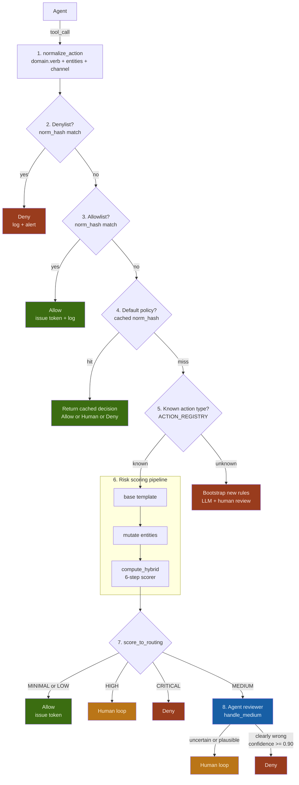
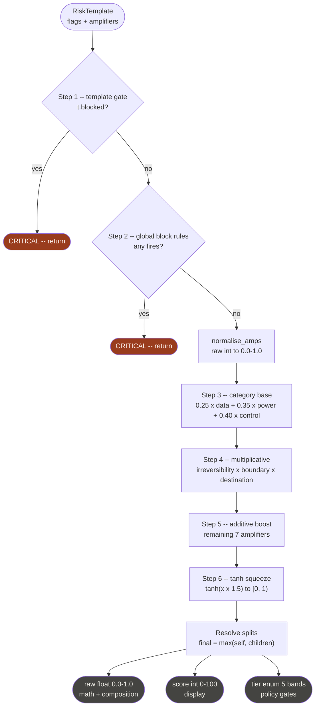

# permit0 — Agent Safety & Permission Framework

## Table of Contents

1. [Introduction](#1-introduction)
2. [System Architecture](#2-system-architecture)
3. [Data Structures](#3-data-structures)
4. [Action Catalog](#4-action-catalog)
5. [Risk Scoring Pipeline](#5-risk-scoring-pipeline)
6. [Action Registry](#6-action-registry)
7. [Worked Example](#7-worked-example)
8. [Permission Decision Mapping](#8-permission-decision-mapping)
9. [Capability Token](#9-capability-token)
10. [Learning System](#10-learning-system)
11. [Calibration Guide](#11-calibration-guide)
12. [Session-Aware Scoring](#12-session-aware-scoring)
13. [Developing](#13-developing)
14. [Agent-in-the-Loop](#14-agent-in-the-loop)

---

## 1. Introduction

### What is permit0?

permit0 is a deterministic, fine-grained permission framework for AI agents.
It intercepts every tool call an agent makes, evaluates its risk, and returns
one of four decisions: **Allow**, **Agent-in-the-loop**, **Human-in-the-loop**, or **Deny**.

### Motivation

Current agent permission systems have three critical gaps:

- **Allowlists are static.** They cannot adapt to the context of a call — the same tool behaves very differently depending on its arguments.
- **Role-based access is coarse.** A role that allows "email" cannot distinguish "send to self" from "forward classified data externally".
- **Natural language policies are non-deterministic.** Asking an LLM to judge permissions produces inconsistent results across runs.

permit0 solves this with a **deterministic, rule-based risk pipeline** that converts raw tool calls into structured risk scores, then maps scores to permission decisions through explicit, auditable thresholds.

### Goals

- Every tool call is assessed against a **structured risk score**, not a natural language policy.
- Risk is computed from **two sources**: static flag weights (what kind of action is this?) and contextual amplifiers (how bad is this instance?).
- Adding a new action type requires **one class** — nothing else changes.
- All decisions are **logged and cacheable**. Human approvals become training data that improves future automation.
- The system is **composable**: a custom allowlist always wins; cached decisions are reused; the risk engine is the fallback.

### Non-Goals

- permit0 does not generate natural language policies.
- It does not make final allow/block decisions autonomously — it produces a tier; the host system decides what to do with it.
- Risk scores are calibrated heuristics, not probabilities. Do not interpret `score=72` as "72% chance of harm".

### Glossary

| Term              | Meaning                                                           |
|-------------------|-------------------------------------------------------------------|
| Raw action        | The verbatim tool call payload from the agent                     |
| Normalized action | Structured representation: action_type, verb, channel, entities   |
| Risk template     | Mutable intermediate: flags + amplifiers, before scoring          |
| Risk flag         | Categorical risk label (e.g. OUTBOUND, DESTRUCTION)               |
| Amplifier         | Continuous dimension that scales risk (e.g. sensitivity)          |
| RiskScore         | Output: raw float, display int, tier enum, flags, reason          |
| Tier              | One of five bands: MINIMAL LOW MEDIUM HIGH CRITICAL               |
| Permission        | One of four decisions: Allow / Agent-loop / Human-loop / Deny     |
| Hard block        | A gate() call that forces CRITICAL regardless of score            |
| Split             | A child assessment scored independently; score = max(self, child) |

---

## 2. System Architecture

### End-to-End Pipeline



```python
from __future__ import annotations
import hashlib, json
from dataclasses import dataclass, field as dc_field
from enum import IntEnum
from typing import Callable


# ── Permission enum ───────────────────────────────────────────────────────────
# These are the three FINAL outcomes visible to the caller.
# AGENT is an internal routing state, never returned externally.

class Permission(str):
    ALLOW  = "allow"               # execute, issue capability token
    HUMAN  = "human_in_the_loop"   # surface to human operator
    DENY   = "deny"                # block unconditionally

# Internal routing only — never returned from get_permission()
class _Routing(str):
    AGENT = "agent_review"         # route to agent reviewer pipeline


# ── Lists and policy cache ────────────────────────────────────────────────────
# All three are keyed on norm_hash (normalized action hash), not raw tool_call_hash.
# This makes them tool-agnostic: the same policy applies whether the action
# arrives via bash, API, or any other surface.

_denylist:        dict[str, str] = {}   # norm_hash → reason string
_allowlist:       dict[str, str] = {}   # norm_hash → permission string (always ALLOW)
_policy_cache:    dict[str, str] = {}   # norm_hash → cached permission decision


def _hash(obj) -> str:
    return hashlib.sha256(json.dumps(obj, sort_keys=True).encode()).hexdigest()[:16]


def get_permission(
    tool_call:  dict,
    db,
    org_domain: str = "",
    task_goal:  str = "",
    session:    "SessionContext | None" = None,
) -> str:
    """
    Main entry point. Returns one of: allow | human_in_the_loop | deny.

    Pipeline order:
      1. normalize_action      -- always first; everything downstream is tool-agnostic
      2. denylist check        -- hard block, no further evaluation
      3. allowlist check       -- hard allow, no scoring needed
      4. default policy cache  -- stored decision for this norm_action pattern
      5. ACTION_REGISTRY check -- bootstrap if action type is unknown
      6. risk scoring          -- base → mutate → compute_hybrid
      7. score_to_routing      -- ALLOW | HUMAN | DENY | _AGENT
      8. agent reviewer        -- only for MEDIUM; resolves to ALLOW | HUMAN | DENY
    """
    # ── Step 1: Normalize ─────────────────────────────────────────────────────
    # Always happens first. Lists and cache operate on norm_hash, not raw
    # tool_call_hash, so the same policy applies across all execution surfaces.
    norm      = normalize_action(tool_call, org_domain=org_domain)
    norm_hash = _hash(norm)
    action_type = norm.get("action_type", "unknown.unclassified")

    # ── Step 2: Denylist ──────────────────────────────────────────────────────
    # Checked before allowlist — deny always wins.
    if norm_hash in _denylist:
        reason = _denylist[norm_hash]
        db.log(tool_call, Permission.DENY, norm=norm, source="denylist",
               block_reason=reason)
        return Permission.DENY

    # ── Step 3: Allowlist ─────────────────────────────────────────────────────
    if norm_hash in _allowlist:
        db.log(tool_call, Permission.ALLOW, norm=norm, source="allowlist")
        return Permission.ALLOW

    # ── Step 4: Default policy cache ─────────────────────────────────────────
    # A cached decision represents a previously computed (or human-set) policy
    # for this normalized action pattern. Hit = skip scoring entirely.
    if norm_hash in _policy_cache:
        decision = _policy_cache[norm_hash]
        db.log(tool_call, decision, norm=norm, source="policy_cache")
        return decision

    # ── Step 5: Unknown action type → bootstrap ───────────────────────────────
    if action_type not in ACTION_REGISTRY:
        decision = create_new_rules(tool_call, norm, db)
        return decision

    # ── Step 6: Risk scoring ──────────────────────────────────────────────────
    entities = {**norm.get("entities", {})}
    entities["org_domain"]  = org_domain
    entities["environment"] = entities.get("environment", "production")
    if session:
        entities["_session"]    = session
    if task_goal:
        entities["_task_goal"]  = task_goal

    risk_score = assess(action_type, entities, session=session)

    # ── Step 7: Map score → routing ───────────────────────────────────────────
    routing = score_to_routing(risk_score.tier, risk_score.blocked)

    # ── Step 8: Agent reviewer (MEDIUM only) ──────────────────────────────────
    if routing == _Routing.AGENT:
        decision, token = handle_medium(
            tool_call=tool_call,
            norm_action=norm,
            risk_score=risk_score,
            task_goal=task_goal,
            session=session,
            db=db,
        )
        _policy_cache[norm_hash] = decision
        return decision

    # ── Steps 7 direct: ALLOW, HUMAN, DENY ───────────────────────────────────
    decision = routing
    db.log(tool_call, decision, norm=norm, risk_score=risk_score, source="scorer")
    _policy_cache[norm_hash] = decision
    return decision


def score_to_routing(tier: "Tier", blocked: bool = False) -> str:
    """
    Map a scorer tier to a routing decision.
    Returns one of: Permission.ALLOW | Permission.HUMAN | Permission.DENY
                    | _Routing.AGENT (internal -- triggers agent reviewer)
    """
    if blocked or tier == Tier.CRITICAL:
        return Permission.DENY
    if tier == Tier.HIGH:
        return Permission.HUMAN
    if tier == Tier.MEDIUM:
        return _Routing.AGENT       # internal routing, not a final permission
    return Permission.ALLOW         # MINIMAL or LOW


def tier_to_permission(tier: "Tier", blocked: bool = False) -> str:
    """Convenience alias -- returns a final Permission, never _Routing.AGENT."""
    r = score_to_routing(tier, blocked)
    return Permission.HUMAN if r == _Routing.AGENT else r


def create_new_rules(tool_call: dict, norm: dict, db) -> str:
    """
    Bootstrap rules for a completely unknown tool.
    Every LLM output is gated by human review before persisting.
    """
    # Steps 1–2: normalize (already done) → human review
    reviewed_norm = db.human_review("norm_action", norm)
    db.save("norm_action", reviewed_norm)

    # Step 3: LLM generates risk rules → human review
    risk_rules = llm_generate_risk_rules(reviewed_norm)
    reviewed_rules = db.human_review("risk_rules", risk_rules)
    db.save("risk_rules", reviewed_rules)

    # Step 4: score → human review
    risk_score = score_from_rules(reviewed_rules, reviewed_norm)
    reviewed_score = db.human_review("risk_score", risk_score)

    # Step 5: derive permission → human review
    permission = tier_to_permission(reviewed_score.tier, reviewed_score.blocked)
    final_permission = db.human_review("permission", permission)
    db.save("permission", final_permission)

    return final_permission


def llm_generate_risk_rules(norm: dict) -> dict:
    """Stub — replace with real LLM call."""
    return {}


def score_from_rules(rules: dict, norm: dict) -> "RiskScore":
    """Stub — replace with rule-based scorer once rules are reviewed."""
    return to_risk_score(0.5, [], "bootstrapped from LLM rules")
```

### Permission Decisions

Three final permissions, one internal routing state, two pre-scoring overrides.

| Decision | Source | Condition |
|---|---|---|
| **Deny** | Denylist | norm_hash in denylist — checked first, always wins |
| **Allow** | Allowlist | norm_hash in allowlist — skips scoring entirely |
| **Allow / Human / Deny** | Policy cache | Stored decision for this norm pattern — skips scoring |
| **Allow** | Scorer | Tier MINIMAL or LOW |
| **Human** | Scorer | Tier HIGH |
| **Deny** | Scorer | Tier CRITICAL or blocked |
| **Human** | Agent reviewer | Uncertain, plausible, or confidence < 0.90 |
| **Deny** | Agent reviewer | Clearly wrong, confidence >= 0.90, grounded reason |

The agent reviewer **never produces Allow** and **never issues tokens**. It is a skeptical gate: Human or Deny only. Allow comes from the scorer (MINIMAL/LOW) or from human review. `_Routing.AGENT` triggers `handle_medium()` which resolves to Human or Deny.

---

## 3. Data Structures

### Output Types

```python
class Tier(IntEnum):
    MINIMAL  = 0   # raw < 0.15  → Allow (direct)
    LOW      = 1   # raw < 0.35  → Allow (direct)
    MEDIUM   = 2   # raw < 0.55  → Agent reviewer → Human | Deny only
    HIGH     = 3   # raw < 0.75  → Human-in-the-loop (direct)
    CRITICAL = 4   # raw >= 0.75 → Deny (direct)


@dataclass
class RiskScore:
    raw:          float        # 0.0–1.0  — use for math / composition
    score:        int          # 0–100    — use for display
    tier:         Tier         #          — use for policy gates
    flags:        list[str]    # which risk flags fired
    reason:       str          # human-readable explanation
    blocked:      bool       = False
    block_reason: str | None = None


TIER_THRESHOLDS: list[tuple[float, Tier]] = [
    (0.15, Tier.MINIMAL),
    (0.35, Tier.LOW),
    (0.55, Tier.MEDIUM),
    (0.75, Tier.HIGH),
    (1.00, Tier.CRITICAL),
]


def to_risk_score(
    raw: float,
    flags: list[str],
    reason: str = "",
    *,
    blocked: bool = False,
    block_reason: str | None = None,
) -> RiskScore:
    raw   = max(0.0, min(1.0, raw))
    score = int(round(raw * 100))
    tier  = next(t for ceiling, t in TIER_THRESHOLDS if raw <= ceiling)
    if blocked:
        tier  = Tier.CRITICAL
        score = 100
        raw   = 1.0
    return RiskScore(
        raw=round(raw, 4), score=score, tier=tier,
        flags=flags, reason=reason,
        blocked=blocked, block_reason=block_reason,
    )
```

### Normalized Action

A structured, tool-agnostic representation of what the action *means*.
This is the stable key used for risk rule lookup and caching.

| Field | Type | Description |
|---|---|---|
| action_type | string | Canonical `domain.verb` identifier. Primary key for risk rules |
| domain | string | Top-level action category (e.g. `email`, `files`, `payments`) |
| verb | string | Core intent (e.g. `send`, `delete`, `read`) |
| channel | string | Provider / integration (e.g. `gmail`, `slack`, `stripe`) |
| entities | object | Semantic parameters: recipient, scope, payload, etc. |
| execution | object | Surface tool and raw command (for audit) |

```python
import re


def normalize_action(tool_call: dict, org_domain: str = "") -> dict:
    """
    Convert a raw tool call into a normalized action.
    In production this is LLM-assisted + human-reviewed.
    This implementation covers the bash/gmail pattern deterministically.
    """
    tool    = tool_call.get("tool", "")
    args    = tool_call.get("arguments", {})
    command = args.get("command", "")

    # ── gmail send via bash ───────────────────────────────────────────────────
    if tool == "bash" and "gmail send" in command:
        to      = _extract_flag(command, "--to")
        subject = _extract_flag(command, "--subject")
        body    = _extract_flag(command, "--body")
        recip_scope = _recipient_scope(to, org_domain)
        return {
            "action_type": "email.send",
            "domain":      "email",
            "verb":        "send",
            "channel":     "gmail",
            "entities": {
                "object":           "email",
                "recipient":        to,
                "recipient_scope":  recip_scope,
                "subject":          subject,
                "has_body":         bool(body),
                "has_attachments":  False,
                "body":             body,
            },
            "execution": {
                "surface_tool":    tool,
                "surface_command": command,
            },
        }

    # ── generic bash fallback ─────────────────────────────────────────────────
    if tool == "bash":
        return {
            "action_type": "process.shell",
            "domain":      "process",
            "verb":        "shell",
            "channel":     "bash",
            "entities":    {"command": command},
            "execution":   {"surface_tool": tool, "surface_command": command},
        }

    # ── unknown ───────────────────────────────────────────────────────────────
    return {
        "action_type": "unknown.unclassified",
        "domain":      "unknown",
        "verb":        "unclassified",
        "channel":     tool,
        "entities":    args,
        "execution":   {"surface_tool": tool, "surface_command": str(args)},
    }


def _extract_flag(command: str, flag: str) -> str:
    m = re.search(rf'{re.escape(flag)}\s+"?([^"]+)"?', command)
    return m.group(1).strip() if m else ""


def _recipient_scope(recipient: str, org_domain: str) -> str:
    if not recipient:
        return "external"
    domain = recipient.split("@")[-1].lower() if "@" in recipient else ""
    if not domain:
        return "external"
    if org_domain and domain == org_domain.lower():
        return "internal"
    return "external"
```

---

## 4. Action Catalog

Every action is identified by a `domain.verb` string.
    
| Domain   | Verbs                                                                                                                        |
|----------|------------------------------------------------------------------------------------------------------------------------------|
| email    | search, get_thread, send, reply, forward, draft, label, archive, delete                                                      |
| messages | send, post_channel, send_dm, search, react, delete                                                                           |
| content  | post_social, update_cms, send_newsletter                                                                                     |
| calendar | list_events, get_event, create_event, update_event, delete_event, rsvp                                                       |
| tasks    | create, assign, complete, update, delete, comment                                                                            |
| files    | list, read, write, delete, move, copy, share, upload, download, export                                                       |
| db       | select, insert, update, delete, admin, export, backup                                                                        |
| crm      | search_contacts, get_contact, create_contact, update_contact, delete_contact, create_deal, update_deal, log_activity, export |
| payments | charge, refund, transfer, get_balance, list_transactions, create_invoice, update_payment_method, create_subscription         |
| legal    | sign_document, submit_filing, accept_terms                                                                                   |
| iam      | list_users, create_user, update_user, delete_user, assign_role, revoke_role, reset_password, generate_api_key                |
| secrets  | read, create, rotate                                                                                                         |
| infra    | list_resources, create_resource, modify_resource, terminate_resource, scale, modify_network                                  |
| process  | shell, run_script, docker_run, lambda_invoke                                                                                 |
| network  | http_get, http_post, webhook_send                                                                                            |
| dev      | get_repo, list_issues, create_issue, create_pr, merge_pr, push_code, deploy, run_pipeline, create_release                    |
| browser  | navigate, click, fill_form, submit_form, screenshot, download, execute_js                                                    |
| device   | unlock, lock, camera_enable, camera_disable, move                                                                            |
| ai       | prompt, embed, fine_tune                                                                                                     |
| unknown  | unclassified                                                                                                                 |

### Default Risk Tier by Verb

| Verb pattern              | Default tier  | Rationale                             |
|---------------------------|---------------|---------------------------------------|
| list, search, get, read   | MINIMAL–LOW   | Read-only, no state change            |
| create, draft, comment    | LOW–MEDIUM    | Additive, usually reversible          |
| send, post, reply         | MEDIUM        | Outbound, irreversible once delivered |
| update, edit, move, copy  | MEDIUM        | Mutation, scope-dependent             |
| delete, archive, revoke   | MEDIUM–HIGH   | Destructive, often irreversible       |
| forward, export, share    | HIGH          | Outbound + potential data leakage     |
| deploy, run, exec, shell  | HIGH          | Execution risk                        |
| charge, transfer, sign    | HIGH–CRITICAL | Financial or legal consequence        |
| terminate, drop, purge    | CRITICAL      | Irreversible destruction              |
| assign_role, generate_key | HIGH          | Privilege escalation                  |

---

## 5. Risk Scoring Pipeline

### Risk Flags

```python
# Per-flag base weights (fractions of 1.0).
# NOT a probability distribution — multiple flags can fire simultaneously.
# Calibration question: "if only this flag fired with no amplifiers,
# what fraction of maximum risk does it represent?"
RISK_WEIGHTS: dict[str, float] = {
    #  Flag             Weight   Category   Rationale
    "DESTRUCTION":      0.28,  # Power      Catastrophic, hard to undo
    "PHYSICAL":         0.26,  # Control    Real-world effects, hardest to reverse
    "EXECUTION":        0.22,  # Control    Arbitrary code — a force multiplier
    "PRIVILEGE":        0.20,  # Power      Cascades to everything else
    "FINANCIAL":        0.20,  # Power      Direct liability
    "EXPOSURE":         0.16,  # Data       Severity depends on what is exposed
    "GOVERNANCE":       0.14,  # Control    Important but often recoverable
    "OUTBOUND":         0.10,  # Data       Risky but common; context matters most
    "MUTATION":         0.10,  # Data       Often reversible, scope-dependent
}

# Flag categories and their scorer weights.
# Control risks weighted most heavily — loss of safety mechanisms.
CATEGORIES: dict[str, dict] = {
    "data": {
        "flags":  ["OUTBOUND", "EXPOSURE", "MUTATION"],
        "amps":   ["sensitivity", "scope", "destination", "volume"],
        "weight": 0.25,
    },
    "power": {
        "flags":  ["DESTRUCTION", "PRIVILEGE", "FINANCIAL"],
        "amps":   ["amount", "irreversibility", "boundary", "environment"],
        "weight": 0.35,
    },
    "control": {
        "flags":  ["EXECUTION", "PHYSICAL", "GOVERNANCE"],
        "amps":   ["actor", "session", "scope", "environment"],
        "weight": 0.40,
    },
}
```

### Amplifier Dimensions

```python
# AMP_WEIGHTS is a budget — MUST sum to exactly 1.0.
# Raising one entry requires lowering another.
AMP_WEIGHTS: dict[str, float] = {
    "destination":     0.155,  # Where data/action is going — largest share
    "sensitivity":     0.136,  # How sensitive the data is
    "scope":           0.136,  # Breadth of impact
    "amount":          0.117,  # Financial or quantitative magnitude
    "session":         0.097,  # Persistence across sessions
    "irreversibility": 0.097,  # Inability to undo
    "volume":          0.078,  # Scale / frequency
    "boundary":        0.078,  # Crossing trust boundaries
    "actor":           0.058,  # Who is performing the action
    "environment":     0.048,  # Prod > staging > test > dev
}
assert abs(sum(AMP_WEIGHTS.values()) - 1.0) < 1e-9, "AMP_WEIGHTS must sum to 1.0"

# Raw integer ceilings — used only for normalisation.
AMP_MAXES: dict[str, int] = {
    "sensitivity":     35,
    "scope":           35,
    "boundary":        20,
    "amount":          30,
    "actor":           20,
    "destination":     40,
    "session":         30,
    "volume":          25,
    "irreversibility": 20,
    "environment":     15,
}


def normalise_amps(amplifiers: dict[str, int]) -> dict[str, float]:
    """Convert raw integer amplifier inputs → 0.0–1.0 per dimension."""
    return {
        dim: max(0.0, min(amplifiers.get(dim, 0) / AMP_MAXES[dim], 1.0))
        for dim in AMP_WEIGHTS
    }
```

### Risk Template and Mutation API

```python
@dataclass
class RiskTemplate:
    flags:        dict[str, str]        # flag → "primary" | "secondary"
    amplifiers:   dict[str, int]        # dimension → raw integer value
    blocked:      bool       = False
    block_reason: str | None = None
    children:     list["RiskTemplate"] = dc_field(default_factory=list)

    # ── Mutation API ──────────────────────────────────────────────────────────
    # The ONLY way to modify a template. Never write to flags/amplifiers directly.

    def add(self, flag: str, role: str = "primary") -> None:
        """Add a flag if not already present."""
        if flag not in self.flags:
            self.flags[flag] = role

    def remove(self, flag: str) -> None:
        """Remove a flag entirely."""
        self.flags.pop(flag, None)

    def promote(self, flag: str) -> None:
        """Upgrade flag role: secondary → primary."""
        if flag in self.flags:
            self.flags[flag] = "primary"

    def demote(self, flag: str) -> None:
        """Downgrade flag role: primary → secondary."""
        if flag in self.flags:
            self.flags[flag] = "secondary"

    def upgrade(self, dim: str, delta: int) -> None:
        """Increase an amplifier, capped at AMP_MAXES ceiling."""
        self.amplifiers[dim] = min(
            self.amplifiers.get(dim, 0) + delta,
            AMP_MAXES[dim],
        )

    def downgrade(self, dim: str, delta: int) -> None:
        """Decrease an amplifier, floored at 0."""
        self.amplifiers[dim] = max(self.amplifiers.get(dim, 0) - delta, 0)

    def override(self, dim: str, value: int) -> None:
        """Set an amplifier to an exact value (clamped to valid range)."""
        self.amplifiers[dim] = max(0, min(value, AMP_MAXES[dim]))

    def gate(self, reason: str) -> None:
        """Hard block — marks template as blocked regardless of score."""
        self.blocked      = True
        self.block_reason = reason

    def split(self, child: "RiskTemplate") -> None:
        """
        Fork an independent child risk assessment.
        compute_hybrid scores all children; final = max(self, children).
        """
        self.children.append(child)
```

### Hard Block Rules

```python
@dataclass
class BlockRule:
    name:      str
    # Receives (active_flags, normalised_amps) — NOT raw integers.
    # Thresholds are 0.0–1.0 so they are range-independent.
    condition: Callable[[list[str], dict[str, float]], bool]
    reason:    str


BLOCK_RULES: list[BlockRule] = [
    BlockRule(
        name="irreversible_destruction",
        condition=lambda flags, norm: (
            "DESTRUCTION" in flags
            and norm.get("irreversibility", 0.0) >= 0.90        # ≥ 18/20
        ),
        reason="Irreversible destruction exceeds tolerable threshold",
    ),
    BlockRule(
        name="financial_exfiltration",
        condition=lambda flags, norm: (
            "FINANCIAL" in flags
            and "OUTBOUND" in flags
            and norm.get("amount", 0.0)      >= 0.83            # ≥ 25/30
            and norm.get("destination", 0.0) >= 0.75            # ≥ 30/40
        ),
        reason="High-value outbound financial movement to untrusted destination",
    ),
    BlockRule(
        name="privileged_prod_execution",
        condition=lambda flags, norm: (
            "EXECUTION" in flags
            and "PRIVILEGE" in flags
            and norm.get("environment", 0.0) >= 0.80            # ≥ 12/15
            and norm.get("scope", 0.0)       >= 0.80            # ≥ 28/35
        ),
        reason="Arbitrary execution with elevated privilege in production scope",
    ),
    BlockRule(
        name="governance_trust_boundary",
        condition=lambda flags, norm: (
            "GOVERNANCE" in flags
            and norm.get("boundary", 0.0) >= 0.90               # ≥ 18/20
        ),
        reason="Rule-change crossing a high trust boundary",
    ),
    BlockRule(
        name="classified_external_send",
        condition=lambda flags, norm: (
            "OUTBOUND" in flags
            and "EXPOSURE" in flags
            and norm.get("sensitivity", 0.0) >= 0.94            # ≥ 33/35
            and norm.get("destination", 0.0) >= 0.75            # ≥ 30/40
        ),
        reason="Highly sensitive data sent to untrusted external destination",
    ),
]
```

### Hybrid Scorer

Steps 1–2 are gates that return CRITICAL immediately. Steps 3–5 compute the score in three layers. Step 6 squeezes to `[0, 1)`. Splits are resolved last by taking `max(self, children)`.



```python
import math

MULTIPLICATIVE_DIMS = {"irreversibility", "boundary", "destination"}
ADDITIVE_DIMS       = {d for d in AMP_WEIGHTS if d not in MULTIPLICATIVE_DIMS}


def _category_raw(
    active_flags: list[str],
    norm: dict[str, float],
    cfg: dict,
) -> float:
    """Score a single flag category against its relevant amplifiers."""
    base = sum(RISK_WEIGHTS[f] for f in active_flags if f in cfg["flags"])
    if base == 0.0:
        return 0.0
    cat_w   = {d: AMP_WEIGHTS[d] for d in cfg["amps"]}
    cat_sum = sum(cat_w.values())
    amp     = sum((w / cat_sum) * norm[d] for d, w in cat_w.items())
    return base * (1.0 + amp) / 2.0     # centred so max(base+amp) ≈ 1


def compute_hybrid(t: RiskTemplate) -> RiskScore:
    """Score a (possibly mutated) RiskTemplate — see diagram above for steps."""
    active_flags = list(t.flags.keys())
    norm         = normalise_amps(t.amplifiers)

    # Step 1 — template-level gate
    if t.blocked:
        return to_risk_score(
            1.0, active_flags,
            t.block_reason or "blocked by template gate",
            blocked=True, block_reason=t.block_reason,
        )

    # Step 2 — global block rules
    for rule in BLOCK_RULES:
        if rule.condition(active_flags, norm):
            return to_risk_score(
                1.0, active_flags, rule.reason,
                blocked=True, block_reason=rule.reason,
            )

    # Step 3 — category-weighted base
    base = sum(
        cfg["weight"] * _category_raw(active_flags, norm, cfg)
        for cfg in CATEGORIES.values()
    )

    # Step 4 — multiplicative compound for high-stakes dims
    # These three compound in reality: all three bad is far worse than any one.
    compound = 1.0
    for dim in MULTIPLICATIVE_DIMS:
        compound *= (1.0 + AMP_WEIGHTS[dim] * norm[dim])

    # Step 5 — additive boost from remaining dims
    add_boost = sum(AMP_WEIGHTS[d] * norm[d] for d in ADDITIVE_DIMS)

    intermediate = base * compound * (1.0 + add_boost)

    # Step 6 — tanh squeeze: maps [0, ∞) → [0, 1), with diminishing returns.
    # Constant 1.5 is a sensitivity knob — tune via calibration.
    raw = math.tanh(intermediate * 1.5)

    reason = (
        f"flags={active_flags}, base={base:.3f}, "
        f"compound={compound:.3f}, add_boost={add_boost:.3f}"
    )
    score = to_risk_score(raw, active_flags, reason)

    # Resolve splits: final score = max(self, all children)
    for child in t.children:
        child_score = compute_hybrid(child)
        if child_score.raw > score.raw:
            score = child_score

    return score
```

---

## 6. Action Registry

A raw tool call travels through the registry into a scored template. `mutate()` is the only place that reads entity field names. Two special operations branch off before the scorer: `gate()` for hard blocks and `split()` for independent child assessments.

```mermaid
flowchart TD
    RAW([Raw action<br/>tool + arguments]) --> NORM[normalize_action<br/>domain.verb + entities]
    NORM --> REG[ACTION_REGISTRY lookup<br/>action_type to base + mutate]

    REG -->|registered| BASE[base()<br/>structural minimum template]
    REG -->|unknown| BOOT([Bootstrap<br/>human review])

    BASE --> MUT[mutate(entities, t)<br/>field-driven rules]

    MUT -->|gate fires| BLOCK([CRITICAL<br/>return immediately])
    MUT -->|split fires| CHILD[Child template<br/>score independently<br/>final = max(self, child)]
    MUT --> TMPL[Mutated RiskTemplate<br/>flags + amplifiers]

    TMPL --> SCORER[compute_hybrid(t)<br/>6-step scorer]
    SCORER --> RS([RiskScore])
    RS --> PERM[tier_to_permission()]

    PERM --> AL([Allow])
    PERM --> AG([Agent loop])
    PERM --> HU([Human loop])
    PERM --> DN([Deny])

    style BLOCK fill:#993C1D,color:#FAECE7
    style BOOT fill:#993C1D,color:#FAECE7
    style AL fill:#3B6D11,color:#EAF3DE
    style AG fill:#185FA5,color:#E6F1FB
    style HU fill:#BA7517,color:#FAEEDA
    style DN fill:#993C1D,color:#FAECE7
```

```python
ActionHandler = tuple[
    Callable[[], RiskTemplate],                    # base_fn
    Callable[[dict, RiskTemplate], None],          # mutate_fn
]

ACTION_REGISTRY: dict[str, ActionHandler] = {}


def register(action_type: str):
    """Decorator — @register("email.send") maps action_type to (base, mutate)."""
    def decorator(cls):
        ACTION_REGISTRY[action_type] = (cls.base, cls.mutate)
        return cls
    return decorator


def assess(action_type: str, fields: dict) -> RiskScore:
    """
    Main scoring entry point.
    fields is the entities dict from the normalized action,
    plus org_domain and environment at the top level.
    """
    if action_type not in ACTION_REGISTRY:
        raise ValueError(
            f"Unknown action type: {action_type!r}. "
            f"Registered: {sorted(ACTION_REGISTRY)}"
        )
    base_fn, mutate_fn = ACTION_REGISTRY[action_type]
    t = base_fn()
    mutate_fn(fields, t)
    return compute_hybrid(t)


# ── Shared helpers ────────────────────────────────────────────────────────────

def _domain_of(email: str) -> str:
    return email.split("@")[-1].lower() if "@" in email else ""

def _contains_any(text: str, patterns: set[str]) -> bool:
    t = text.lower()
    return any(p in t for p in patterns)

def _env_mutations(fields: dict, t: RiskTemplate) -> None:
    env = fields.get("environment", "")
    if env == "production":
        t.override("environment", 15)
    elif env in ("test", "staging", "dev"):
        t.override("environment", 3)
```

### email.send

```python
@register("email.send")
class EmailSend:

    @staticmethod
    def base() -> RiskTemplate:
        return RiskTemplate(
            flags={
                "OUTBOUND": "primary",    # every send crosses a boundary
                "EXPOSURE": "primary",    # surfaces sender identity and content
                "MUTATION": "secondary",  # leaves a record (sent folder, logs)
            },
            amplifiers={
                "irreversibility": 16,   # cannot be recalled once sent
                "boundary":        12,   # crosses at least one trust boundary
                "destination":     20,   # unknown until recipient is seen
                "sensitivity":     10,   # unknown until content is seen
                "environment":     10,   # assumed production until stated
                "session":          8,
                "actor":            5,
                "scope":            5,
                "volume":           3,
                "amount":           0,
            },
        )

    @staticmethod
    def mutate(fields: dict, t: RiskTemplate) -> None:
        scope       = fields.get("recipient_scope", "external")
        body        = fields.get("body", "")
        subject     = fields.get("subject", "")
        attachments = fields.get("attachments", [])
        n_recipients = fields.get("recipient_count", 1)
        send_rate   = fields.get("send_rate_per_minute", 0)

        FINANCIAL_PATTERNS  = {"invoice", "wire", "payment", "account number", "routing number"}
        CREDENTIAL_PATTERNS = {"password", "secret", "api key", "token", "private key"}

        # ── Recipient scope ───────────────────────────────────────────────────
        if scope == "self":
            t.remove("EXPOSURE")
            t.downgrade("boundary", 10)
            t.downgrade("destination", 12)
        elif scope == "internal":
            t.downgrade("destination", 12)
            t.downgrade("boundary", 6)
        else:  # external
            t.upgrade("destination", 14)

        # ── Reply context ─────────────────────────────────────────────────────
        if fields.get("in_reply_to"):
            t.downgrade("boundary", 5)

        # ── Attachments ───────────────────────────────────────────────────────
        if attachments:
            t.upgrade("sensitivity", 12)

        if any(a.get("classification") in ("confidential", "secret")
               for a in attachments):
            t.gate("Classified attachment to external or unknown recipient")
            return   # no further mutations after a gate

        # ── Body / subject content ────────────────────────────────────────────
        full_text = f"{subject} {body}"
        if _contains_any(full_text, FINANCIAL_PATTERNS):
            t.add("FINANCIAL")
            t.upgrade("amount", 18)

        if _contains_any(full_text, CREDENTIAL_PATTERNS):
            t.upgrade("sensitivity", 20)
            t.promote("EXPOSURE")

        # ── Recipient count ───────────────────────────────────────────────────
        if n_recipients > 50:
            t.upgrade("scope", 25)
            t.add("GOVERNANCE", "secondary")
        elif n_recipients > 10:
            t.upgrade("scope", 12)

        # ── Send rate ─────────────────────────────────────────────────────────
        if send_rate > 10:
            t.upgrade("volume", 18)
            t.add("EXECUTION", "secondary")

        # ── Forward leakage ───────────────────────────────────────────────────
        org = fields.get("org_domain", "")
        if (
            fields.get("is_forward")
            and org
            and fields.get("original_sender_domain", "") == org
            and scope == "external"
        ):
            child = EmailSend.base()
            child.upgrade("destination", 20)
            child.upgrade("sensitivity", 15)
            child.add("EXPOSURE")
            child.upgrade("irreversibility", 4)
            t.split(child)

        _env_mutations(fields, t)
```

### email.forward

```python
@register("email.forward")
class EmailForward:

    @staticmethod
    def base() -> RiskTemplate:
        # Higher base than email.send — original content is re-exposed
        t = EmailSend.base()
        t.override("destination", 28)
        t.override("sensitivity", 18)
        return t

    @staticmethod
    def mutate(fields: dict, t: RiskTemplate) -> None:
        # All email.send mutations apply
        EmailSend.mutate(fields, t)

        # Plus: internal→external forward is the canonical leakage vector
        org   = fields.get("org_domain", "")
        scope = fields.get("recipient_scope", "external")
        orig_domain = fields.get("original_sender_domain", "")

        if org and orig_domain == org and scope == "external":
            t.upgrade("destination", 14)
            t.upgrade("sensitivity", 10)
            t.add("GOVERNANCE", "secondary")
```

### process.shell

```python
@register("process.shell")
class ProcessShell:

    DESTRUCTIVE = {"rm -rf", "drop table", "shred", "mkfs", "truncate"}
    NETWORK_OUT = {"curl", "wget", "scp", "rsync", " nc ", "ncat", "ssh "}
    PRIVILEGE   = {"sudo", "su ", "chmod 777", "chown root", "setuid"}
    SENSITIVE   = {"password", "secret", "token", "private_key", "credentials"}
    FINANCIAL   = {"stripe", "payment", "invoice", "wire", "transfer"}

    @staticmethod
    def base() -> RiskTemplate:
        return RiskTemplate(
            flags={
                "EXECUTION": "primary",   # arbitrary shell logic always runs
                "MUTATION":  "primary",   # filesystem or process state may change
            },
            amplifiers={
                "irreversibility": 10,
                "boundary":         8,
                "destination":      5,
                "sensitivity":      8,
                "environment":     10,
                "session":         10,
                "actor":            8,
                "scope":           10,
                "volume":           5,
                "amount":           0,
            },
        )

    @staticmethod
    def mutate(fields: dict, t: RiskTemplate) -> None:
        command = fields.get("command", "").lower()

        if _contains_any(command, ProcessShell.DESTRUCTIVE):
            t.add("DESTRUCTION")
            t.upgrade("irreversibility", 10)

        if _contains_any(command, ProcessShell.NETWORK_OUT):
            t.add("OUTBOUND")
            t.upgrade("destination", 15)
            t.upgrade("boundary", 8)

        if _contains_any(command, ProcessShell.PRIVILEGE):
            t.add("PRIVILEGE")
            t.upgrade("scope", 15)
            t.upgrade("actor", 10)

        if _contains_any(command, ProcessShell.SENSITIVE):
            t.add("EXPOSURE")
            t.upgrade("sensitivity", 20)

        if _contains_any(command, ProcessShell.FINANCIAL):
            t.add("FINANCIAL")
            t.upgrade("amount", 15)

        # Chained commands have harder-to-predict blast radius
        pipe_count = command.count("|") + command.count(";") + command.count("&&")
        if pipe_count >= 3:
            t.upgrade("scope", 8)
            t.upgrade("irreversibility", 4)

        if fields.get("environment") == "production":
            t.override("environment", 15)
            t.upgrade("scope", 8)   # prod multiplies blast radius
        elif fields.get("environment") in ("test", "staging", "dev"):
            t.override("environment", 3)
```

### files.write

```python
@register("files.write")
class FilesWrite:

    SYSTEM_PATHS   = {"/etc/", "/bin/", "/usr/", "/boot/", "/sys/", "/proc/"}
    SENSITIVE_KEYS = {"password", "secret", "token", "api_key", "private_key"}

    @staticmethod
    def base() -> RiskTemplate:
        return RiskTemplate(
            flags={"MUTATION": "primary"},
            amplifiers={
                "irreversibility":  8,
                "boundary":         4,
                "destination":      8,
                "sensitivity":      8,
                "environment":     10,
                "session":          5,
                "actor":            5,
                "scope":            8,
                "volume":           5,
                "amount":           0,
            },
        )

    @staticmethod
    def mutate(fields: dict, t: RiskTemplate) -> None:
        path    = fields.get("path", "").lower()
        content = fields.get("content", "").lower()
        mode    = fields.get("mode", "write")

        if any(path.startswith(sp) for sp in FilesWrite.SYSTEM_PATHS):
            t.add("PRIVILEGE")
            t.upgrade("scope", 20)
            t.upgrade("irreversibility", 8)

        if mode in ("delete", "overwrite"):
            t.add("DESTRUCTION", "secondary")
            t.upgrade("irreversibility", 8)

        if _contains_any(content, FilesWrite.SENSITIVE_KEYS):
            t.add("EXPOSURE")
            t.upgrade("sensitivity", 18)

        _env_mutations(fields, t)
```

### network.http_post

```python
@register("network.http_post")
class NetworkHttpPost:

    INTERNAL_HOSTS  = {"localhost", "127.0.0.1", "0.0.0.0", ".internal.", ".corp."}
    SENSITIVE_KEYS  = {"password", "secret", "token", "api_key", "private"}
    FINANCIAL_TERMS = {"payment", "charge", "invoice", "stripe", "wire", "transfer"}

    @staticmethod
    def base() -> RiskTemplate:
        return RiskTemplate(
            flags={"OUTBOUND": "primary"},
            amplifiers={
                "irreversibility":  6,
                "boundary":        14,
                "destination":     18,
                "sensitivity":      8,
                "environment":     10,
                "session":          8,
                "actor":            5,
                "scope":            5,
                "volume":           5,
                "amount":           0,
            },
        )

    @staticmethod
    def mutate(fields: dict, t: RiskTemplate) -> None:
        method  = fields.get("method", "POST").upper()
        url     = fields.get("url", "").lower()
        body    = fields.get("body", "")
        headers = fields.get("headers", {})

        header_str = " ".join(f"{k} {v}" for k, v in headers.items()).lower()
        body_lower = body.lower() if isinstance(body, str) else ""

        if any(h in url for h in NetworkHttpPost.INTERNAL_HOSTS):
            t.downgrade("destination", 10)
            t.downgrade("boundary", 6)
        else:
            t.upgrade("destination", 10)

        if method in ("POST", "PUT", "PATCH"):
            t.add("MUTATION")
            t.upgrade("irreversibility", 6)
        elif method == "DELETE":
            t.add("DESTRUCTION", "secondary")
            t.upgrade("irreversibility", 10)

        if _contains_any(body_lower + header_str, NetworkHttpPost.SENSITIVE_KEYS):
            t.add("EXPOSURE")
            t.upgrade("sensitivity", 18)

        if _contains_any(body_lower + url, NetworkHttpPost.FINANCIAL_TERMS):
            t.add("FINANCIAL")
            t.upgrade("amount", 20)
            t.upgrade("irreversibility", 6)

        _env_mutations(fields, t)
```

### db.delete

```python
@register("db.delete")
class DbDelete:

    SENSITIVE_TABLES = {"users", "payments", "credentials", "secrets", "tokens", "sessions"}

    @staticmethod
    def base() -> RiskTemplate:
        return RiskTemplate(
            flags={"MUTATION": "primary"},
            amplifiers={
                "irreversibility": 10,
                "boundary":         6,
                "destination":      6,
                "sensitivity":     14,   # databases often hold sensitive data
                "environment":     10,
                "session":          8,
                "actor":            5,
                "scope":           12,   # queries can touch many rows
                "volume":           5,
                "amount":           0,
            },
        )

    @staticmethod
    def mutate(fields: dict, t: RiskTemplate) -> None:
        verb      = fields.get("verb", "delete").lower()
        table     = fields.get("table", "").lower()
        query     = fields.get("query", "").upper()
        row_count = fields.get("estimated_row_count", 0)

        # Hard stop for schema-level destruction
        if "DROP" in query or "TRUNCATE" in query:
            t.gate("DROP or TRUNCATE on database table")
            return

        if verb in ("delete", "admin", "drop", "truncate"):
            t.add("DESTRUCTION")
            t.upgrade("irreversibility", 12)

        if verb == "export":
            t.add("OUTBOUND")
            t.upgrade("destination", 18)
            t.upgrade("sensitivity", 10)
            t.add("EXPOSURE", "secondary")

        if table in DbDelete.SENSITIVE_TABLES:
            if "EXPOSURE" in t.flags:
                t.promote("EXPOSURE")
            else:
                t.add("EXPOSURE")
            t.upgrade("sensitivity", 18)

        if row_count > 10_000:
            t.upgrade("scope", 20)
        elif row_count > 1_000:
            t.upgrade("scope", 10)

        _env_mutations(fields, t)
```

### payments.charge

```python
@register("payments.charge")
class PaymentsCharge:

    APPROVED_PAYEES: set[str] = set()   # populate from DB at startup

    @staticmethod
    def base() -> RiskTemplate:
        return RiskTemplate(
            flags={
                "FINANCIAL": "primary",
                "MUTATION":  "primary",
                "OUTBOUND":  "secondary",  # money leaves the account
            },
            amplifiers={
                "irreversibility": 18,   # financial txns are hard to reverse
                "boundary":        16,   # crosses financial system boundary
                "destination":     22,   # external payment endpoint
                "amount":          20,   # unknown until amount is known
                "sensitivity":     12,
                "environment":     12,
                "session":         10,
                "actor":           10,
                "scope":            5,
                "volume":           5,
            },
        )

    @staticmethod
    def mutate(fields: dict, t: RiskTemplate) -> None:
        amount    = fields.get("amount", 0)
        verb      = fields.get("verb", "charge")
        recipient = fields.get("recipient", "")

        if amount > 100_000:
            t.gate("Large financial transaction exceeds autonomous limit")
            return

        if amount > 10_000:
            t.upgrade("amount", 10)
            t.upgrade("scope", 8)

        if recipient and recipient not in PaymentsCharge.APPROVED_PAYEES:
            t.upgrade("destination", 14)
            t.upgrade("boundary", 8)

        if verb == "transfer" and fields.get("destination_is_external", True):
            t.upgrade("destination", 16)
            t.add("GOVERNANCE", "secondary")

        _env_mutations(fields, t)
```

### iam.assign_role

```python
@register("iam.assign_role")
class IamAssignRole:

    ADMIN_ROLES = {"admin", "owner", "superuser", "root", "administrator"}

    @staticmethod
    def base() -> RiskTemplate:
        return RiskTemplate(
            flags={
                "PRIVILEGE":   "primary",
                "GOVERNANCE":  "secondary",  # changing who can do what is a rule change
            },
            amplifiers={
                "irreversibility": 12,
                "boundary":        14,
                "destination":      8,
                "sensitivity":     10,
                "environment":     12,
                "session":         12,
                "actor":           14,
                "scope":           14,
                "volume":           3,
                "amount":           0,
            },
        )

    @staticmethod
    def mutate(fields: dict, t: RiskTemplate) -> None:
        role        = fields.get("role", "").lower()
        verb        = fields.get("verb", "assign_role")
        target_type = fields.get("target_type", "user")  # user | service_account | external

        if role in IamAssignRole.ADMIN_ROLES:
            t.upgrade("scope", 20)
            t.upgrade("irreversibility", 8)
            t.promote("GOVERNANCE")

        if target_type in ("service_account", "external"):
            t.upgrade("boundary", 8)
            t.upgrade("destination", 10)

        if verb == "generate_api_key":
            t.add("EXECUTION", "secondary")
            t.upgrade("session", 14)   # API keys persist beyond the session

        if fields.get("environment") == "production":
            t.override("environment", 15)
            t.upgrade("scope", 6)
        elif fields.get("environment") in ("test", "staging", "dev"):
            t.override("environment", 3)
```

### secrets.read

```python
@register("secrets.read")
class SecretsRead:

    HIGH_RISK_TYPES = {"api_key", "private_key", "certificate", "signing_key"}

    @staticmethod
    def base() -> RiskTemplate:
        return RiskTemplate(
            flags={
                "EXPOSURE":  "primary",    # reading a secret surfaces it
                "EXECUTION": "secondary",  # access is a programmatic privilege
            },
            amplifiers={
                "irreversibility":  8,
                "boundary":        12,
                "destination":     10,
                "sensitivity":     30,    # secrets are by definition highly sensitive
                "environment":     10,
                "session":         14,    # secrets in session persist in memory
                "actor":            8,
                "scope":            8,
                "volume":           5,
                "amount":           0,
            },
        )

    @staticmethod
    def mutate(fields: dict, t: RiskTemplate) -> None:
        verb        = fields.get("verb", "read")
        secret_type = fields.get("secret_type", "")
        dest_proc   = fields.get("destination_process", "")
        is_external = fields.get("destination_is_external", False)

        if verb == "read" and secret_type in SecretsRead.HIGH_RISK_TYPES:
            t.upgrade("sensitivity", 5)
            t.upgrade("scope", 8)

        if verb in ("create", "rotate"):
            t.add("MUTATION")
            t.upgrade("irreversibility", 8)

        if is_external or (dest_proc and "external" in dest_proc.lower()):
            t.add("OUTBOUND")
            t.upgrade("destination", 16)
            t.upgrade("boundary", 8)

        _env_mutations(fields, t)
```

### Adding a New Action Type — Checklist

```python
# Checklist (enforce in code review):
# □ action_type uses domain.verb format
# □ base() includes only structurally-always-true flags
# □ base() amplifiers set to reasonable defaults — not all zeros
# □ mutate() covers all meaningful entity field values
# □ gate() is always followed by return
# □ split() used only for independent sub-risk events
# □ _env_mutations() called at the end of mutate()
# □ Five calibration assertions written and passing

def _calibration_assertions(action_type: str, cases: list[tuple[dict, Tier]]) -> None:
    """Run calibration assertions for a new action type."""
    for fields, expected_tier in cases:
        result = assess(action_type, fields)
        assert result.tier <= expected_tier, (
            f"CALIBRATION FAIL: {action_type} "
            f"fields={fields} → tier={result.tier.name} "
            f"expected ≤ {expected_tier.name}"
        )
```

---

## 7. Worked Example

**Input: `bash` → gmail send**

```python
raw_action = {
    "tool": "bash",
    "arguments": {
        "command": 'gog gmail send --to lan_huiying@outlook.com --subject "Hello" --body "Hello!"'
    }
}

# Step 1: Normalize
norm = normalize_action(raw_action, org_domain="myorg.com")
# norm = {
#   "action_type": "email.send",
#   "domain": "email", "verb": "send", "channel": "gmail",
#   "entities": {
#     "recipient": "lan_huiying@outlook.com",
#     "recipient_scope": "external",   ← outlook.com ≠ myorg.com
#     "subject": "Hello",
#     "has_body": True,
#     "has_attachments": False,
#     "body": "Hello!",
#   }, ...
# }

# Step 2: Build fields for assess()
fields = {
    **norm["entities"],
    "org_domain":           "myorg.com",
    "environment":          "production",
    "recipient_count":      1,
    "send_rate_per_minute": 0,
    "in_reply_to":          None,
    "is_forward":           False,
}

# Step 3: Base template (EmailSend.base())
# flags = {OUTBOUND: primary, EXPOSURE: primary, MUTATION: secondary}
# amplifiers = {irreversibility:16, boundary:12, destination:20,
#               sensitivity:10, environment:10, session:8,
#               actor:5, scope:5, volume:3, amount:0}

# Step 4: Mutations applied
# recipient_scope == "external"  → upgrade(destination, 14)  → 20+14 = 34
# no attachments                 → skip
# body "Hello!" — no patterns   → skip
# environment "production"       → override(environment, 15)

# Step 5: Score
result = assess("email.send", fields)

# Scoring trace:
#   norm: destination=34/40=0.85, boundary=12/20=0.60, irreversibility=16/20=0.80
#   compound = (1 + 0.155×0.85) × (1 + 0.078×0.60) × (1 + 0.097×0.80)
#            = 1.132 × 1.047 × 1.078 ≈ 1.277
#   base (data category only): OUTBOUND+EXPOSURE+MUTATION fire → moderate
#   tanh squeeze → raw ≈ 0.38

print(f"raw={result.raw}  score={result.score}  tier={result.tier.name}")
# → raw=0.38  score=38  tier=MEDIUM

# MEDIUM routes to agent reviewer; final permission depends on reviewer verdict.
# With a benign body and single recipient the reviewer approves:
print(f"routing={score_to_routing(result.tier)}")
# → routing=agent_review  (internal -- triggers handle_medium)
```

**Why MEDIUM and not LOW?**
- `destination` elevated to 34/40 (external recipient)
- `irreversibility` at 16/20 (email cannot be recalled)
- `environment` at 15/15 (production confirmed)
- These three multiply → pushes above LOW ceiling (raw 0.35)

**Why not HIGH?**
- Body is benign — no financial or credential patterns
- No attachments — sensitivity stays at 10/35
- Single recipient — scope minimal at 5/35
- No Power or Control flags fired

---

## 8. Permission Decision Mapping

```python
def tier_to_permission(tier: Tier, blocked: bool = False) -> str:
    """
    Public convenience function -- always returns a final Permission.
    MEDIUM maps to HUMAN as a conservative fallback when agent review
    is unavailable. Normally MEDIUM is handled by handle_medium().
    """
    r = score_to_routing(tier, blocked)
    return Permission.HUMAN if r == _Routing.AGENT else r


# Scorer tier → routing:
# MINIMAL  → Allow    (direct, no review)
# LOW      → Allow    (direct, no review)
# MEDIUM   → _Routing.AGENT → handle_medium() → Allow | Human | Deny
# HIGH     → Human    (direct, no agent review)
# CRITICAL → Deny     (direct, hard block)
# blocked  → Deny     (same as CRITICAL regardless of raw score)
```

### Allowlist and Denylist

Both lists are keyed on `norm_hash` — the hash of the normalized action — not the raw tool call. This means a single entry covers all execution surfaces: the same `email.send` to `@myorg.com` is allowlisted whether it comes via bash, API, or the TypeScript SDK.

**Priority order:** denylist is checked before allowlist. If an action appears on both, it is denied.

```python
def add_to_denylist(norm: dict, reason: str) -> None:
    """
    Hard-block a normalized action pattern permanently.
    Fires before allowlist and before scoring.
    Use for patterns that should never execute regardless of context:
      - known-bad recipients
      - prohibited action types for this org
      - actions flagged by a security incident
    """
    _denylist[_hash(norm)] = reason


def remove_from_denylist(norm: dict) -> None:
    _denylist.pop(_hash(norm), None)


def add_to_allowlist(norm: dict) -> None:
    """
    Pre-approve a normalized action pattern, bypassing scoring.
    Use for patterns that are always safe in this org:
      - self-send emails
      - read-only queries against non-sensitive tables
      - internal API calls that have been manually reviewed
    Allowlisted calls still generate an audit log entry.
    """
    _allowlist[_hash(norm)] = Permission.ALLOW


def remove_from_allowlist(norm: dict) -> None:
    _allowlist.pop(_hash(norm), None)


def is_denylisted(norm: dict) -> bool:
    return _hash(norm) in _denylist


def is_allowlisted(norm: dict) -> bool:
    return _hash(norm) in _allowlist
```

### Default Policy Cache

The policy cache stores the computed (or human-set) permission for a normalized action pattern. A cache hit means the full scoring pipeline is skipped for that pattern. This is what makes repeated identical actions fast.

The cache key is `norm_hash` — normalized action hash — not the raw tool call. Two different bash commands that normalize to the same `email.send` to the same recipient share a cache entry.

```python
def set_policy(norm: dict, permission: str) -> None:
    """
    Store a permission decision for a normalized action pattern.
    Called automatically after every scored decision.
    Can also be called manually to pre-set a policy without scoring.
    """
    _policy_cache[_hash(norm)] = permission


def get_policy(norm: dict) -> str | None:
    """Return stored policy for this norm, or None if not cached."""
    return _policy_cache.get(_hash(norm))


def invalidate_policy(norm: dict | None = None) -> None:
    """
    Invalidate policy cache entries.
    Pass norm to invalidate a specific pattern; None clears all.

    Call when:
      - A risk rule is updated via human review
      - A quarterly calibration pass changes weights
      - An org policy change occurs
      - A human overrides a cached decision
    """
    if norm is None:
        _policy_cache.clear()
    else:
        _policy_cache.pop(_hash(norm), None)
```

**What belongs in each store:**

| Store | Key type | Set by | Use for |
|---|---|---|---|
| Denylist | norm_hash | Security team, incident response | Known-bad patterns, prohibited actions |
| Allowlist | norm_hash | Ops team, manual review | Known-safe patterns, pre-approved ops |
| Policy cache | norm_hash | Scorer (automatic) or human | Default decision for this action pattern |

The denylist and allowlist are configuration — they change rarely and deliberately. The policy cache is operational — it fills automatically and can be cleared at any time without losing configuration.

---

## 9. Capability Token

Once an action is approved -- by the rule-based scorer, an agent reviewer, or a human -- permit0 issues a **capability token** using [Biscuit](https://github.com/eclipse-biscuit/biscuit). Downstream tools can verify this token cryptographically without re-running the full risk pipeline.

### Why Biscuit?

Biscuit is an open-standard bearer token with two properties that make it well-suited here:

- **Attenuation** -- any holder can narrow a token's scope (e.g. restrict it to a single recipient) without contacting the issuer. This lets an agent-loop reviewer issue a tighter token than the original approval granted.
- **Datalog authorisation** -- policies are expressed as Datalog facts and rules embedded in the token itself, not in a central policy service. A verifier checks the token offline.

### Token structure

Each approved action produces one token. The token encodes:

| Claim | Type | Description |
|---|---|---|
| `action_type` | string | The `domain.verb` that was approved, e.g. `email.send` |
| `scope` | object | Permitted entity constraints (recipient, path, amount ceiling, etc.) |
| `issued_by` | enum | Which authority approved: `scorer` / `agent` / `human` |
| `risk_score` | int | The `score` (0-100) at time of approval |
| `risk_tier` | string | The tier name: `MINIMAL` / `LOW` / `MEDIUM` / `HIGH` |
| `session_id` | string | Session this token belongs to |
| `issued_at` | timestamp | Unix timestamp of issuance |
| `expires_at` | timestamp | Hard expiry -- token is invalid after this |
| `safeguards` | list | Required checks before execution (e.g. `["confirm_recipient", "log_body"]`) |
| `nonce` | bytes | Random bytes preventing replay |

### Scope constraints

The `scope` object mirrors the `entities` dict from the normalized action, but with approved-value constraints rather than observed values. This lets a verifier check that the actual arguments stay within what was approved.

```python
@dataclass
class TokenScope:
    action_type:      str
    # Entity constraints -- None means unconstrained
    recipient:        str | None = None       # exact match
    recipient_scope:  str | None = None       # self | internal | external
    path_prefix:      str | None = None       # files.write: path must start with
    amount_ceiling:   float | None = None     # payments: amount must be <= this
    environment:      str | None = None       # must match exactly
    custom:           dict = None             # action-specific extra constraints

    def verify(self, entities: dict) -> tuple[bool, str]:
        """Check that actual call entities stay within approved scope."""
        if self.recipient and entities.get("to") != self.recipient:
            return False, f"recipient {entities.get('to')!r} not in approved scope"
        if self.recipient_scope and entities.get("recipient_scope") != self.recipient_scope:
            return False, "recipient_scope mismatch"
        if self.path_prefix:
            path = entities.get("path", "")
            if not path.startswith(self.path_prefix):
                return False, f"path {path!r} outside approved prefix {self.path_prefix!r}"
        if self.amount_ceiling is not None:
            amount = entities.get("amount", 0)
            if amount > self.amount_ceiling:
                return False, f"amount {amount} exceeds approved ceiling {self.amount_ceiling}"
        if self.environment and entities.get("environment") != self.environment:
            return False, "environment mismatch"
        return True, "ok"
```

### Issuing a token

```python
from dataclasses import dataclass
from enum import Enum
import time, secrets


class IssuingAuthority(str, Enum):
    SCORER  = "scorer"    # rule-based scorer approved autonomously
    AGENT   = "agent"     # secondary agent approved
    HUMAN   = "human"     # human operator approved


@dataclass
class CapabilityToken:
    action_type:   str
    scope:         TokenScope
    issued_by:     IssuingAuthority
    risk_score:    int
    risk_tier:     str
    session_id:    str
    issued_at:     float
    expires_at:    float
    safeguards:    list[str]
    nonce:         str       # hex-encoded random bytes

    def is_expired(self) -> bool:
        return time.time() > self.expires_at

    def to_claims(self) -> dict:
        """Serialize to a dict suitable for Biscuit fact encoding."""
        return {
            "action_type":  self.action_type,
            "scope":        self.scope.__dict__,
            "issued_by":    self.issued_by.value,
            "risk_score":   self.risk_score,
            "risk_tier":    self.risk_tier,
            "session_id":   self.session_id,
            "issued_at":    self.issued_at,
            "expires_at":   self.expires_at,
            "safeguards":   self.safeguards,
            "nonce":        self.nonce,
        }


# TTL per issuing authority.
# AGENT entry is removed -- the agent reviewer no longer issues tokens.
# Tokens are issued only by the scorer (low-risk calls) or by a human.
TOKEN_TTL: dict[IssuingAuthority, int] = {
    IssuingAuthority.SCORER: 300,    #  5 min -- auto-approved by scorer
    IssuingAuthority.HUMAN:  3600,   #  1 hour -- approved by human operator
}

# Required safeguards per tier
TIER_SAFEGUARDS: dict[str, list[str]] = {
    "MINIMAL": [],
    "LOW":     [],
    "MEDIUM":  ["log_entities"],
    "HIGH":    ["log_entities", "log_body", "confirm_before_execute"],
    "CRITICAL": [],   # CRITICAL never issues a token -- it's DENY
}


def issue_token(
    risk_score:      "RiskScore",
    norm_action:     dict,
    session_id:      str,
    issued_by:       IssuingAuthority,
    scope_overrides: dict | None = None,
) -> CapabilityToken:
    """
    Issue a capability token after a permission approval.
    Only call when tier is not CRITICAL and blocked is False.
    """
    if risk_score.blocked or risk_score.tier.name == "CRITICAL":
        raise ValueError("Cannot issue token for a denied action")

    entities = norm_action.get("entities", {})
    scope = TokenScope(
        action_type=norm_action.get("action_type", ""),
        recipient=entities.get("to"),
        recipient_scope=entities.get("recipient_scope"),
        environment=entities.get("environment"),
        **(scope_overrides or {}),
    )

    tier_name = risk_score.tier.name
    now       = time.time()
    ttl       = TOKEN_TTL[issued_by]

    return CapabilityToken(
        action_type=norm_action.get("action_type", ""),
        scope=scope,
        issued_by=issued_by,
        risk_score=risk_score.score,
        risk_tier=tier_name,
        session_id=session_id,
        issued_at=now,
        expires_at=now + ttl,
        safeguards=TIER_SAFEGUARDS.get(tier_name, []),
        nonce=secrets.token_hex(16),
    )
```

### Verifying a token

```python
@dataclass
class VerificationResult:
    valid:   bool
    reason:  str
    token:   CapabilityToken | None = None


def verify_token(
    token:    CapabilityToken,
    entities: dict,
) -> VerificationResult:
    """
    Verify that a capability token authorises the given tool call entities.
    Called by the executor immediately before running the action.
    """
    # 1. Expiry
    if token.is_expired():
        return VerificationResult(False, "token expired")

    # 2. Action type match
    if entities.get("action_type") and entities["action_type"] != token.action_type:
        return VerificationResult(
            False,
            f"action_type mismatch: token={token.action_type!r} "
            f"call={entities['action_type']!r}"
        )

    # 3. Scope constraints
    ok, reason = token.scope.verify(entities)
    if not ok:
        return VerificationResult(False, f"scope violation: {reason}")

    return VerificationResult(True, "ok", token=token)
```

### Token attenuation

A reviewer can narrow the token's scope before passing it downstream -- restricting to a specific recipient, capping a payment amount, or shortening the TTL.

```python
def attenuate_token(
    original:        CapabilityToken,
    new_scope:       TokenScope,
    new_ttl_seconds: int | None = None,
) -> CapabilityToken:
    """
    Return a narrowed copy of the token with tighter scope or shorter TTL.
    Attenuation can only restrict -- it cannot grant new permissions.
    """
    now = time.time()
    return CapabilityToken(
        action_type=original.action_type,
        scope=new_scope,
        issued_by=original.issued_by,
        risk_score=original.risk_score,
        risk_tier=original.risk_tier,
        session_id=original.session_id,
        issued_at=original.issued_at,
        expires_at=min(
            original.expires_at,
            now + new_ttl_seconds if new_ttl_seconds else original.expires_at,
        ),
        safeguards=original.safeguards,
        nonce=secrets.token_hex(16),
    )
```

### Integration with get_permission()

```python
def get_permission(
    tool_call:  dict,
    db,
    org_domain: str = "",
    session:    "SessionContext | None" = None,
) -> tuple[str, CapabilityToken | None]:
    """
    Returns (permission, token).
    token is None when permission is DENY or pending review.
    token is issued immediately only when permission is ALLOW.
    AGENT and HUMAN flows issue the token after the reviewer approves.
    """
    # ... existing scoring logic ...

    permission = tier_to_permission(risk_score.tier, risk_score.blocked)

    token = None
    if permission == Permission.ALLOW:
        token = issue_token(
            risk_score=risk_score,
            norm_action=norm,
            session_id=session.session_id if session else "anonymous",
            issued_by=IssuingAuthority.SCORER,
        )

    db.log(tool_call, permission, norm=norm, risk_score=risk_score,
           token=token, source="scorer")
    return permission, token
```

### Worked example

```python
session = SessionContext(session_id="task-99")
norm    = normalize_action({
    "tool": "bash",
    "arguments": {"command": "gog gmail send --to bob@myorg.com --subject Hi --body Hello"}
}, org_domain="myorg.com")

fields = {**norm["entities"], "org_domain": "myorg.com", "environment": "production"}
rs     = assess("email.send", fields, session=session)
# rs.tier = MEDIUM -> agent reviewer routes to Human-in-the-loop
# (reviewer never produces Allow; a human must approve)

# After human operator approves:
token = issue_token(
    risk_score=rs,
    norm_action=norm,
    session_id=session.session_id,
    issued_by=IssuingAuthority.HUMAN,
)

print(f"action:   {token.action_type}")      # email.send
print(f"scope:    {token.scope.recipient}")  # bob@myorg.com
print(f"approved: {token.issued_by}")        # human
print(f"ttl:      {int(token.expires_at - token.issued_at)}s")  # 3600
print(f"guards:   {token.safeguards}")       # ['log_entities']

# Executor verifies before running
result = verify_token(token, entities=fields)
print(f"valid:    {result.valid}")           # True
```


---

## 10. Learning System

### Decision Record

```python
from datetime import datetime

@dataclass
class DecisionRecord:
    timestamp:      datetime
    tool_call:      dict         # raw action payload
    norm_action:    dict         # normalized action
    risk_score:     RiskScore    # full RiskScore output
    permission:     str          # final permission granted
    human_override: bool         # did a human change the automated decision?
    override_to:    str | None   # what did they change it to?
    context: dict = dc_field(default_factory=dict)  # user, session, org, env


class DecisionDB:
    """Minimal in-memory DB stub — replace with real persistence."""

    def __init__(self):
        self._records: list[DecisionRecord] = []

    def log(self, tool_call: dict, permission: str, *,
            norm: dict | None = None,
            risk_score: RiskScore | None = None,
            source: str = "scorer") -> None:
        record = DecisionRecord(
            timestamp=datetime.utcnow(),
            tool_call=tool_call,
            norm_action=norm or {},
            risk_score=risk_score or to_risk_score(0.0, [], ""),
            permission=permission,
            human_override=False,
            override_to=None,
            context={"source": source},
        )
        self._records.append(record)

    def record_override(self, record: DecisionRecord, new_permission: str) -> None:
        record.human_override = True
        record.override_to    = new_permission

    def human_review(self, label: str, value):
        """Stub — in production, surfaces `value` to a human reviewer UI."""
        print(f"[HUMAN REVIEW REQUIRED] {label}: {value}")
        return value   # assume approved in this stub

    def save(self, label: str, value) -> None:
        print(f"[SAVED] {label}")

    def training_data(self) -> list[DecisionRecord]:
        """Return records where a human override occurred — highest-signal data."""
        return [r for r in self._records if r.human_override]
```

### Using Decisions as Training Data

```python
def extract_training_features(record: DecisionRecord) -> dict:
    """
    Convert a DecisionRecord into a feature vector for ML training.
    Human overrides are the most valuable signal — they show where the
    automated score disagreed with human judgment.
    """
    rs = record.risk_score
    return {
        # Risk score features
        "raw_score":       rs.raw,
        "score":           rs.score,
        "tier":            rs.tier.value,
        "flag_count":      len(rs.flags),
        "blocked":         rs.blocked,
        # Flag indicators
        **{f"flag_{f.lower()}": (f in rs.flags) for f in RISK_WEIGHTS},
        # Action features
        "action_type":     record.norm_action.get("action_type", ""),
        "verb":            record.norm_action.get("verb", ""),
        "domain":          record.norm_action.get("domain", ""),
        # Label: what did the human decide?
        "label":           record.override_to or record.permission,
        "was_overridden":  record.human_override,
    }


def build_training_dataset(db: DecisionDB) -> list[dict]:
    """
    Build a labelled dataset from human overrides.
    Use to:
      a. Adjust RISK_WEIGHTS for specific flags
      b. Adjust AMP_WEIGHTS for specific dimensions
      c. Tighten or loosen BLOCK_RULE thresholds
      d. Train an ML classifier as a complement to the rule-based scorer
    """
    return [extract_training_features(r) for r in db.training_data()]
```

### Automation Escalation

```python
def should_auto_approve(
    action_type: str,
    db: DecisionDB,
    confidence_threshold: float = 0.95,
    min_examples: int = 100,
) -> bool:
    """
    Returns True if a MEDIUM-tier action_type has enough approved
    examples to be automatically allowed (with monitoring).

    Phase 1: all MEDIUM → Agent-in-the-loop
    Phase 2: well-understood MEDIUM → Allow (when this returns True)
    Phase 3: edge MEDIUM cases remain Agent-in-the-loop
    """
    approved = [
        r for r in db._records
        if r.norm_action.get("action_type") == action_type
        and r.permission == Permission.ALLOW
        and not r.human_override   # confirmed by human without override
    ]
    overridden = [
        r for r in db._records
        if r.norm_action.get("action_type") == action_type
        and r.human_override
    ]
    total = len(approved) + len(overridden)
    if total < min_examples:
        return False
    approval_rate = len(approved) / total
    return approval_rate >= confidence_threshold
```

### ML Approaches

| Approach | Use case | Notes |
|---|---|---|
| LLM classifier | Unknown action types, free-text policies | Non-deterministic, use as fallback only |
| Transformer + classifier | Feature extraction from norm_action | Moderate data requirement |
| XGBoost / gradient boost | Tabular features from risk scores | Interpretable, low data requirement |
| Rule-based only | Bootstrap / low-data environment | Fully deterministic, auditable |

Start with rule-based only. Add ML as a **complement**, not a replacement.
The rule-based scorer always runs; ML can suggest overrides with confidence scores.

---

## 11. Calibration Guide

### What Calibrated Means

The system is calibrated when:
- A human reviewer, shown a tool call and its tier, agrees ≥ 90% of cases
- Tier distribution across production traffic matches:
  - MINIMAL / LOW: ~60% (routine reads, internal ops)
  - MEDIUM: ~25% (sends, writes, external calls)
  - HIGH: ~10% (sensitive data, financial, prod exec)
  - CRITICAL: ~5% (should be rare — tune if higher)
- Block rules fire on real violations, not benign actions

### Calibration Workflow

```python
def run_calibration(
    cases: list[tuple[dict, str, Tier]],  # (fields, action_type, expected_tier)
) -> dict:
    """
    Run calibration assertions and return a mismatch report.

    Workflow:
      1. Collect 20–30 real tool calls, hand-classified into tiers
      2. Run each through assess() with current weights
      3. For each mismatch, identify the cause and adjust:

         Scores too high everywhere  → lower tanh constant (1.5 → 1.2)
         Scores too low everywhere   → raise tanh constant
         One flag too dominant       → lower its RISK_WEIGHTS entry
         One amplifier too dominant  → lower its AMP_WEIGHTS entry
         HIGH/CRITICAL too common    → raise TIER_THRESHOLDS[HIGH]
         Block rule fires too often  → tighten normalised threshold
         Block rule never fires      → loosen threshold or remove rule

      4. Re-run until tier disagreement < 10%
      5. Record calibration cases as regression tests
    """
    mismatches = []
    for fields, action_type, expected_tier in cases:
        result = assess(action_type, fields)
        if result.tier != expected_tier:
            mismatches.append({
                "action_type":   action_type,
                "fields":        fields,
                "got_tier":      result.tier.name,
                "expected_tier": expected_tier.name,
                "raw":           result.raw,
                "flags":         result.flags,
                "reason":        result.reason,
            })
    agreement_rate = 1.0 - len(mismatches) / max(len(cases), 1)
    return {
        "total":          len(cases),
        "mismatches":     len(mismatches),
        "agreement_rate": round(agreement_rate, 3),
        "details":        mismatches,
    }


# Example calibration cases for email.send
EMAIL_CALIBRATION_CASES: list[tuple[dict, str, Tier]] = [
    # (fields, action_type, expected_tier)
    (
        {"recipient_scope": "self", "environment": "dev", "recipient_count": 1},
        "email.send", Tier.MINIMAL,
    ),
    (
        {"recipient_scope": "internal", "environment": "staging", "recipient_count": 1},
        "email.send", Tier.LOW,
    ),
    (
        {"recipient_scope": "external", "environment": "production", "recipient_count": 1,
         "body": "Hello!", "subject": "Hello"},
        "email.send", Tier.MEDIUM,
    ),
    (
        {"recipient_scope": "external", "environment": "production",
         "body": "Please wire payment to account 123456", "subject": "Invoice"},
        "email.send", Tier.HIGH,
    ),
    (
        {"recipient_scope": "external", "environment": "production",
         "attachments": [{"classification": "confidential"}]},
        "email.send", Tier.CRITICAL,
    ),
]
```

### Tuning AMP_WEIGHTS

```python
def tune_amp_weights(new_weights: dict[str, float]) -> None:
    """
    Update AMP_WEIGHTS. Enforces budget constraint (must sum to 1.0).
    To shift weight between dimensions:
      Before:  destination=0.155  scope=0.136
      After:   destination=0.170  scope=0.121  (moved 0.015)
    """
    total = sum(new_weights.values())
    if abs(total - 1.0) > 1e-9:
        raise ValueError(
            f"AMP_WEIGHTS must sum to 1.0, got {total:.6f}. "
            f"Adjust weights to compensate — raising one requires lowering another."
        )
    AMP_WEIGHTS.update(new_weights)
```

### Calibration Cadence

| Trigger | Action |
|---|---|
| New action type registered | Calibrate that type with ≥ 5 cases |
| New risk class observed in prod | Review relevant block rules |
| Human override rate > 15% | Full calibration pass |
| Quarterly review | Full calibration pass |
| Significant policy change | Re-derive TIER_THRESHOLDS |
| ML model update | A/B test against rule-based baseline |

---

## 12. Session-Aware Scoring

The core framework scores each tool call in isolation. But many risks only emerge from the *sequence* of actions in a session, not from any single call.

**Single calls that look harmless, dangerous in combination:**

```
call 1: files.read   path=/etc/passwd       -> LOW
call 2: network.http_post  url=external.com -> LOW
```

Each is low risk alone. Together: read a system file then exfiltrate it.

**Sequences that reveal intent:**

```
call 1: iam.assign_role  role=admin         -> HIGH
call 2: secrets.read     secret=prod_key    -> MEDIUM
call 3: payments.transfer  amount=50000     -> HIGH
```

Three steps: escalate privilege, steal a key, move money. Each is an independent risk, but the sequence is a complete attack chain.

**Rate anomalies:**

```
calls 1-50: email.send  recipient=external  -> MEDIUM x 50
```

Call 1 is MEDIUM. Call 50 is still MEDIUM. But this is bulk exfiltration.

### SessionContext

```python
from dataclasses import dataclass, field
import time

@dataclass
class ActionRecord:
    action_type: str
    tier:        Tier
    flags:       list[str]
    timestamp:   float          # unix timestamp
    entities:    dict           # key entities snapshot


@dataclass
class SessionContext:
    session_id: str
    records:    list[ActionRecord] = field(default_factory=list)

    def recent(self, seconds: int = 300) -> list[ActionRecord]:
        """Actions within the last N seconds."""
        cutoff = time.time() - seconds
        return [r for r in self.records if r.timestamp >= cutoff]

    def count(self, action_type: str = None, flag: str = None) -> int:
        """Count actions matching type or flag in this session."""
        results = self.records
        if action_type:
            results = [r for r in results if r.action_type == action_type]
        if flag:
            results = [r for r in results if flag in r.flags]
        return len(results)

    def max_tier(self) -> Tier:
        """Highest tier seen so far in this session."""
        if not self.records:
            return Tier.MINIMAL
        return max(r.tier for r in self.records)

    def flag_sequence(self, last_n: int = 5) -> list[str]:
        """Flattened flag list from the last N actions."""
        flags = []
        for r in self.records[-last_n:]:
            flags.extend(r.flags)
        return flags

    def rate_per_minute(self, action_type: str) -> float:
        """How many times per minute this action_type has fired."""
        recent = self.recent(60)
        return sum(1 for r in recent if r.action_type == action_type)

    def preceded_by(self, *action_types: str, within: int = 10) -> bool:
        """True if all given action_types appeared in the last N actions."""
        recent_types = {r.action_type for r in self.records[-within:]}
        return all(t in recent_types for t in action_types)
```

### Updated assess()

`session` is passed as an optional argument, injected into `fields` under `_session` so `mutate()` can read it without changing the mutation API signature. After scoring, the result is appended to the session record.

```python
def assess(
    action_type: str,
    fields:      dict,
    session:     SessionContext | None = None,
) -> RiskScore:
    if action_type not in ACTION_REGISTRY:
        raise ValueError(
            f"Unknown action type: {action_type!r}. "
            f"Registered: {sorted(ACTION_REGISTRY)}"
        )
    base_fn, mutate_fn = ACTION_REGISTRY[action_type]
    t = base_fn()

    # Inject session so mutate() can read it alongside entities
    if session:
        fields = {**fields, "_session": session}

    mutate_fn(fields, t)
    result = compute_hybrid(t)

    # Record this action into the session after scoring
    if session:
        session.records.append(ActionRecord(
            action_type=action_type,
            tier=result.tier,
            flags=result.flags,
            timestamp=time.time(),
            entities={k: v for k, v in fields.items() if not k.startswith("_")},
        ))

    return result
```

### Session-aware mutation rules

Each `mutate()` reads `_session` from fields and applies additional rules on top of the existing per-call rules. Existing rules are unchanged.

```python
# Inside EmailSend.mutate(), after existing rules

session: SessionContext | None = fields.get("_session")

if session:
    # Rate: too many external sends in a short window
    rate = session.rate_per_minute("email.send")
    if rate > 20:
        t.gate("Email send rate exceeds 20/min -- possible exfiltration")
        return
    elif rate > 5:
        t.upgrade("volume", 15)
        t.add("GOVERNANCE", "secondary")

    # Pattern: sensitive read immediately before send
    if session.preceded_by("files.read", "db.select", within=5):
        t.upgrade("sensitivity", 12)
        t.upgrade("destination", 8)

    # Elevation: session already contains high-risk actions
    if session.max_tier() >= Tier.HIGH:
        t.upgrade("boundary", 6)
        t.upgrade("scope", 6)


# Inside ProcessShell.mutate(), after existing rules

session: SessionContext | None = fields.get("_session")

if session:
    # Privilege escalation chain: role assigned then shell executed
    if session.preceded_by("iam.assign_role", within=3):
        t.upgrade("scope", 15)
        t.upgrade("actor", 10)
        t.add("PRIVILEGE")

    # Exfiltration pattern: EXPOSURE flag in recent history
    recent_flags = session.flag_sequence(last_n=4)
    if "EXPOSURE" in recent_flags:
        t.upgrade("destination", 10)
        t.upgrade("sensitivity", 8)
```

### Session-level Block Rules

Some patterns should trigger a hard block regardless of the individual call's score. These are evaluated in `compute_hybrid` as a new step 2b, after per-call block rules.

```python
@dataclass
class SessionBlockRule:
    name:      str
    condition: Callable[[SessionContext, str, dict], bool]
    reason:    str


SESSION_BLOCK_RULES: list[SessionBlockRule] = [
    SessionBlockRule(
        name="privilege_escalation_then_exec",
        condition=lambda s, action_type, fields: (
            action_type in ("process.shell", "files.write")
            and s.preceded_by("iam.assign_role", within=5)
            and s.max_tier() >= Tier.HIGH
        ),
        reason="Execution after privilege escalation in same session",
    ),
    SessionBlockRule(
        name="read_then_exfiltrate",
        condition=lambda s, action_type, fields: (
            action_type in ("email.send", "network.http_post")
            and "EXPOSURE" in s.flag_sequence(last_n=3)
            and fields.get("recipient_scope") == "external"
        ),
        reason="Sensitive data read followed by external send in same session",
    ),
    SessionBlockRule(
        name="bulk_external_send",
        condition=lambda s, action_type, fields: (
            action_type == "email.send"
            and s.rate_per_minute("email.send") > 20
        ),
        reason="Email send rate exceeds autonomous limit",
    ),
]


def compute_hybrid(
    t:           RiskTemplate,
    session:     SessionContext | None = None,
    action_type: str = "",
    fields:      dict | None = None,
) -> RiskScore:
    active_flags = list(t.flags.keys())
    norm         = normalise_amps(t.amplifiers)

    # Step 1 -- template gate
    if t.blocked:
        return to_risk_score(1.0, active_flags, t.block_reason,
                             blocked=True, block_reason=t.block_reason)

    # Step 2 -- per-call block rules
    for rule in BLOCK_RULES:
        if rule.condition(active_flags, norm):
            return to_risk_score(1.0, active_flags, rule.reason,
                                 blocked=True, block_reason=rule.reason)

    # Step 2b -- session-level block rules
    if session and action_type:
        for rule in SESSION_BLOCK_RULES:
            if rule.condition(session, action_type, fields or {}):
                return to_risk_score(1.0, active_flags, rule.reason,
                                     blocked=True, block_reason=rule.reason)

    # Steps 3-6 unchanged
    base = sum(
        cfg["weight"] * _category_raw(active_flags, norm, cfg)
        for cfg in CATEGORIES.values()
    )
    compound = 1.0
    for dim in MULTIPLICATIVE_DIMS:
        compound *= (1.0 + AMP_WEIGHTS[dim] * norm[dim])
    add_boost = sum(AMP_WEIGHTS[d] * norm[d] for d in ADDITIVE_DIMS)
    raw       = math.tanh(base * compound * (1.0 + add_boost) * 1.5)

    reason = (
        f"flags={active_flags}, base={base:.3f}, "
        f"compound={compound:.3f}, add_boost={add_boost:.3f}"
    )
    score = to_risk_score(raw, active_flags, reason)

    for child in t.children:
        child_score = compute_hybrid(child)
        if child_score.raw > score.raw:
            score = child_score

    return score
```

### Driving the `session` amplifier from history

The `session` amplifier dimension (0-30) previously had to be set manually. With `SessionContext` it can be derived automatically, reflecting the true accumulated risk of the session.

```python
def session_amplifier_score(session: SessionContext) -> int:
    """
    Derive a raw session amplifier value (0-30) from session history.
    Called inside mutate() to replace any manually set session value.
    """
    if not session.records:
        return 5   # baseline: unknown session history

    high_count   = sum(1 for r in session.records if r.tier >= Tier.HIGH)
    medium_count = sum(1 for r in session.records if r.tier == Tier.MEDIUM)
    distinct_flags = len(set(f for r in session.records for f in r.flags))

    score = (
        high_count   * 8 +   # each HIGH action adds significant weight
        medium_count * 3 +   # each MEDIUM adds moderate weight
        distinct_flags * 1   # breadth of risk types seen
    )
    return min(score, 30)    # capped at dimension ceiling


# Usage inside any mutate():
if session:
    t.override("session", session_amplifier_score(session))
```

### Storage and lifecycle

| Deployment | Storage | Notes |
|---|---|---|
| Development / single process | `dict[str, SessionContext]` in memory | Simple, no dependencies |
| Production single node | Same in-memory dict | Reset on restart |
| Production distributed | Redis with TTL | Key = session_id, TTL = 30 min or task completion |
| Long-running agents | Persistent DB + in-memory cache | Needed if tasks span hours |

Session lifetime should follow the natural task boundary. Clear the session when the agent task completes, not on a fixed timer. This way actions in the same task are correlated, but the same two actions in separate tasks are not falsely linked.

### Worked example: read-then-exfiltrate

```python
session = SessionContext(session_id="task-42")

# Call 1: read sensitive file -- scores LOW on its own
r1 = assess("files.read", {
    "path": "/etc/credentials.json",
    "environment": "production",
}, session=session)
print(f"call 1: {r1.tier.name}")   # -> LOW

# Call 2: send email externally -- session rule fires
r2 = assess("email.send", {
    "recipient_scope": "external",
    "to": "attacker@external.com",
    "body": "here you go",
    "environment": "production",
}, session=session)
print(f"call 2: {r2.tier.name}")   # -> HIGH  (sensitivity+12, destination+8)
print(f"blocked: {r2.blocked}")    # -> False

# Call 3: same pattern again -- session block rule fires
r3 = assess("email.send", {
    "recipient_scope": "external",
    "to": "attacker@external.com",
    "body": "and more",
    "environment": "production",
}, session=session)
print(f"call 3: {r3.blocked}")         # -> True
print(f"reason: {r3.block_reason}")
# -> Sensitive data read followed by external send in same session
```

---

## 14. Agent-in-the-Loop

The agent reviewer sits between the automatic scorer and human review. It handles MEDIUM-tier calls by applying contextual reasoning the scorer cannot: reading the task goal, inspecting session history, and comparing against prior decisions.

Its output is exactly two structured verdicts: **Human** or **Deny**. It cannot approve, cannot issue tokens, and cannot override policy.

### Role boundaries

| Role           | Input                            | Outputs                        | Cannot                                           |
|----------------|----------------------------------|--------------------------------|--------------------------------------------------|
| Scorer         | raw action + entities            | ALLOW / HUMAN / DENY / _AGENT_ | Read task goal or session intent                 |
| Agent reviewer | MEDIUM calls only + full context | **Human or Deny only**         | Produce Allow, issue tokens, act without context |
| Human          | Any call routed to Human         | Allow / Deny                   | --                                               |

`_AGENT_` (italic) is the internal routing signal -- it never surfaces to callers.

### When the reviewer is invoked

```python
# Confidence threshold for denial -- tune via calibration.
# The reviewer has only two outputs: HUMAN or DENY.
# Low confidence always produces HUMAN, not DENY.
# Uncertainty is a reason to involve a human, not to block.
CONFIDENCE_THRESHOLDS = {
    "deny_above": 0.90,   # only deny when very confident the action is wrong
}

# Action types where agent review is skipped -- go straight to human.
# These are inherently high-stakes; the reviewer adds no value here.
ALWAYS_HUMAN_ACTION_TYPES = {
    "payments.charge",
    "payments.transfer",
    "iam.assign_role",
    "iam.generate_api_key",
    "secrets.read",
    "legal.sign_document",
}


def should_skip_agent_review(norm_action: dict, risk_score: RiskScore) -> bool:
    """
    Returns True when the agent reviewer adds no value and the call
    should go straight to human review.

    Skip when:
    - Action type is always high-stakes regardless of MEDIUM score.
    - Score >= 52: top of MEDIUM band, too close to HIGH to trust automation.
    - Session already contains a blocked action (compromised context).
    """
    if norm_action.get("action_type") in ALWAYS_HUMAN_ACTION_TYPES:
        return True
    if risk_score.score >= 52:
        return True
    return False
```

### Input schema

```python
@dataclass
class AgentReviewRequest:
    # The call being reviewed
    norm_action:     dict              # full normalized action
    risk_score:      RiskScore         # from the scorer
    raw_tool_call:   dict              # original verbatim payload

    # Context the reviewer reasons over
    task_goal:       str               # what the agent was asked to do
    session:         SessionContext    # history of actions in this session
    session_summary: str               # lightweight LLM summary of session

    # Prior decisions for pattern matching
    similar_past:    list[DecisionRecord]  # nearest neighbours from DB
    org_policy:      str               # plain-text policy for this action type
```

### Output schema

```python
class ReviewVerdict(str, Enum):
    # Three outcomes -- maps directly to the three final Permissions.
    ALLOW    = "allow"              # approve as-is, issue token
    ATTENUATE = "attenuate"         # approve with narrowed scope, issue token
    HUMAN    = "human_in_the_loop"  # escalate to human operator
    DENY     = "deny"               # block, no token issued


@dataclass
class AgentReviewResponse:
    verdict:          ReviewVerdict
    reason:           str           # logged; shown to human if verdict is HUMAN
    confidence:       float         # 0.0-1.0 -- below threshold forces HUMAN
    attenuation:      dict | None   # scope overrides if verdict is ATTENUATE
    escalate_reason:  str | None    # why human review is needed (verdict=HUMAN only)
```

### Reviewer prompt

The reviewer is called with a tightly constrained system prompt. It has no tool access, no memory, and no ability to request more information -- only the data in `AgentReviewRequest`.

```python
REVIEWER_SYSTEM_PROMPT = """
You are a security reviewer for an AI agent permission system.
You will be shown a tool call that scored MEDIUM risk. Decide whether
it should execute given the task context.

Respond with a JSON object and nothing else:
{
  "verdict": "allow" | "attenuate" | "human_in_the_loop" | "deny",
  "reason": "<one sentence>",
  "confidence": <0.0 to 1.0>,
  "attenuation": { <scope overrides> } | null,
  "escalate_reason": "<why a human is needed>" | null
}

Verdict meanings:
  allow             -- safe to execute as-is, issue capability token
  attenuate         -- safe to execute with narrowed scope (fill attenuation field)
  human_in_the_loop -- uncertain or suspicious, escalate to human operator
  deny              -- clearly contradicts task goal or policy, block

Hard constraints you cannot override:
- Never allow if the action contradicts the stated task goal.
- Never allow if the action accesses data not mentioned in the task goal.
- Never allow financial transfers to recipients not named in the task goal.
- Always return human_in_the_loop if confidence < 0.7.
- Always return human_in_the_loop if the session shows read-then-send-externally.
- Never deny without a specific reason grounded in the data provided.
"""


def build_reviewer_prompt(req: AgentReviewRequest) -> str:
    similar_str = "\n".join(
        f"  [{r.permission}] {r.norm_action.get('action_type')} "
        f"score={r.risk_score.score}"
        for r in req.similar_past[:3]
    )
    session_lines = "\n".join(
        f"  [{r.tier.name}] {r.action_type}"
        for r in req.session.records[-5:]
    )
    return f"""
TASK GOAL:
{req.task_goal}

ACTION BEING REVIEWED:
  type:     {req.norm_action.get('action_type')}
  score:    {req.risk_score.score}/100  tier={req.risk_score.tier.name}
  flags:    {req.risk_score.flags}
  reason:   {req.risk_score.reason}
  entities: {req.norm_action.get('entities')}

SESSION SUMMARY:
{req.session_summary}

RECENT SESSION ACTIONS ({len(req.session.records)} total):
{session_lines}

SIMILAR PAST DECISIONS:
{similar_str if similar_str else '  (none found)'}

ORG POLICY:
{req.org_policy}

Respond with JSON only.
"""
```

### Reviewer pipeline

```python
import json


@dataclass
class AgentReviewResult:
    response:  AgentReviewResponse
    token:     CapabilityToken | None   # set if verdict is APPROVE*
    escalated: bool                     # True if routed to human


def run_agent_review(
    req:     AgentReviewRequest,
    db:      DecisionDB,
    session: SessionContext,
) -> AgentReviewResult:
    """
    Call the LLM reviewer, parse its verdict, issue token or escalate.
    Any parse failure escalates -- never fails open.
    """
    prompt   = build_reviewer_prompt(req)
    raw_resp = call_reviewer_llm(prompt)    # returns raw string

    try:
        parsed = json.loads(raw_resp)
        resp   = AgentReviewResponse(
            verdict=ReviewVerdict(parsed["verdict"]),
            reason=parsed.get("reason", ""),
            confidence=float(parsed.get("confidence", 0.0)),
            attenuation=parsed.get("attenuation"),
            escalate_reason=parsed.get("escalate_reason"),
        )
    except (json.JSONDecodeError, KeyError, ValueError) as e:
        resp = AgentReviewResponse(
            verdict=ReviewVerdict.HUMAN,
            reason=f"Reviewer parse failure: {e}",
            confidence=0.0,
            attenuation=None,
            escalate_reason="LLM reviewer returned unparseable response",
        )

    # Low confidence always routes to human regardless of stated verdict
    # Deny requires high confidence. Below the threshold, downgrade to HUMAN.
    # Uncertainty is not a reason to block -- it is a reason to involve a human.
    if (
        resp.verdict == ReviewVerdict.DENY
        and resp.confidence < CONFIDENCE_THRESHOLDS["deny_above"]
    ):
        resp.verdict         = ReviewVerdict.HUMAN
        resp.escalate_reason = (
            f"Deny confidence {resp.confidence:.2f} below threshold "
            f"{CONFIDENCE_THRESHOLDS['deny_above']} -- routing to human instead"
        )
        resp.deny_reason = None

    # The reviewer never issues tokens. Two outcomes only.
    if resp.verdict == ReviewVerdict.HUMAN:
        db.log_escalation(req, resp)
        return AgentReviewResult(response=resp, token=None, escalated=True)

    # DENY: confident and grounded
    db.log_denial(req, resp)
    return AgentReviewResult(response=resp, token=None, escalated=False)
```

### Full MEDIUM handler

```python
def handle_medium(
    tool_call:   dict,
    norm_action: dict,
    risk_score:  RiskScore,
    task_goal:   str,
    session:     SessionContext,
    db:          DecisionDB,
) -> tuple[str, CapabilityToken | None]:
    """
    Full handler for MEDIUM-tier tool calls.
    Returns (final_permission, token).
    """
    # Fast-path: skip reviewer for always-escalate action types
    if should_skip_agent_review(norm_action, risk_score):
        db.log(tool_call, Permission.HUMAN, norm=norm_action,
               risk_score=risk_score, source="skip_agent_review")
        return Permission.HUMAN, None

    # Fetch context for the reviewer
    similar_past    = db.find_similar(norm_action, limit=3)
    session_summary = summarise_session(session)
    org_policy      = db.get_policy(norm_action.get("action_type", ""))

    req    = AgentReviewRequest(
        norm_action=norm_action,
        risk_score=risk_score,
        raw_tool_call=tool_call,
        task_goal=task_goal,
        session=session,
        session_summary=session_summary,
        similar_past=similar_past,
        org_policy=org_policy,
    )
    result = run_agent_review(req, db, session)

    # Reviewer has exactly two outcomes -- no token is ever issued here.
    # Tokens are issued by human approval or by the scorer for low-risk calls.
    if result.escalated:
        # HUMAN: reviewer is uncertain or action is plausible but unverified
        db.log(tool_call, Permission.HUMAN, norm=norm_action,
               risk_score=risk_score,
               reviewer_reason=result.response.escalate_reason or result.response.reason,
               source="agent_review")
        return Permission.HUMAN, None

    # DENY: reviewer is confident (>= 0.90) the action contradicts task goal / policy
    db.log(tool_call, Permission.DENY, norm=norm_action,
           risk_score=risk_score,
           reviewer_reason=result.response.deny_reason or result.response.reason,
           source="agent_review")
    return Permission.DENY, None
```

### Decision flow diagram

```mermaid
flowchart TD
    M([MEDIUM score]) --> SK{"should_skip_agent_review?<br/>always-escalate type or score >= 52"}

    SK -->|yes| HL0([Human loop -- direct])
    SK -->|no|  CTX["Fetch context<br/>task_goal, session, similar_past, org_policy"]

    CTX --> LLM["call_reviewer_llm()"]
    LLM --> PV{"Parse + confidence check"}

    PV -->|"parse failure"| HLC([Human loop])
    PV -->|"deny but confidence < 0.90"| HLC
    PV --> VD{"ReviewVerdict?"}

    VD -->|"human (uncertain / plausible)"| HLV([Human loop])
    VD -->|"deny (confidence >= 0.90)"| DN(["Deny<br/>log deny_reason"])

    style HL0  fill:#BA7517,color:#FAEEDA
    style HLC  fill:#BA7517,color:#FAEEDA
    style HLV  fill:#BA7517,color:#FAEEDA
    style DN   fill:#993C1D,color:#FAECE7
```

### Learning from reviewer decisions

Every reviewer decision is logged with its confidence score and reason. This builds a dataset that drives three improvements over time.

**1. Promote stable patterns to Allowlist** -- if a pattern has been routed to human review many times and the human always approves, it can be moved to the allowlist so future calls skip agent review and scoring entirely. Promotion comes only from human decision history (the reviewer never produces Allow):

```python
def promote_to_allowlist(
    db:                DecisionDB,
    min_human_approvals: int   = 50,
    max_override_rate:   float = 0.02,
) -> list[str]:
    """
    Find patterns that humans have approved consistently enough to
    promote to the allowlist, skipping agent review and scoring entirely.
    Promotion only comes from human decision history -- the reviewer
    never produces Allow, so reviewer verdicts are not counted here.
    """
    promoted   = []
    candidates = db.find_human_approval_patterns(
        min_count=min_human_approvals,
        max_human_override_rate=max_override_rate,
    )
    for pattern_hash, pattern_norm in candidates:
        _allowlist[pattern_hash] = Permission.ALLOW
        promoted.append(pattern_hash)
        db.log_promotion(pattern_hash, pattern_norm)
    return promoted
```

**2. Tune the deny confidence threshold** -- if a reviewer denies at 0.91 confidence and a human later overrides to Allow, that is evidence `deny_above` is too low. Raise it. If the reviewer is rarely denying at all, it may be appropriate to lower it slightly.

**3. Grow `ALWAYS_HUMAN_ACTION_TYPES`** -- action types where the reviewer consistently routes to Human (> 80% of the time) are not worth calling the LLM for. Pre-route them directly to human review and remove them from agent review entirely.

### Worked example

```python
session = SessionContext(session_id="task-55")

# Step 1: scorer returns MEDIUM
norm    = normalize_action({
    "tool": "bash",
    "arguments": {"command": "gog gmail send --to cfo@myorg.com --subject Q3 --body 'See attached'"}
}, org_domain="myorg.com")

fields  = {**norm["entities"], "org_domain": "myorg.com", "environment": "production",
           "attachments": [{"name": "q3_forecast.xlsx", "classification": "internal"}]}
rs      = assess("email.send", fields, session=session)
# rs.tier = MEDIUM, rs.score = 43

# Step 2: handle_medium invokes the agent reviewer
permission, token = handle_medium(
    tool_call={"tool": "bash", "arguments": {"command": "..."}},
    norm_action=norm,
    risk_score=rs,
    task_goal="Prepare and send the Q3 financial summary to the CFO.",
    session=session,
    db=db,
)

# Reviewer sees: task goal mentions CFO, recipient is CFO, attachment is internal.
# Consistent with task -- no grounded reason to deny.
# -> verdict: HUMAN (plausible, confidence 0.72, let human confirm)

print(permission)      # human_in_the_loop
print(token)           # None -- reviewer never issues tokens
```

---

## 13. Developing

### Language strategy

permit0 uses three languages with clearly separated responsibilities:

| Layer | Language | Responsibility |
|---|---|---|
| Core engine | Rust | Risk scoring, token issuance/verification, session state, crypto |
| Rules & config | Python | Action definitions, mutation rules, amplifier weights, block rules |
| Integrations | TypeScript | SDK for agent frameworks, browser tooling, API client |

The core is Rust for two reasons: the scoring pipeline runs on every tool call in the hot path (latency matters), and the token crypto must be correct by construction (safety matters). Python and TypeScript never touch cryptographic primitives -- they call into the Rust core via FFI or a local socket.

### Rust core

The Rust crate exposes a narrow public API. Everything else is internal.

```rust
// Core public API surface

pub struct RiskEngine {
    weights:       RiskWeights,
    block_rules:   Vec<BlockRule>,
    session_store: SessionStore,
}

impl RiskEngine {
    /// Load weights and rules from a compiled rule bundle.
    pub fn from_bundle(bundle: &RuleBundle) -> Result<Self, EngineError>;

    /// Score a normalized action, optionally against a session.
    pub fn assess(
        &self,
        action_type: &str,
        entities:    &EntityMap,
        session_id:  Option<&str>,
    ) -> Result<RiskScore, EngineError>;

    /// Issue a Biscuit token after approval.
    pub fn issue_token(
        &self,
        score:      &RiskScore,
        norm:       &NormalizedAction,
        session_id: &str,
        authority:  IssuingAuthority,
        keypair:    &KeyPair,
    ) -> Result<BiscuitToken, TokenError>;

    /// Verify a Biscuit token against actual call entities.
    pub fn verify_token(
        &self,
        token:    &BiscuitToken,
        entities: &EntityMap,
        root_key: &PublicKey,
    ) -> Result<VerificationResult, TokenError>;
}
```

Key Rust crates:

| Crate | Purpose |
|---|---|
| `biscuit-auth` | Biscuit token issuance, attenuation, and verification |
| `serde` / `serde_json` | Serialization of entities and rule bundles |
| `tokio` | Async runtime for the session store and socket server |
| `dashmap` | Concurrent in-memory session state |
| `tracing` | Structured logging for every scoring decision |

### Python wrapper

The Python package wraps the Rust core via `PyO3`. It provides the action registry, mutation rules, and the `assess()` / `issue_token()` / `verify_token()` entry points described throughout this document.

```
permit0/
  __init__.py
  engine.py          # PyO3 bindings to Rust core
  registry.py        # ACTION_REGISTRY + @register decorator
  actions/
    email.py         # EmailSend, EmailForward
    process.py       # ProcessShell
    files.py         # FilesWrite
    network.py       # NetworkHttpPost
    db.py            # DbDelete
    payments.py      # PaymentsCharge
    iam.py           # IamAssignRole
    secrets.py       # SecretsRead
  session.py         # SessionContext, ActionRecord
  token.py           # CapabilityToken, issue_token, verify_token
  weights.py         # RISK_WEIGHTS, AMP_WEIGHTS, TIER_THRESHOLDS
  block_rules.py     # BLOCK_RULES, SESSION_BLOCK_RULES
```

The Python layer is the authoring surface for rules. When a new action type is added, a developer writes a Python class with `base()` and `mutate()`, decorates it with `@register`, and the rule compiler serialises it into a binary bundle that the Rust core loads at startup. Rule updates do not require recompiling Rust.

```python
# Compiling Python rules into a Rust-loadable bundle
from permit0.compiler import RuleCompiler

compiler = RuleCompiler()
bundle   = compiler.compile(ACTION_REGISTRY, BLOCK_RULES, AMP_WEIGHTS)
bundle.write("/etc/permit0/rules.bundle")
# Rust engine loads this at startup, or hot-reloads on SIGHUP
```

### TypeScript SDK

The TypeScript package is a thin client -- it contains no scoring logic. It serialises tool calls, sends them to the permit0 server (running the Rust core), and returns the permission and token. This is the integration point for JavaScript/TypeScript agent frameworks.

```typescript
import { Permit0Client } from "@permit0/sdk";

const client = new Permit0Client({
  endpoint:  "http://localhost:7743",
  orgDomain: "myorg.com",
});

// Intercept a tool call before execution
const { permission, token } = await client.assess({
  toolCall:    { tool: "bash", arguments: { command: "..." } },
  sessionId:   "task-42",
  environment: "production",
});

if (permission === "deny") {
  throw new Error(`Blocked: ${token?.blockReason}`);
}

if (permission === "human_in_the_loop") {
  await client.awaitHumanApproval(token!.nonce);
}

// Token is valid -- execute the tool call
await executeTool(toolCall, token!);
```

The SDK also exposes `verify()` for executors that receive a token from an upstream agent and need to check it locally before running.

```typescript
const result = await client.verify({
  token:    receivedToken,
  entities: actualCallEntities,
});

if (!result.valid) {
  throw new Error(`Token verification failed: ${result.reason}`);
}
```

### Development workflow

```
1. Write or update a Python action class (base + mutate)
2. Run unit tests:        pytest tests/actions/
3. Compile rule bundle:   python -m permit0.compiler --output rules.bundle
4. Run integration tests: cargo test   (loads the compiled bundle)
5. Run calibration:       python -m permit0.calibrate --cases tests/calibration/
6. Deploy rules:          copy rules.bundle to server, send SIGHUP for hot reload
```

Rules can be updated and hot-reloaded without restarting the Rust process. Only changes to the Rust core -- scoring algorithm, crypto, session store -- require a binary release.
